# Reference-guided expiMap identifies tissue-specific pathway responses to spaceflight in mouse transcriptomes

**Jason Trinh1**

1 NASA Space Life Sciences Training Program (NASA/SLSTP), NASA Ames Research Center, Moffett Field, California, USA

**Correspondence:** jasontrinh@berkeley.edu

## Abstract

Spaceflight perturbs multiple organ systems, but mission heterogeneity complicates biological synthesis. We adapted expiMap, a pathway-constrained variational autoencoder, to map NASA Open Science Data Repository mouse bulk RNA-sequencing samples into tissue-matched ARCHS4 references. Six tissue models were screened using approximately 2,000 reference-selected highly variable genes and current mouse Reactome programs. A retrospective evidence review retained thymus, skin, liver, and spleen as the positive-result set and kidney as a secondary exploratory result. We summarized decoder-oriented flight-minus-ground scores with equal project or accession weight, compared the same gene sets using single-sample and preranked enrichment, predicted held-out-project directions, retrained complete reference-query pipelines across three seeds, and adjusted for broad cell-composition proxies. Flight skin had lower chromatin-regulatory, DNA-repair, Hedgehog, sphingolipid, and cell-junction scores. Flight thymus had lower DNA-repair and RHOA cytoskeletal scores; lower lymphoid-stromal interaction remained an internally reproducible expiMap-specific hypothesis. Flight liver had lower MHC class II antigen-presentation and T-cell receptor scores. Flight spleen had lower T-cell receptor, neutrophil degranulation, and C-type lectin receptor programs across five unconfounded projects and three trainings; all three had preranked-GSEA FDR below 0.05. Kidney showed a reproducible higher ECM-proteoglycan, WNT, and IGF-transport axis, but those effects were composition-attenuated and lacked conventional FDR support. Reference-guided modeling therefore recovers known tissue biology and adds testable regulatory, structural, and innate-immune perspectives, while orthogonal checks materially narrow the defensible claims. Non-advanced tissue screens are retained in the supplement, and all reported bulk-tissue associations require independent, cell-resolved validation.

**Keywords:** spaceflight; NASA Open Science Data Repository; expiMap; ARCHS4; Reactome; transcriptomics; thymus; skin; liver; spleen; kidney

## Introduction

Spaceflight combines unloading, radiation, altered circadian and nutritional environments, confinement, and mission-specific operational factors. Its biological effects are correspondingly distributed across immune, integumentary, metabolic, and musculoskeletal systems. NASA's Open Science Data Repository (OSDR) makes molecular and phenotypic data from many missions available under a common discovery framework [1]. This breadth creates an opportunity for cross-mission analysis, but it also introduces heterogeneity in strain, sex, age, mission duration, hardware, tissue collection, and sequencing protocol. A pooled flight-ground contrast can therefore be precise while still describing the composition of the pooled studies rather than a reproducible spaceflight response.

Most published spaceflight transcriptomic studies interpret lists of differentially expressed genes or enrichments computed independently for each experiment. Those analyses have established several tissue phenotypes. Mouse thymus undergoes atrophy and loss of proliferative programs during flight [6-10]. Spaceflight-exposed skin exhibits barrier disruption, dermal atrophy, oxidative and DNA stress, inflammation, and impaired regeneration [12-16]. Mouse liver develops lipid dysregulation, altered xenobiotic and sulfur metabolism, insulin-signaling changes, and mitochondrial stress [17-23]. Splenic studies report reduced T-cell abundance or activation and altered hematopoietic and innate immune states [34-39]. Kidney studies implicate strain-dependent extracellular-matrix, fibrosis-related, transporter, and nephron responses [40-42]. What remains less clear is whether an interpretable reference model can recover established responses while revealing additional pathway layers that are coherent across studies.

expiMap embeds prior gene-program knowledge directly in the decoder of a conditional variational autoencoder [2]. Each constrained latent dimension represents an annotated gene program, while scArches architecture surgery permits a query dataset to be mapped into a trained reference [3]. The original method was developed for single-cell atlases, where latent programs contextualize cell state and perturbation. Here, we use the same interpretable architecture with bulk RNA sequencing. The purpose is not to infer cell types or to claim single-cell resolution. Instead, a large non-spaceflight bulk reference supplies a tissue expression background, and OSDR samples are queried as whole-tissue profiles.

We screened six reassessed models that use tissue-matched ARCHS4 references [4], current mouse Reactome programs [5], and approximately 2,000 highly variable genes (HVGs). A results-based review retained thymus, skin, liver, and spleen as the positive core and kidney as a secondary exploratory result. Our primary estimand is descriptive: the average project- or accession-specific change in decoder-oriented pathway score with equal source weight. We then ask whether those directions agree with conventional enrichment, predict held-out mission projects, recur after full reference-query retraining, and persist after adjustment for broad cell-composition proxies. This separates literature alignment from reproducibility: a pathway can be biologically familiar yet model-sensitive, or internally reproducible in expiMap yet unsupported by conventional scoring. Statistical tests remain sensitivity evidence rather than hard discovery gates.

## Materials and methods

### Study design

We performed a retrospective, reference-guided analysis of publicly available mouse bulk RNA-sequencing data. The repository screen covered liver, aggregate skeletal muscle, skin, kidney, thymus, spleen, lung, and retina; soleus was added after muscle-type stratification because it is an established spaceflight-sensitive antigravity muscle [24-30]. We advanced a tissue when at least one manually reviewed pathway was supported across projects and complete training seeds, was not contradicted by member-gene or tissue-context review, and either passed all five directional checks or remained internally robust with explicitly incomplete conventional support. Under that rule, thymus, skin, liver, and spleen formed the positive-result set. Kidney was retained as a secondary exploratory result because a coherent pathway family lacked conventional FDR support. Soleus did not meet the advancement rule and is retained only in supplementary screening and sensitivity records; lung and retina remained negative screens. Models were trained independently by tissue; latent-score magnitudes are interpreted within tissue and are not compared numerically across tissues.

### OSDR query discovery and assembly

Studies were discovered through the NASA OSDR Biological Data API rather than a preassembled OSDR HDF5 file [1]. Selection required *Mus musculus*, bulk transcriptomic RNA sequencing, an identifiable spaceflight or ground-control condition, a supported tissue label, and an available unnormalized-count table. Samples not assigned to flight or ground control were excluded. Public processed count tables and ISA-style sample metadata were assembled using the repository pipeline documented in `docs/osdr_api.md`.

The five paper-facing models mapped 709 OSDR samples. Primary effects used 700 after exclusion of nine condition-strain-confounded spleen samples. The main positive set included 117 thymus samples (63 flight, 54 ground control; 5 projects), 151 skin samples (80, 71; 6 accessions collapsed to 4 mission projects for project-level checks), 197 liver samples (101, 96; 10 accessions collapsed to 9 projects), and 100 retained spleen samples (49, 51; 5 projects). The spleen model mapped 109 samples, but OSD-288 was excluded from the primary effect because its recorded strain labels were disjoint by condition. The secondary kidney model included 135 samples (68, 67; 6 projects). A 53-sample soleus model (28 flight, 25 ground control; 3 projects) was evaluated during screening and is documented only in supplementary records.

The initial liver assembly contained 231 samples from 12 accessions. OSD-168 was excluded because it repackages RR-1 and RR-3 cohorts represented by the canonical OSD-48 and OSD-137 accessions and includes with-ERCC and without-ERCC technical variants. OSD-164 was excluded because its RR-1 animals overlap OSD-47 and its MiSeq libraries are not an independent biological cohort. The liver query was remapped after both exclusions. This avoids treating technical or library representations of the same animals as independent studies. Where an ERCC pair must be collapsed elsewhere in the repository, the established policy retains the no-ERCC profile because it is more comparable with the standard matrices used by the other studies; no OSD-168 profile was retained in this primary analysis.

The accession-level sample and covariate audit is provided in Table S2, and the revised six-model scope is provided in Table S25. Sex was fixed or balanced within each accession's flight-ground comparison. Age was not retained in the assembled analysis metadata. OSD-289 thymus and OSD-714 soleus had strain labels that were disjoint by condition and were prespecified for restricted sensitivity analysis. OSD-288 spleen was excluded from the primary corrected-model effect rather than used only as a sensitivity because its condition-strain disjointness was identified before the corrected spleen pathway review.

### ARCHS4 references and Reactome architecture

Tissue-matched, non-spaceflight mouse bulk RNA-sequencing samples were extracted from the ARCHS4 mouse H5 resource [4]. Search terms and metadata filters were tissue specific, and known spaceflight records were excluded. To keep reference size tractable without allowing one GEO series to dominate, series-aware sampling was used where necessary. The references contained 1,362 thymus samples from 107 series, 2,593 skin samples from 185 series, 5,000 liver samples from 518 series, 6,289 spleen samples from 470 series, 2,464 kidney samples from 154 series, and 1,412 skeletal-muscle samples from 88 series. The corrected kidney model used all eligible reference profiles. For spleen, 19 singleton series were excluded from HVG ranking only so that batch-aware selection could run; all 6,289 profiles remained in reference training.

The architecture mask was generated from current official Reactome mouse pathway assignments mapped to mouse Ensembl gene identifiers [5]. For each reference, `scanpy.pp.highly_variable_genes` selected 2,000 genes from raw reference counts with the ARCHS4 condition as the batch key. Genes unavailable after reference-query matching were removed, leaving 1,994, 1,997, 1,995, 1,994, and 1,996 genes for thymus, skin, liver, spleen, and kidney. Pathways with insufficient retained membership were excluded, leaving 387, 319, 364, 360, and 336 constrained latent programs. The non-advanced soleus screen retained 1,975 genes and 357 programs (Table S25).

### expiMap training and query mapping

Reference models used a negative-binomial reconstruction loss, three hidden layers of 300 units, and a Reactome-constrained linear decoder. Reference training requested 400 epochs with early stopping. Primary seed-2020 training completed 400, 244, 248, 205, and 287 epochs for thymus, skin, liver, spleen, and kidney; the non-advanced soleus screen completed 400 epochs. OSDR queries were mapped for 250 epochs with accession encoded as the query condition so that mission-specific offsets could be represented during mapping. The de-duplicated liver query was mapped de novo against the unchanged trained liver reference. Posterior-mean latent scores were exported. Training and mapping used an NVIDIA A100-SXM4-40GB GPU. Full original-model and reassessment provenance is reported in Tables S1, S25, and S26.

The selected models contain constrained Reactome dimensions only. In this paper, *complementary* means that an annotated Reactome program adds a plausible tissue-specific perspective beyond the dominant prior-literature phenotype. It does not mean an unconstrained de novo program. De novo variants evaluated during model development were not included because their leading nodes were less stable and frequently recapitulated known pathway content.

### Pathway direction and primary effect

The sign of an unconstrained latent variable is arbitrary. We oriented every pathway score using `EXPIMAP.latent_directions(method="sum")`, which applies the sign of the summed decoder weights so that positive latent direction corresponds to the model's net upregulation direction. All higher and lower statements in this manuscript use these oriented scores. They describe a latent pathway score and do not imply concordant differential expression of every member gene.

For each pathway and accession, we calculated the mean score in flight minus the mean score in ground control. The descriptive effect was the arithmetic mean of accession-specific differences; when accessions represented paired sites or overlapping sources from one mission project, accession effects were first averaged within project. This prevents a large sample set or multiply represented project from dominating the summary, but it does not make mission projects statistically interchangeable. We also recorded direction counts, pooled-sample Welch and Mann-Whitney tests, Wilcoxon signed-rank tests over accession effects, random-effects estimates, and leave-one-accession-out statistics. Benjamini-Hochberg false-discovery rates (FDRs) were calculated within each tissue where applicable. Because the analysis was exploratory and pathway programs overlap extensively, no single FDR or leave-one-out threshold was used as an automatic biological inclusion rule. Instead, magnitude, direction, project agreement, gene support, metadata quality, and orthogonal method evidence were considered together.

### Conventional pathway benchmarks and held-out-project validation

We benchmarked the latent directions against two conventional gene-set analyses on the same samples, HVG universe, and Reactome memberships. First, rank-normalized single-sample GSEA (ssGSEA) was calculated with GSEApy 1.3.0 using weight 0.25 and pathway sizes of 5-500 measured genes [31,32]. Accession- and project-balanced ssGSEA flight-ground effects were then calculated exactly as for expiMap. Second, genes were ranked by their mean project-balanced `log2(CPM + 1)` flight-ground effect, and preranked GSEA was run with 1,000 permutations and weight 1 [31,32]. Agreement was summarized by direction and Spearman rank correlation for all comparable programs, the primary expiMap top decile, the 29 reviewed pathways, and the 37 family representatives. Conventional agreement is triangulation, not a ground-truth test of expiMap superiority.

For internal held-out validation, accession effects from shared mission projects were averaged before validation; this collapses the paired MHU-2 and RR-5 skin sites and the two RR-1 liver accessions into one project effect each. In each fold, one project was withheld, pathway effects were estimated from the remaining projects, and the held-out direction was predicted. The top-decile analysis selected pathways using absolute training-project effect only, without viewing the held-out project. Because every fold still comes from the same public repository, this is internal cross-validation rather than independent external replication.

### Full-pipeline training-seed sensitivity

The complete reference and query pipeline was rerun with seeds 2021 and 2022 in addition to the primary seed 2020. Each run retrained the tissue-specific ARCHS4 reference for up to 400 epochs and remapped its OSDR query for 250 epochs with otherwise matched settings. Latent signs were reoriented from each fitted decoder before effects were calculated. A program was called seed-direction-supported only when it was active and had the same direction in all three full-pipeline runs. This is stricter than resampling a fixed trained reference because both reference optimization and query mapping can vary.

### Bulk cell-composition proxy sensitivity

Broad composition proxies were derived independently from the Tabula Muris Senis Smart-seq2 mouse atlas [33]. Atlas cell types were consolidated into tissue-relevant broad compartments for thymus, skin, liver, spleen, kidney, and limb muscle. For each compartment, the 30 most specific genes available in the tissue HVG matrix were selected from atlas pseudobulk profiles. Bulk-sample marker scores were calculated as the mean standardized `log2(CPM + 1)` expression of those genes. Marker scores and pathway scores were centered within accession, marker scores were reduced to at most three principal components explaining at least 90% of their variance, and the flight coefficient was estimated with and without those components. Composition support required direction retention and at least 25% retention of the absolute unadjusted coefficient.

This procedure is not cell-type deconvolution. Marker-score variation can represent cell state as well as abundance, composition can mediate a real spaceflight response, and the limb-muscle atlas lacks mature myofibers. The analysis therefore asks whether a pathway direction remains after removal of broad atlas-marker-associated variation; it cannot assign the pathway to a cell type or prove a within-cell effect.

### Reviewer-directed robustness status

Five directional checks were integrated descriptively: ssGSEA, preranked GSEA, held-out-project concordance of at least two thirds, all-three-seed concordance, and composition-proxy support. The original review covered 29 thymus, skin, liver, and soleus pathways; the corrected kidney and spleen review applied the same checks to every primary top-decile program and then manually assessed member genes, decoder weights, redundancy, and tissue fit. *Triangulated* pathways passed all five directional checks. *Internally robust, incomplete conventional support* pathways passed held-out, seed, and composition checks but not both conventional directions. *Method-supported, model-sensitive* pathways had both conventional directions and held-out support but failed seed or composition sensitivity. Remaining pathways were labeled *sensitivity-dependent*. These labels are not significance levels and do not require GSEA FDR below 0.05. We therefore report GSEA FDR separately, which is essential for distinguishing the statistically supported spleen core from the directionally triangulated but exploratory kidney axis. Parameters for the reviewer-directed analyses and the training-only held-out selection rule were fixed before those outputs were generated, but tissue selection, literature labels, pathway-family review, and protocol subgroups remain retrospective and post hoc.

### Confound and gene-level sensitivity analyses

Restricted effects were recomputed after removing OSD-289 from thymus and OSD-714 from soleus. The corrected spleen primary effect excluded OSD-288, with the full 109-sample mapping retained as sensitivity evidence. These removals address recorded condition-strain disjointness; they do not solve unmeasured age, hardware, or mission-duration differences. The original 12-accession liver mapping was retained as a full-input sensitivity analysis against the 10-cohort primary remap. For secondary gene-level support, OSDR unnormalized counts were transformed to `log2(counts per million + 1)`. Gene-wise pooled Welch tests were adjusted by Benjamini-Hochberg, and accession-specific flight-ground gene effects were averaged with equal accession weight. Liver gene-level results used the de-duplicated primary input. Kidney and spleen additionally compared observed member-gene effects with seed-specific oriented decoder weights. Gene-level results were used to test whether members of an interpreted pathway supported or contradicted the latent interpretation, not to redefine the expiMap score.

### Protocol-context sensitivity

The broad OSDR flight label can merge biologically different comparisons. We therefore performed post hoc, within-accession context contrasts where sample names and official study metadata supported them (Table S8; Fig. 6). We refer to this as *depooling*: the trained model and each sample's pathway score remain fixed, but one pooled flight-minus-ground contrast is replaced by matched contrasts among protocol-defined sample groups. Depooling does not add samples, retrain expiMap, or make the subgroup comparisons independent. Its purpose is to show whether an aggregate effect is shared across contexts or instead reflects cancellation among opposing site, gravity, recovery, strain, duration, or collection effects. MHU-2 dorsal and femoral skin were separated into microgravity and onboard centrifuge-generated artificial 1 g, each compared with the same Earth 1 g controls. RR-5 dorsal and femoral skin represented approximately 30 days of terrestrial recovery after flight. The paired animal identifiers show that the MHU-2 dorsal and femoral accessions and the RR-5 dorsal and femoral accessions are different anatomical samples from shared experimental cohorts, not independent missions or duplicated transcriptomes. We therefore also averaged paired-site accession effects within MHU-2 and RR-5 before averaging the four skin projects MHU-2, RR-5, RR-6, and RR-7. RR-6 dorsal skin was separated into approximately 30-day live-return and approximately 60-day ISS-terminal collections. RR-7 dorsal skin was separated by strain and 25- versus 75-day terminal collection. These contrasts diagnose heterogeneity; because they were not prespecified and some share controls, they are not independent confirmatory tests. Collection endpoint was also considered when interpreting thymus and soleus accession effects.

### Literature review and evidence labels

Primary spaceflight literature available through July 10, 2026 was reviewed for each tissue. Literature-aligned pathways recovered an established tissue phenotype with compatible direction. Complementary pathways represented a biologically plausible additional layer but lacked direct prior validation in the same tissue or condition. Context-sensitive pathways changed or materially attenuated in a restricted analysis, divided approximately evenly among studies, had a direction that conflicted with tissue-specific prior evidence, or belonged to an overlapping family whose nested latent nodes opposed one another. These literature roles were not automatically changed by protocol stratification. Tables 2, S24, and S27-S30 report numerical evidence and review provenance separately from the biological role.

We also performed broader rule-based reviews rather than limiting interpretation to displayed pathways. For the original thymus, skin, liver, and soleus set, candidates included the top 10% of active programs by absolute study-balanced effect, directionally stable programs through rank 40, and every prespecified display pathway. This yielded 153 records consolidated into 37 process families using Reactome hierarchy, gene-set overlap, tissue context, and primary literature. For corrected kidney and spleen, every primary top-decile program was manually reviewed, including off-tissue labels and broad parent programs, before three pathways per tissue were retained. A pathway was flagged when overlapping or nested terms made an apparently distinct mechanism redundant or directionally unresolved. Tables S3, S10-S11, and S27-S29 preserve complete or review-stage results so that the compact narrative does not substitute for the full pathway screen.

## Results

### Five retained tissue models provide a positive core and secondary extension

The five retained models mapped 709 OSDR samples to 17,708 tissue-matched ARCHS4 profiles across 1,434 GEO series (Table 1; Fig. 1). The primary effect analyses used 700 samples after excluding OSD-288 spleen; the four positive-result tissues contributed 565 samples. HVG and pathway-membership filtering retained 1,994-1,997 genes and 319-387 Reactome programs per retained model. This provided hundreds of interpretable programs while keeping the input space comparable among tissues.

**Table 1. Revised model scope.**

| Tissue | Analysis role | ARCHS4 reference | Mapped OSDR | Primary effect samples | Flight | Ground | Primary projects | Genes | Programs |
| --- | --- | ---: | ---: | ---: | ---: | ---: | ---: | ---: | ---: |
| Thymus | Main positive | 1,362 | 117 | 117 | 63 | 54 | 5 | 1,994 | 387 |
| Skin | Main positive | 2,593 | 151 | 151 | 80 | 71 | 4 | 1,997 | 319 |
| Liver | Main positive | 5,000 | 197 | 197 | 101 | 96 | 9 | 1,995 | 364 |
| Spleen | Main positive | 6,289 | 109 | 100 | 49 | 51 | 5 | 1,994 | 360 |
| Kidney | Secondary exploratory | 2,464 | 135 | 135 | 68 | 67 | 6 | 1,996 | 336 |

Supplementary source tables preserve all 1,427 pathways from the original thymus, skin, liver, and non-advanced soleus screen and a 153-pathway expanded family review (Tables S3 and S9-S11; Figs. S1-S3). The corrected kidney and spleen screen retains every pathway in Table S27 and every manually reviewed top-decile program in Table S28. Off-tissue labels, broad parent terms, seed reversals, nested terms, and latent scores contradicted by member genes were not promoted on magnitude alone. This review retained spleen in the positive core and kidney as an explicit secondary hypothesis; tissues that did not meet the advancement criteria remain in the supplementary audit rather than the biological narrative.

### Orthogonal checks separate robust directions from statistical strength

Among the original primary top-decile programs for the retained thymus, skin, and liver models, ssGSEA and preranked GSEA direction agreement was 86% and 86%, 77% and 87%, and 83% and 91%, respectively (Fig. S4; Tables S12-S14). Held-out-project direction prediction was 99%, 75%, and 75%. Complete retraining further narrowed the primary-score narrative: 71% of reviewed thymus, 71% of skin, and 67% of liver programs retained one direction across all three runs. Corresponding results for the non-advanced soleus screen remain in Figures S4-S9 and the supplementary source tables.

The corrected spleen and kidney models used the same five directional checks plus member-gene and decoder-weight review (Figs. 3, 4; Tables S27-S29). Three spleen programs passed all five checks, were lower in all five unconfounded projects, and had preranked-GSEA FDR below 0.05. Three kidney programs also passed all five directional checks, but their GSEA FDR values were 0.156-1.000 and composition adjustment retained only 29%-36% of their unadjusted magnitude. Directional triangulation therefore supports repeatability, whereas conventional FDR and attenuation determine the strength of the biological claim.

**Table 2. Retained pathway-level results.** Median shifts are across three complete reference-query trainings.

| Tissue | Retained programs | Median flight-minus-ground shifts | Project direction | GSEA FDR | Interpretation |
| --- | --- | --- | --- | --- | --- |
| Thymus | DNA repair; RHOA cytoskeletal cycle; lymphoid-stromal interactions | -0.902; -0.478; -0.617 | 5/5 lower for each | <0.001; 0.154; 1.000 | First two triangulated; niche interaction internally robust but conventionally discordant |
| Skin | Chromatin regulation; DNA repair; Hedgehog; sphingolipid metabolism; cell-cell junction organization | -0.701; -0.257; -0.364; -0.194; -0.162 | 3/4 lower for each | <0.001; <0.001; 0.280; 0.897; 0.007 | Four triangulated directions; junction result lacks ssGSEA support |
| Liver | MHC class II antigen presentation; T-cell receptor signaling | -0.158; -0.064 | 8/9 lower for each | 0.121; 0.051 | Directionally triangulated lower adaptive-immune axis |
| Spleen | T-cell receptor; neutrophil degranulation; C-type lectin receptor signaling | -0.216; -0.182; -0.105 | 5/5 lower for each | 0.042; <0.001; 0.017 | Main result; adaptive alignment plus complementary innate-effector layer |
| Kidney | ECM proteoglycans; WNT; IGF transport and uptake | +0.096; +0.067; +0.077 | 5/6; 6/6; 5/6 higher | 0.156; 1.000; 0.433 | Secondary exploratory structural and growth-factor axis |

### Thymus retains a repair-cytoskeletal core and a model-specific niche hypothesis

The primary thymus model recovered the established involution phenotype: mitotic cell-cycle and T-cell receptor scores were lower, consistent with reduced thymocyte proliferation and adaptive activity [6-9]. Individual latent stability was narrower than this family-level alignment. Cell-cycle direction changed in one complete training, and the T-cell receptor coefficient approached zero after composition adjustment, so neither anchors the revised expiMap claim.

DNA repair and the RHOA cytoskeletal cycle were lower in all five projects, agreed with both conventional methods, predicted every held-out-project direction, retained direction across all trainings, and retained 59% and 82% of their effects after composition adjustment (Figs. 2, 3). Lower lymphoid-stromal interaction also persisted across projects, trainings, and composition adjustment, but both conventional methods disagreed. The resulting complementary hypothesis is specific: flight thymus has a lower repair and cytoskeletal state, with a possible lower thymocyte-niche interaction layer that requires cell-resolved validation.

Higher innate Toll-like receptor and extracellular-matrix scores in the primary run were not retained as central claims. The Toll-like receptor effect approached zero and reversed in both added trainings, while composition adjustment reduced the matrix coefficient to 14% of its original magnitude. Prior evidence still makes innate and stromal responses biologically relevant [10,11], but the current model does not support a stable adaptive-to-innate switch.

### Skin shows a coordinated lower regulatory, repair, and barrier-maintenance state

Prior skin studies report inflammation, DNA and oxidative stress, barrier disruption, collagen turnover, and impaired regeneration [12-16]. Four lower programs passed every directional check: chromatin-modifying enzymes, DNA repair, Hedgehog signaling, and sphingolipid metabolism. Each recurred across all trainings, predicted 3 of 4 held-out projects, and retained 69%-85% of its effect after composition adjustment (Figs. 2, 3). Cell-cell junction organization was also lower in 3 of 4 projects and stable across trainings and composition adjustment; preranked GSEA agreed, whereas ssGSEA did not. The combined pattern describes a lower regulatory, damage-response, regenerative, barrier-lipid, and intercellular-coordination state rather than one isolated wound-healing pathway.

Keratinization remained a strong primary-model phenotype but not a stable latent node. Its seed effects were -1.22, -2.16, and +0.25. Both conventional methods, most projects, and published cross-mission work supported a lower barrier-differentiation state [12], so keratinization is not dismissed as junk; it is excluded from the robustness-filtered expiMap core because the node reversed under complete retraining.

Protocol depooling clarified the apparent mission heterogeneity (Fig. 6; Table S8). Microgravity was lower than Earth 1 g for all eight originally reviewed programs at both MHU-2 skin sites. Onboard artificial 1 g was also lower in dorsal skin but higher for most femoral-skin programs, including keratinization, so the data do not support a general artificial-gravity rescue claim. RR-5, sampled after terrestrial recovery, was the main project-level exception. RR-6 direction was shared between live-return and terminal collections but stronger in the longer terminal group; RR-7 depended on strain and duration. Averaging paired MHU-2 and RR-5 sites within project preserved lower direction for all eight displayed programs, and the six-accession versus four-project effects correlated at r=0.995 across all active skin programs. Thus, paired-site weighting did not create the lower skin state, but depooling identifies the contexts in which it weakens or reverses.

### Liver retains a lower adaptive-immune axis beside heterogeneous metabolism

Mouse spaceflight studies consistently implicate hepatic lipid handling, xenobiotic metabolism, sulfur and glutathione biology, insulin signaling, mitochondrial stress, and tissue remodeling [17-23]. The de-duplicated model reproduced involvement of these families without a uniform direction. Cytochrome P450 was higher on average but split 5 positive and 5 negative accessions; insulin-regulatory and glutathione nodes changed or became inactive under one training. This is consistent with mission, strain, and enzyme-family heterogeneity rather than a single metabolic switch.

The reproducible complementary result was lower immune communication. MHC class II antigen presentation and T-cell receptor signaling were lower in 8 of 9 projects, agreed with both conventional directions, recurred in all trainings, and retained 53% and 104% of their effects after composition adjustment (Figs. 2, 3). Broader class-I processing, neutrophil, complement, and interleukin terms were also predominantly lower in the expanded review, but are treated as correlated members of one immune-effector family rather than separate discoveries. Bulk data cannot distinguish lower immune-cell abundance from altered signaling within resident or infiltrating cells.

Rho-family and extracellular-matrix programs did not survive as directional central claims. Rho-family direction changed across trainings. Matrix organization was predominantly lower in the de-duplicated primary run and agreed with conventional methods, but crossed zero after composition adjustment. The result clarifies prior reports of hepatic remodeling by showing coordinated matrix-family involvement without establishing a composition-independent direction.

### Spleen links lower adaptive activation to lower innate effector programs

The corrected spleen model excluded OSD-288 from the primary effect because strain was disjoint by condition. T-cell receptor signaling was lower in all five retained projects and all three trainings, with a median shift of -0.216 and GSEA FDR 0.042 (Figs. 2-4). This aligns with reduced splenic T-cell abundance, activation, and anti-CD3/CD28 responsiveness reported after spaceflight [35-37]. Sixty-two percent of measured member genes moved lower, and a median 69% of absolute decoder weight predicted the observed gene direction.

Two lower innate programs added the complementary layer. Neutrophil degranulation had a median shift of -0.182 and GSEA FDR below 0.001; C-type lectin receptor signaling had a median shift of -0.105 and GSEA FDR 0.017. Both were lower in all five projects, all trainings, ssGSEA, preranked GSEA, and composition-adjusted analyses. Approximately 62%-63% of measured member genes and 76%-78% of median absolute decoder weight supported the directions. Together with lower T-cell receptor signaling, these findings suggest coordinated reduction of adaptive activation, innate pathogen sensing, and a neutrophil effector transcriptional program.

The degranulation score is not a functional assay. Human postflight neutrophils can show activated, T-cell-suppressive phenotypes [39], and a lower whole-spleen transcriptomic program could reflect cell abundance, maturation, localization, or altered state. The publishable claim is therefore a lower splenic degranulation-related program, not reduced neutrophil function. CD28-linked activation and lymphoid-to-nonlymphoid interaction were also lower across projects and trainings but disagreed with preranked GSEA; MHC class II antigen presentation was lower in only 3 of 5 projects. These terms support context but do not define the central result.

### Kidney provides a secondary structural and growth-factor hypothesis

Three higher kidney programs formed one coherent structural and growth-factor axis (Fig. 4). ECM proteoglycans, aggregate WNT signaling, and IGF transport and uptake had median shifts of +0.096, +0.067, and +0.077. WNT was higher in all six projects, and ECM proteoglycans and IGF transport were higher in five. All retained direction across three trainings and after composition adjustment. Eighty-one to 86% of measured member genes shared the pathway direction, while a median 63%-80% of absolute decoder weight predicted the observed member-gene directions.

This combination is compatible with reported renal ECM dysregulation, fibrosis-related signaling, nephron remodeling, and WNT involvement [40,41]. Its added perspective is integration: matrix structure, WNT signaling, and IGF availability move together as a possible repair or maladaptive-growth state. It does not establish fibrosis, growth-factor protein activity, or a uniform response of every WNT ligand.

The evidence remains secondary. Preranked-GSEA FDR was 0.156 for ECM proteoglycans, 1.000 for WNT, and 0.433 for IGF transport, and composition adjustment retained only 29%-36% of the unadjusted effects. Lower amino-acid metabolism was rejected because only 27% of measured genes shared the latent direction, decoder-weighted concordance was 42%, and ssGSEA, GSEA, and prior kidney analysis pointed higher [42]. Biological oxidations was retained only as heterogeneous CYP, UGT, and ACSM regulation rather than a broad decrease. These checks prevent a numerically repeatable but biologically contradicted metabolic label from entering the narrative.

### Cross-tissue synthesis is coherent but not universal

The positive core is tissue specific (Fig. 5). Thymus contributes a lower repair-cytoskeletal state and possible niche-interaction layer. Skin contributes a coordinated lower regulatory, repair, regenerative, barrier-lipid, and junction state. Liver contributes a lower adaptive-immune communication axis beside heterogeneous metabolism. Spleen connects lower adaptive activation to lower innate sensing and effector programs. Kidney extends the structural theme as a weaker higher matrix and growth-factor axis. No single direction or process is shared strongly enough to claim a universal spaceflight pathway.

These programs are also not statistically independent. Reactome terms overlap, and low-overlap latent scores can covary because of cell composition, model structure, or a common condition axis. The biological contribution is therefore organization into nonredundant tissue-state hypotheses, not multiplication of every significant or high-magnitude pathway into a separate mechanism.

## Discussion

This study applies an interpretable reference-mapping architecture to a use case for which it was not originally designed: cross-mission bulk tissue. The primary models recovered major elements of prior literature, but the new benchmarks show that biological familiarity is insufficient evidence of latent-program reproducibility. Top expiMap pathways agreed with conventional enrichment substantially more often than the full latent background, while full reference-query retraining changed or inactivated several prominent programs. expiMap therefore provides a biologically organized representation, but neither superiority to conventional enrichment nor stability of every named latent node can be assumed.

### Alternative perspective after robustness filtering

The robustness-filtered perspective has four main tissue stories and one weaker secondary extension (Figs. 2-5). Skin links established barrier injury and inflammation to a lower regulatory, repair, regenerative, barrier-lipid, and cell-junction state. The pathway family is coherent even though individual terms differ in conventional FDR and one junction result lacks ssGSEA support. This is more informative than saying only that wound healing is altered: it proposes that flight skin enters a lower tissue-maintenance state whose magnitude depends on gravity, anatomical site, recovery, strain, and duration.

Thymus narrows from a broad adaptive-to-innate remodeling narrative to lower repair and cytoskeletal programs with a possible lower lymphoid-stromal interaction layer. The higher innate and matrix nodes that initially looked compelling were not stable after full retraining or composition adjustment. The revised interpretation therefore complements known involution without claiming an unsupported innate switch.

Liver separates two kinds of heterogeneity. Established metabolic families are repeatedly involved but do not share a uniform direction across missions, while MHC class II antigen presentation and T-cell receptor signaling form a more reproducible lower immune-communication axis. The result adds an immune or non-parenchymal dimension to the dominant metabolic literature while retaining the boundary that bulk data cannot resolve abundance from cell state.

Spleen provides the clearest newly promoted result. Lower T-cell receptor signaling recovers prior adaptive impairment, while lower C-type lectin receptor and neutrophil degranulation programs extend that phenotype to innate sensing and effector transcription. All three were lower across unconfounded projects, trainings, conventional methods, and composition adjustment and had GSEA FDR below 0.05. The alternative perspective is not that neutrophils are simply inactive. It is that whole-spleen adaptive activation, pathogen-recognition circuitry, and a degranulation-related transcriptional program shift together, a pattern that could reflect immune-cell abundance, localization, maturation, or altered regulatory state.

Kidney provides pathway integration rather than a statistically confirmed discovery. Higher ECM proteoglycan, WNT, and IGF-transport scores connect structural and growth-factor responses already implicated separately in renal spaceflight biology. Their project, seed, member-gene, and decoder support justify follow-up, but high GSEA FDR and composition attenuation prevent an equal-strength claim. This distinction illustrates why directional triangulation and statistical strength must be reported separately.

The evidence matrix also clarifies how complementary findings should be interpreted. A pathway that disagrees with one conventional score is not automatically noise: thymic lymphoid-stromal interaction and skin cell-cell junction organization remained reproducible within the latent framework and may capture weighted gene relationships that rank-based methods miss. Conversely, agreement with prior literature does not guarantee model stability, as shown by skin keratinization and thymic cell cycle. External data should test these frozen pathway directions rather than reselecting a biologically appealing story after each analysis.

### Strengths and limitations

Strengths include API-based OSDR provenance, tissue-matched references, current mouse Reactome mappings, decoder-oriented latent signs, project-aware weighting, and release of all pathway results. The robustness analysis adds same-gene conventional benchmarks, training-only held-out-project prediction, complete reference-query seed reruns, member-gene and decoder checks, and an independent single-cell-atlas marker sensitivity. The tissue-selection audit records the advancement decisions and preserves non-advanced screens in the supplement. Reporting failed checks alongside positive results prevents literature alignment from substituting for reproducibility.

Several limitations remain. First, there is no independent external flight cohort: project-wise validation reuses the same repository and cannot estimate performance in a new mission. Second, expiMap was developed for single-cell reference mapping; bulk latent shifts can reflect cell abundance or state. The Tabula Muris Senis analysis is only a broad marker proxy, not deconvolution. Third, three seeds reveal optimization sensitivity but do not characterize every source of model uncertainty. Fourth, independently trained scales cannot be compared quantitatively across tissues. Fifth, HVG selection omits low-variance genes, while overlapping Reactome nodes can partition shared genes in opposite directions. Sixth, tissue and pathway selection, family consolidation, literature labels, and protocol subgroups were retrospective and post hoc; directional robustness labels are descriptive and do not retroactively prespecify discovery. Seventh, age was unavailable, and mission, endpoint, strain, sex, vendor, duration, and hardware remain partly inseparable. Eighth, paired skin sites are not independent missions, spleen excludes one confounded project, and unrecognized overlap may persist in public assemblies. Ninth, kidney's five-direction support should not be confused with conventional pathway significance because all three GSEA FDR values exceed 0.05. Finally, a latent score does not imply that every member gene changes together or establish causal pathway activity. The retained directions are candidates for external, cell-resolved validation, not definitive biomarkers.

## Conclusion

Reference-guided expiMap organizes heterogeneous OSDR bulk transcriptomes into interpretable pathway shifts, but method, project, seed, composition, and member-gene checks materially narrow those shifts. Skin supports a lower regulatory, repair, regenerative, barrier-lipid, and junction state. Thymus retains lower repair and cytoskeletal programs plus a model-specific lower lymphoid-stromal interaction hypothesis. Liver retains a lower adaptive-immune axis beside heterogeneous metabolism. Spleen adds the clearest newly promoted result: lower T-cell receptor, neutrophil degranulation, and C-type lectin receptor programs across all unconfounded projects and orthogonal checks. Kidney contributes a weaker higher matrix and growth-factor hypothesis. These frozen directions provide targets for independent single-cell, spatial, biochemical, and functional validation rather than a causal model or universal spaceflight signature.

## Data and code availability

All source data are publicly available from the NASA Open Science Data Repository, ARCHS4, Reactome, and the Tabula Muris Senis CELLxGENE distribution. OSDR discovery and file-access documentation is in `docs/osdr_api.md`. The official mouse Reactome-derived GMT is `data/pathways/reactome_current_mouse_ensembl.gmt`. Exact model directories, source tables, and rebuild commands are listed in `paper/asgsr_expimap_hvg/supplementary_methods.md`. The original figures and tables are generated by `build_asgsr_paper.py`; original conventional, held-out, composition, and seed analyses by `reviewer_robustness_analysis.py`, `run_asgsr_seed_sensitivity.py`, and `integrate_reviewer_robustness.py`; corrected kidney and spleen outputs by `run_kidney_spleen_seed_sensitivity.py`, `analyze_kidney_spleen_reassessment.py`, and `curate_kidney_spleen_reassessment.py`; and the revised paper integration by `integrate_reassessed_tissues_paper.py`. All scripts are under `src/expiMap_scarches/nasa_mouse_expimap/`. Repository URL and archival DOI: [add public repository URL and release DOI after author review].

## Author contributions

Jason Trinh: conceptualization, methodology, software, formal analysis, investigation, visualization, writing, and project administration. [Review contribution statement after author and mentor review.]

## Acknowledgments

The author acknowledges the NASA Space Life Sciences Training Program and the investigators and data-curation teams who made OSDR and ARCHS4 data publicly available. [Confirm required NASA program, mentor, facility, and funding acknowledgments before submission.]

## Funding

[Confirm whether NASA/SLSTP support requires a formal funding statement or award number. No award number was inferred.]

## Competing interests

The author declares no competing interests. [Confirm before submission.]

## References

1. Gebre SG, Scott RT, Saravia-Butler AM, Lopez DK, Sanders LM, Costes SV. NASA open science data repository: open science for life in space. *Nucleic Acids Research*. 2025;53:D1697-D1710. doi:10.1093/nar/gkae1116.
2. Lotfollahi M, Rybakov S, Hrovatin K, Hediyeh-zadeh S, Talavera-Lopez C, Misharin AV, Theis FJ. Biologically informed deep learning to query gene programs in single-cell atlases. *Nature Cell Biology*. 2023;25:337-350. doi:10.1038/s41556-022-01072-x.
3. Lotfollahi M, Naghipourfar M, Luecken MD, et al. Mapping single-cell data to reference atlases by transfer learning. *Nature Biotechnology*. 2022;40:121-130. doi:10.1038/s41587-021-01001-7.
4. Lachmann A, Torre D, Keenan AB, et al. Massive mining of publicly available RNA-seq data from human and mouse. *Nature Communications*. 2018;9:1366. doi:10.1038/s41467-018-03751-6.
5. Milacic M, Beavers D, Conley P, et al. The Reactome Pathway Knowledgebase 2024. *Nucleic Acids Research*. 2024;52:D672-D678. doi:10.1093/nar/gkad1025.
6. Horie K, Kato T, Kudo T, et al. Impact of spaceflight on the murine thymus and mitigation by exposure to artificial gravity during spaceflight. *Scientific Reports*. 2019;9:19866. doi:10.1038/s41598-019-56432-9.
7. Gridley DS, Mao XW, Stodieck LS, et al. Changes in mouse thymus and spleen after return from the STS-135 mission in space. *PLoS ONE*. 2013;8:e75097. doi:10.1371/journal.pone.0075097.
8. Lebsack TW, Fa V, Woods CC, et al. Microarray analysis of spaceflown murine thymus tissue reveals changes in gene expression regulating stress and glucocorticoid receptors. *Journal of Cellular Biochemistry*. 2010;110:372-381. doi:10.1002/jcb.22547.
9. Okamura Y, Gochi K, Ishikawa T, et al. Impact of microgravity and lunar gravity on murine skeletal and immune systems during space travel. *Scientific Reports*. 2024;14:28774. doi:10.1038/s41598-024-79315-0.
10. Shimizu R, Hirano I, Hasegawa A, et al. Nrf2 alleviates spaceflight-induced immunosuppression and thrombotic microangiopathy in mice. *Communications Biology*. 2023;6:875. doi:10.1038/s42003-023-05251-w.
11. Grandke F, Rishik S, Wagner V, et al. MiRNAs shape mouse age-independent tissue adaptation to spaceflight via ECM and developmental pathways. *Nature Communications*. 2026;17:1387. doi:10.1038/s41467-026-68737-1.
12. Cope H, Elsborg JD, Demharter S, et al. Transcriptomics analysis reveals molecular alterations underpinning spaceflight dermatology. *Communications Medicine*. 2024;4:106. doi:10.1038/s43856-024-00532-9.
13. Park J, Overbey EG, Narayanan SA, et al. Spatial multi-omics of human skin reveals KRAS and inflammatory responses to spaceflight. *Nature Communications*. 2024;15:4773. doi:10.1038/s41467-024-48625-2.
14. Mao XW, Pecaut MJ, Stodieck LS, et al. Biological and metabolic response in STS-135 space-flown mouse skin. *Free Radical Research*. 2014;48:890-897. doi:10.3109/10715762.2014.920086.
15. Neutelings T, Nusgens BV, Liu Y, et al. Skin physiology in microgravity: a 3-month stay aboard ISS induces dermal atrophy and affects cutaneous muscle and hair follicles cycling in mice. *npj Microgravity*. 2015;1:15002. doi:10.1038/npjmgrav.2015.2.
16. Zhao M, Ma X, Zuo Z, Wang Y, Fang Y, Sun Y. Microgravity modulates keratinocyte, fibroblast, and endothelial cell communication during wound healing. *Life Sciences*. 2025;378:123842. doi:10.1016/j.lfs.2025.123842.
17. Beheshti A, Chakravarty K, Fogle H, et al. Multi-omics analysis of multiple missions to space reveal a theme of lipid dysregulation in mouse liver. *Scientific Reports*. 2019;9:19195. doi:10.1038/s41598-019-55869-2.
18. Jonscher KR, Alfonso-Garcia A, Suhalim JL, et al. Spaceflight activates lipotoxic pathways in mouse liver. *PLoS ONE*. 2016;11:e0152877. doi:10.1371/journal.pone.0152877.
19. Moskaleva N, Moysa A, Novikova S, Tikhonova O, Zgoda V, Archakov A. Spaceflight effects on cytochrome P450 content in mouse liver. *PLoS ONE*. 2015;10:e0142374. doi:10.1371/journal.pone.0142374.
20. Kurosawa R, Sugimoto R, Imai H, et al. Impact of spaceflight and artificial gravity on sulfur metabolism in mouse liver: sulfur metabolomic and transcriptomic analysis. *Scientific Reports*. 2021;11:21786. doi:10.1038/s41598-021-01129-1.
21. Mathyk BA, Tabetah M, Karim R, et al. Spaceflight induces changes in gene expression profiles linked to insulin and estrogen. *Communications Biology*. 2024;7:692. doi:10.1038/s42003-023-05213-2.
22. da Silveira WA, Fazelinia H, Rosenthal SB, et al. Comprehensive multi-omics analysis reveals mitochondrial stress as a central biological hub for spaceflight impact. *Cell*. 2020;183:1185-1201.e20. doi:10.1016/j.cell.2020.11.002.
23. Li N, Zhang X, Luo H, et al. Shear flow alleviates spaceflight-induced hepatic lipid dysregulation via suppression of SREBP mechanotransduction. *Science Bulletin*. 2026;71:2173-2177. doi:10.1016/j.scib.2026.01.072.
24. Gambara G, Salanova M, Ciciliot S, et al. Gene expression profiling in slow-type calf soleus muscle of 30 days space-flown mice. *PLoS ONE*. 2017;12:e0169314. doi:10.1371/journal.pone.0169314.
25. Okada R, Fujita S, Suzuki R, et al. Transcriptome analysis of gravitational effects on mouse skeletal muscles under microgravity and artificial 1 g onboard environment. *Scientific Reports*. 2021;11:9168. doi:10.1038/s41598-021-88392-4.
26. Tascher G, Brioche T, Maes P, et al. Proteome-wide adaptations of mouse skeletal muscles during a full month in space. *Journal of Proteome Research*. 2017;16:2623-2638. doi:10.1021/acs.jproteome.7b00201.
27. Sandona D, Desaphy JF, Camerino GM, et al. Adaptation of mouse skeletal muscle to long-term microgravity in the MDS mission. *PLoS ONE*. 2012;7:e33232. doi:10.1371/journal.pone.0033232.
28. Murgia M, Rittweger J, Reggiani C, et al. Spaceflight on the ISS changed the skeletal muscle proteome of two astronauts. *npj Microgravity*. 2024;10:60. doi:10.1038/s41526-024-00406-3.
29. Tsuji R, Fujita R, Hayashi T, et al. 0.33 g mitigates muscle atrophy while 0.67 g preserves muscle function and myofiber type composition in mice during spaceflight. *Science Advances*. 2026;12:eaed2258. doi:10.1126/sciadv.aed2258.
30. Braun JL, Fajardo VA. Spaceflight increases sarcoplasmic reticulum Ca2+ leak and this cannot be counteracted with BuOE treatment. *npj Microgravity*. 2024;10:78. doi:10.1038/s41526-024-00419-y.
31. Subramanian A, Tamayo P, Mootha VK, et al. Gene set enrichment analysis: a knowledge-based approach for interpreting genome-wide expression profiles. *Proceedings of the National Academy of Sciences of the United States of America*. 2005;102:15545-15550. doi:10.1073/pnas.0506580102.
32. Fang Z, Liu X, Peltz G. GSEApy: a comprehensive package for performing gene set enrichment analysis in Python. *Bioinformatics*. 2023;39:btac757. doi:10.1093/bioinformatics/btac757.
33. The Tabula Muris Consortium. A single-cell transcriptomic atlas characterizes ageing tissues in the mouse. *Nature*. 2020;583:590-595. doi:10.1038/s41586-020-2496-1.
34. Horie K, Sasanuma H, Kudo T, et al. Down-regulation of GATA1-dependent erythrocyte-related genes in the spleens of mice exposed to a space travel. *Scientific Reports*. 2019;9:7654. doi:10.1038/s41598-019-44067-9.
35. Gridley DS, Slater JM, Luo-Owen X, et al. Spaceflight effects on T lymphocyte distribution, function and gene expression. *Journal of Applied Physiology*. 2009;106:194-202. doi:10.1152/japplphysiol.91126.2008.
36. Martinez EM, Yoshida MC, Candelario TLT, Hughes-Fulford M. Spaceflight and simulated microgravity cause a significant reduction of key gene expression in early T-cell activation. *American Journal of Physiology-Regulatory, Integrative and Comparative Physiology*. 2015;308:R480-R488. doi:10.1152/ajpregu.00449.2014.
37. Hwang SA, Crucian B, Sams C, Actor JK. Post-spaceflight (STS-135) mouse splenocytes demonstrate altered activation properties and surface molecule expression. *PLoS ONE*. 2015;10:e0124380. doi:10.1371/journal.pone.0124380.
38. Wu F, Du H, Overbey E, et al. Single-cell analysis identifies conserved features of immune dysfunction in simulated microgravity and spaceflight. *Nature Communications*. 2024;15:4795. doi:10.1038/s41467-023-42013-y.
39. Tavukcuoglu E, Yanik H, Guven HE, et al. Spaceflight alters the immune regulatory functions of neutrophil granulocytes on T lymphocytes. *iScience*. 2026;29:114380. doi:10.1016/j.isci.2025.114380.
40. Finch RH, Vitry G, Siew K, et al. Spaceflight causes strain-dependent gene expression changes in the kidneys of mice. *npj Microgravity*. 2025;11:11. doi:10.1038/s41526-025-00465-0.
41. Siew K, Nestler KA, Nelson C, et al. Cosmic kidney disease: an integrated pan-omic, physiological and morphological study into spaceflight-induced renal dysfunction. *Nature Communications*. 2024;15:4923. doi:10.1038/s41467-024-49212-1.
42. Hammond TG, Allen PL, Birdsall HH. Effects of space flight on mouse liver versus kidney: gene pathway analyses. *International Journal of Molecular Sciences*. 2018;19:4106. doi:10.3390/ijms19124106.

## Figure captions

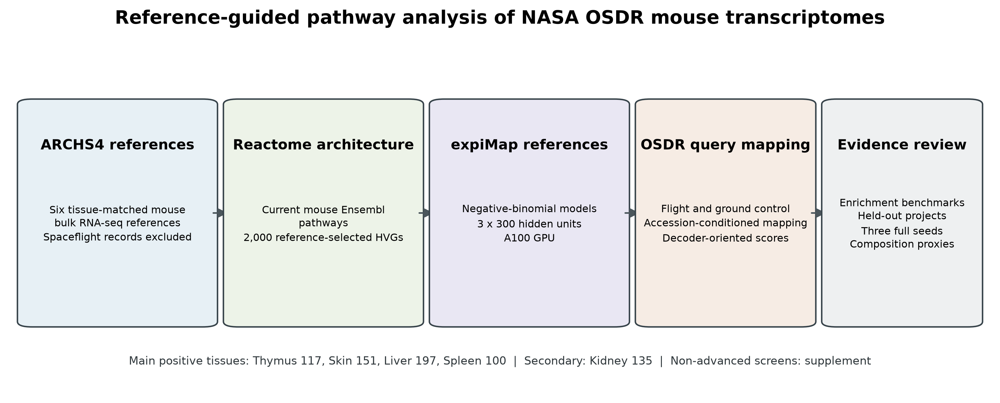

**Figure 1. Reference-guided analysis workflow and revised tissue scope.** Six tissue-matched non-spaceflight ARCHS4 references were connected to current mouse Reactome programs after reference-based HVG selection. NASA OSDR flight and ground-control samples were mapped as accession-conditioned queries. Evidence review included conventional pathway scoring, held-out-project prediction, three complete training seeds, broad composition proxies, member-gene review, and primary literature. Thymus, skin, liver, and spleen form the main positive set; kidney is secondary, and non-advanced screens are retained in the supplement.

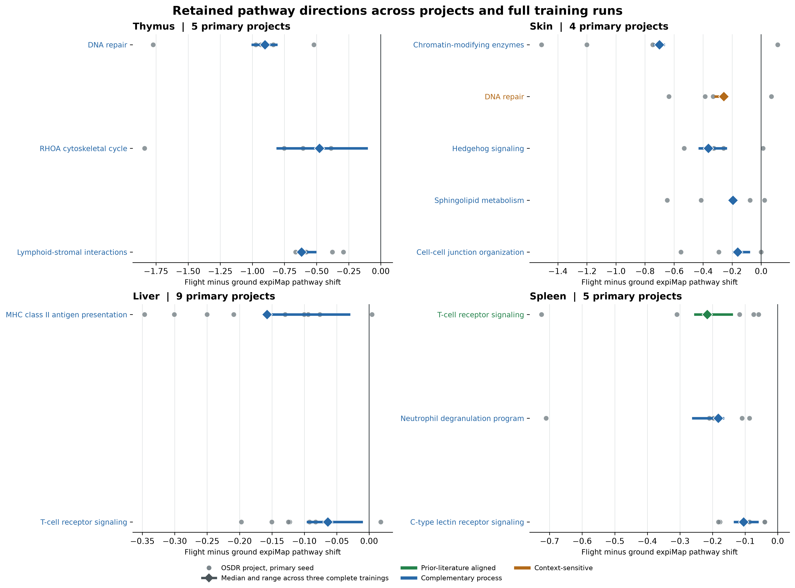

**Figure 2. Retained pathway directions across projects and complete training runs.** Gray circles are primary-seed project effects. Colored diamonds are the median across three complete reference-query trainings, and horizontal segments span the three seed effects. Green denotes prior-literature alignment, blue denotes a complementary process hypothesis, and orange denotes context-sensitive literature interpretation. All displayed scores are lower in flight. Spleen excludes OSD-288 from the primary project effect. Effects are decoder-oriented and scales are tissue specific.

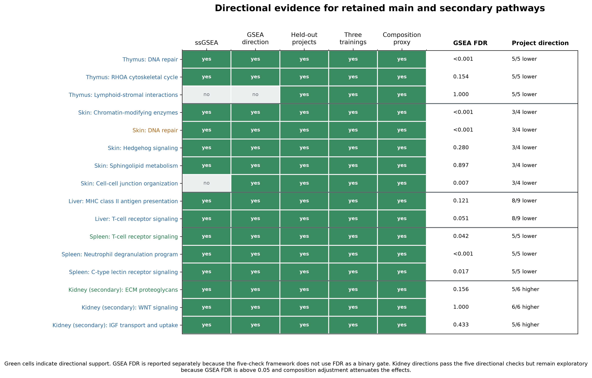

**Figure 3. Directional evidence for retained main and secondary pathways.** Green cells indicate directional agreement with ssGSEA, preranked GSEA, held-out projects, all three complete trainings, or composition-proxy adjustment. GSEA FDR and primary-project direction are reported separately. The five-check label is directional and is not a significance threshold; this distinction is why kidney is exploratory despite five supported directions.

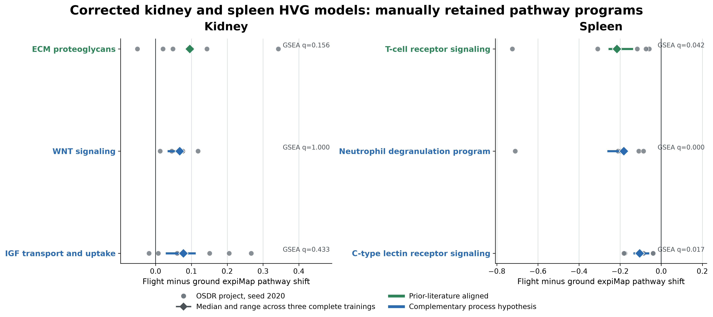

**Figure 4. Corrected kidney and spleen HVG reassessment.** Gray circles show primary-seed project effects; diamonds and horizontal ranges show the median and range across three complete trainings. Kidney programs are higher in flight and spleen programs are lower. Green denotes prior-literature alignment and blue denotes a complementary process hypothesis. GSEA FDR is shown for each program. The kidney directions are reproducible but not conventionally significant at FDR below 0.05; all three spleen programs pass that threshold.

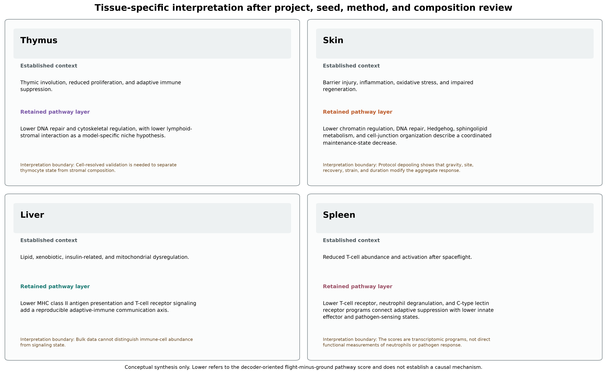

**Figure 5. Tissue-specific interpretation after evidence review.** Each panel separates the established organ phenotype from the pathway layer retained after project, seed, method, and composition review. The summaries are nonredundant tissue-state hypotheses, not causal mechanisms or cell-resolved results. Lower refers to the decoder-oriented flight-minus-ground pathway score.

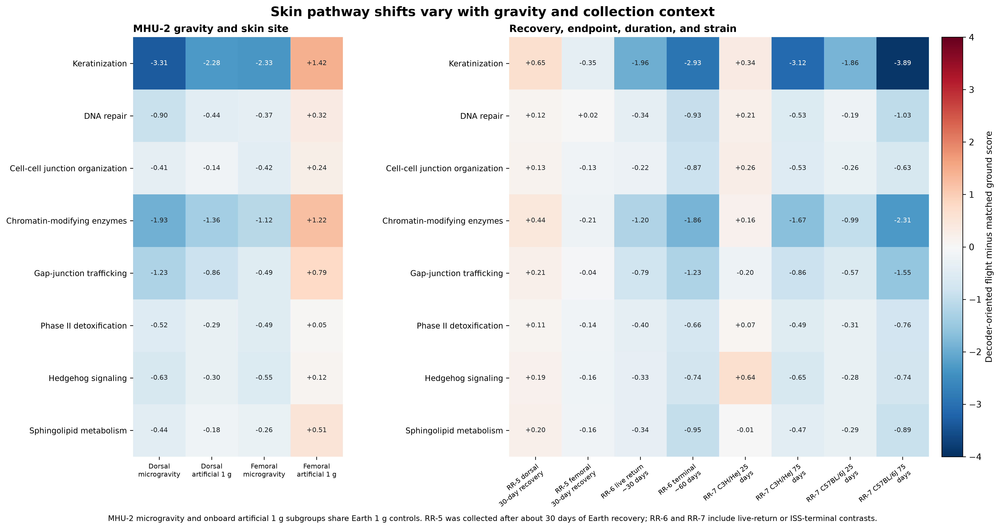

**Figure 6. Depooled skin pathway effects by protocol context.** Values are decoder-oriented flight-minus-matched-ground scores calculated from fixed sample scores. MHU-2 microgravity and onboard artificial 1 g subgroups share Earth 1 g controls and are shown separately for dorsal and femoral skin. Paired MHU-2 and RR-5 sites are not independent missions. RR-5 was collected after terrestrial recovery; RR-6 separates live-return and ISS-terminal collections; RR-7 separates strain and duration. These post hoc contrasts reveal cancellation and context dependence but are not independent confirmatory tests.

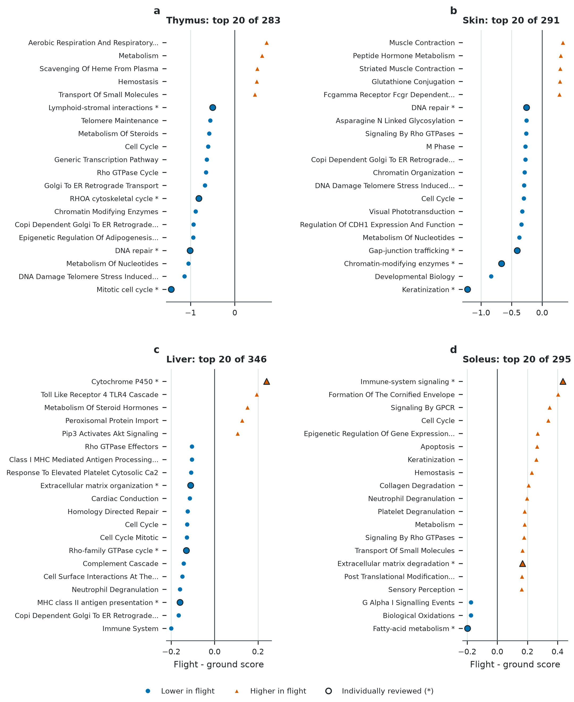

**Figure S1. Original four-model broad pathway screen.** The 20 active Reactome programs with the largest absolute study-balanced effect are displayed for thymus, skin, liver, and soleus. Asterisks and outlined points identify pathways individually reviewed in the original package. Ranking is based on magnitude only; Figure S3 and Tables S10-S11 provide the subsequent pathway-family and tissue-context review. Corrected kidney and spleen screens are in Tables S27-S29.

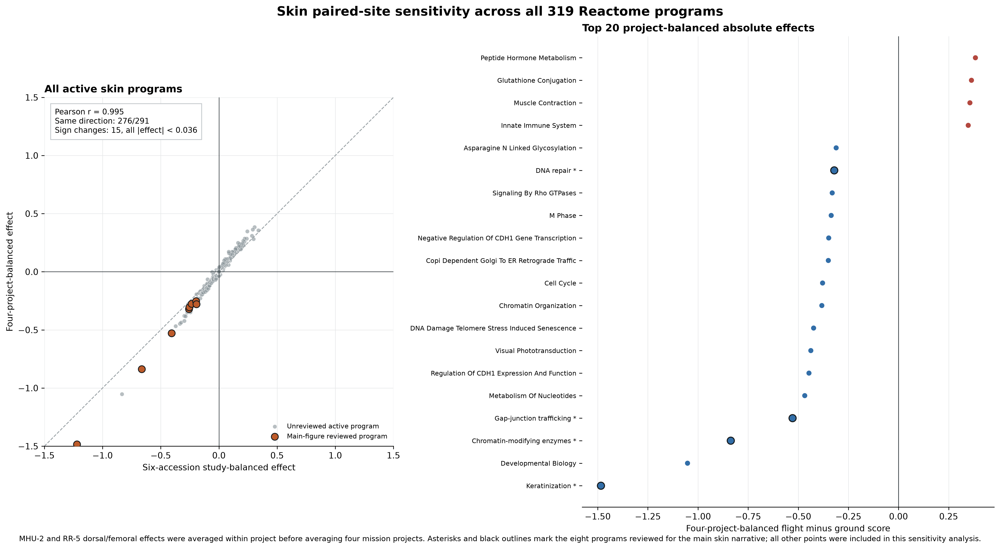

**Figure S2. Skin paired-site project-balance sensitivity across the full pathway model.** The left panel compares the primary six-accession effect with a four-project effect after averaging paired dorsal and femoral accessions within MHU-2 and RR-5. All 291 active skin pathways are shown. The right panel displays the 20 largest absolute four-project effects. Asterisks and outlined points identify the eight pathways individually reviewed for the main figures; expanded candidate assessments are provided in Figure S3 and Tables S10-S11.

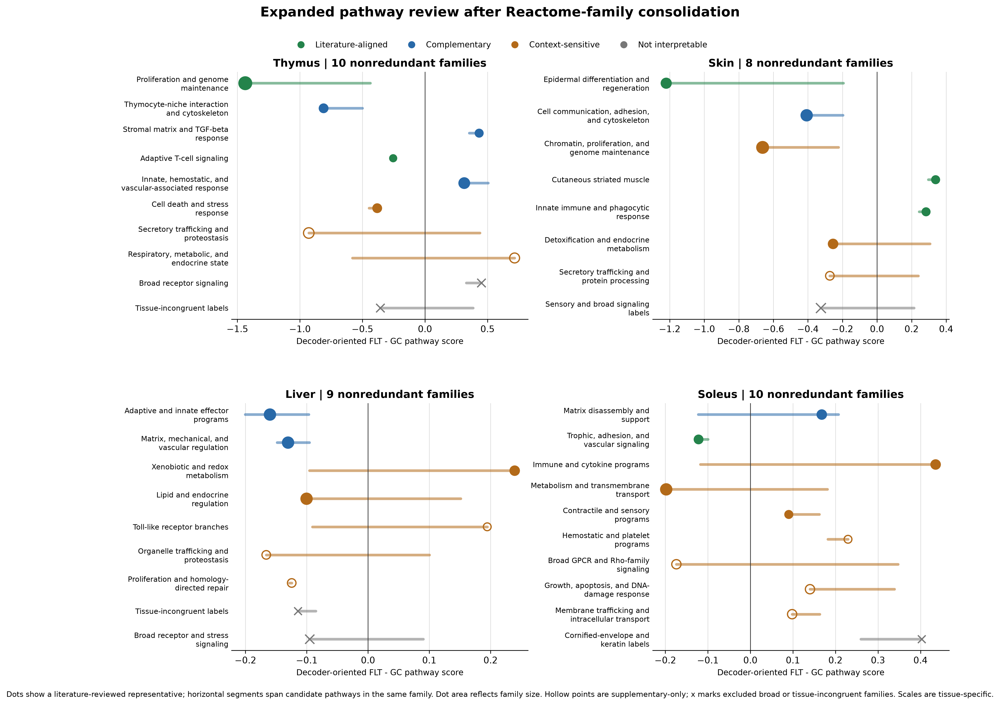

**Figure S3. Original four-model expanded pathway review after Reactome-family consolidation.** The review included the top within-tissue decile, directionally stable programs through rank 40, and every original display pathway, yielding 153 pathway records and 37 tissue-specific process families. Dots show a reviewed representative and segments span candidate effects within each family. Crosses denote broad or tissue-incongruent families excluded from interpretation. Corrected kidney and spleen top-decile review is reported separately in Table S28.

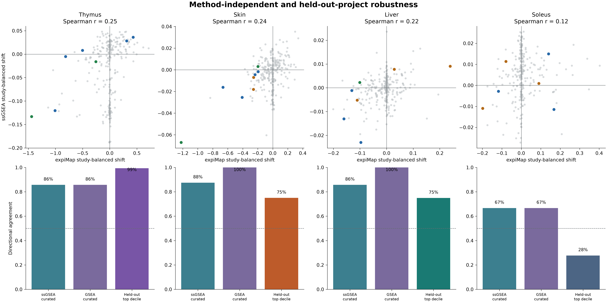

**Figure S4. Original four-model method and held-out-project robustness.** Top panels compare decoder-oriented expiMap shifts with rank-normalized ssGSEA shifts; colored points are the 29 reviewed thymus, skin, liver, and soleus programs. Bottom panels report directional agreement against ssGSEA and preranked GSEA and training-only top-decile prediction of held-out projects. Held-out results are internal cross-validation, not external replication. Corrected kidney and spleen equivalents are included in Figure 4 and Table S27.

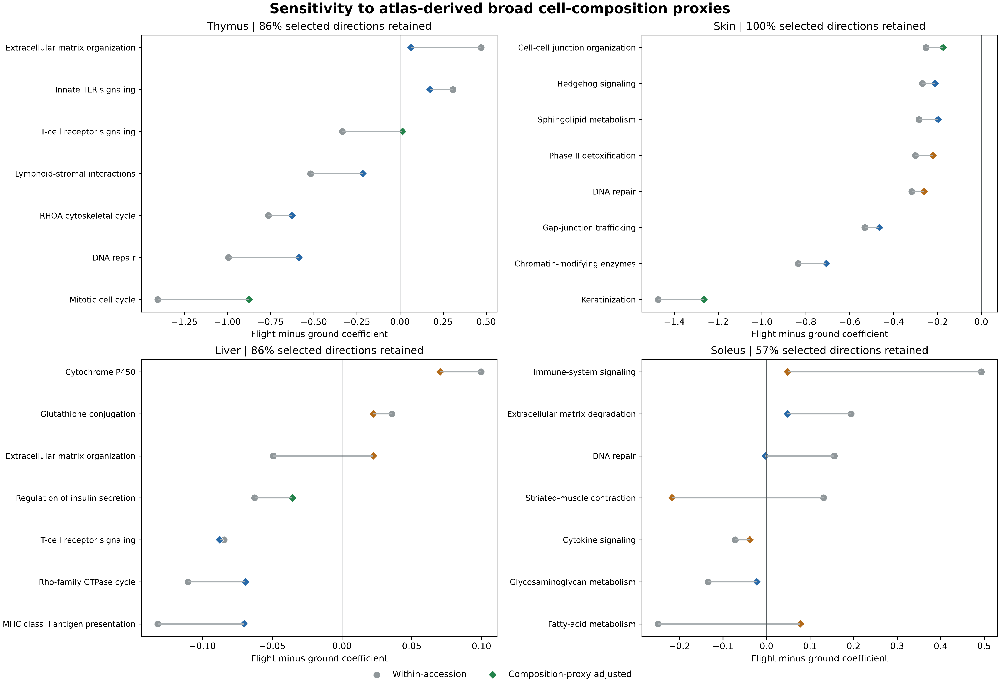

**Figure S5. Original four-model sensitivity to atlas-derived broad composition proxies.** Circles show within-accession flight coefficients before adjustment and diamonds after adjustment for up to three principal components of Tabula Muris Senis broad-compartment marker scores. Marker adjustment is a sensitivity analysis, not cell-type deconvolution. Corrected kidney and spleen composition results are in Table S27.

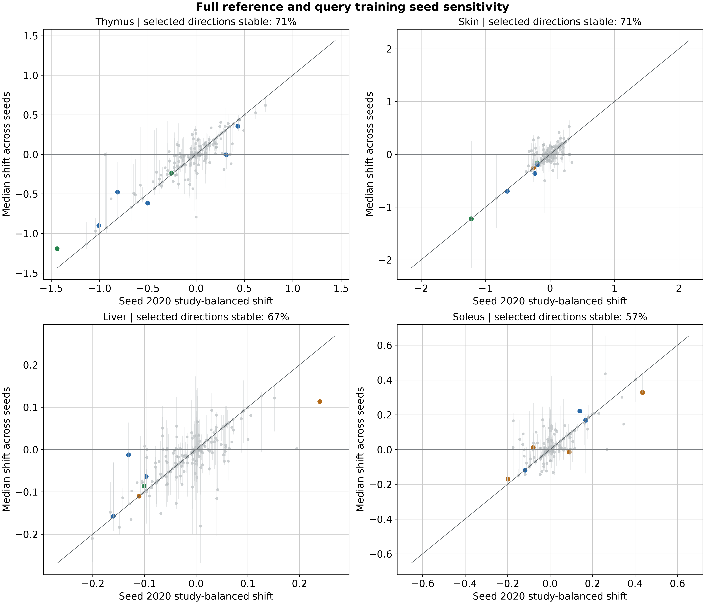

**Figure S6. Original four-model full reference-query training-seed sensitivity.** The primary seed-2020 effect is compared with the median across three complete reference and query training runs. Segments span the seed range. Unlike query resampling against a fixed reference, this analysis retrains both the ARCHS4 reference and OSDR mapping. Corrected kidney and spleen seed ranges are in Figure 4 and Tables S26-S27.

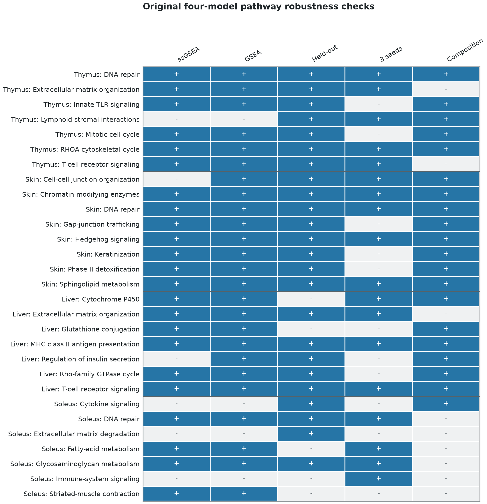

**Figure S7. Original four-model pathway-level robustness evidence matrix.** Green cells indicate directional support from ssGSEA, preranked GSEA, held-out projects, all-three-seed concordance, or composition adjustment for 29 reviewed thymus, skin, liver, and soleus pathways. These are descriptive evidence categories, not statistical significance levels.

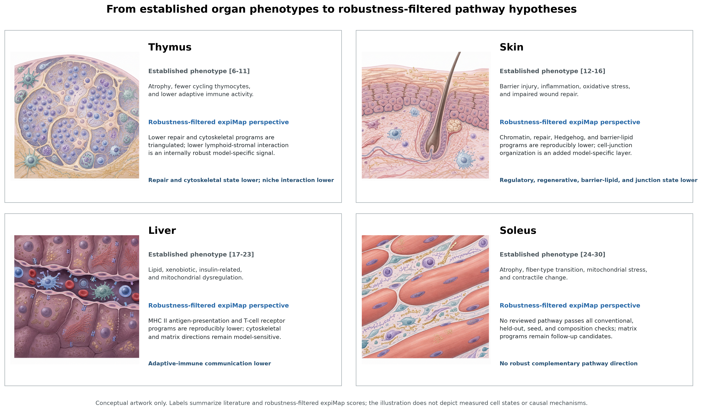

**Figure S8. Conceptual illustration from the original four-model analysis.** Prior-literature phenotypes are paired with the robustness-filtered interpretation for thymus, skin, liver, and soleus. The tissue artwork was generated with OpenAI GPT Image 2 and arranged programmatically. It is illustrative only and does not represent measured morphology, abundance, spatial localization, or causal pathway interactions. The soleus panel is retained as provenance from a non-advanced screen, not as a paper-facing biological result.

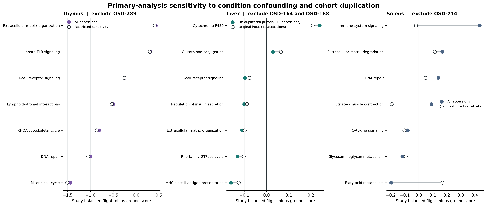

**Figure S9. Original-tissue confound and cohort-overlap sensitivity.** Thymus and soleus effects are compared before and after excluding OSD-289 or OSD-714. Liver compares the de-duplicated 10-accession primary remap with the original 12-accession input containing overlapping cohort representations. Thymus directions were preserved, liver immune directions sharpened after de-duplication, and several soleus directions changed or attenuated.

