# Interpretable and generative modeling of mouse spaceflight transcriptomes

**Jason Trinh1**

1 NASA Space Life Sciences Training Program, NASA Ames Research Center, Moffett Field, California, USA 
Internship technical report and research manuscript 
Correspondence: jasontrinh@berkeley.edu

## Abstract

Mouse spaceflight RNA-sequencing studies differ in mission, tissue, experimental design, and sequencing protocol, making flight-ground biology difficult to separate from study effects. This internship tested whether neural networks could organize public mouse bulk transcriptomes into interpretable, tissue-specific hypotheses. Samples were assembled through the NASA Open Science Data Repository API and analyzed in three stages: unsupervised representation learning with GLARE, Reactome-constrained pathway scoring with expiMap using ARCHS4 references, and conditional expression generation with WGAN-GP and diffusion models. GLARE remained dominated by study identity even after MOBER correction. expiMap identified lower thymic repair and cytoskeletal programs, reduced skin-maintenance programs, lower hepatic adaptive immune signaling, and lower splenic adaptive and innate immune programs. Diffusion reproduced real expression more closely than WGAN-GP and was then used to test whether synthetic training changed flight-ground classification and gene ranking on real test samples. Thymus gave the clearest combined interpretation: pathway scores and synthetic-supported genes indicated lower cell cycling, repair, and tissue renewal in flight. Together, the models support testable hypotheses of reduced thymic renewal, a barrier-damage and inflammatory-cell-death cycle in skin, and splenic niche remodeling linked to lower immune signaling.

<strong>Keywords:</strong> spaceflight; NASA OSDR; bulk RNA sequencing; GLARE; expiMap; Reactome; diffusion model; WGAN-GP; synthetic transcriptomics

## 1. Introduction

Spaceflight changes mechanical loading, radiation exposure, circadian timing, diet, habitat, and stress physiology at the same time. Mouse experiments provide controlled access to affected organs, and OSDR makes their molecular data and metadata available across missions [1]. Comparisons remain difficult because strain, sex, mission duration, dissection, material, and sequencing differ among studies. A pooled flight-ground contrast can therefore reflect study composition rather than biology.

The project asked whether learned representations could organize biological responses that are difficult to interpret gene by gene. This led to three stages: unsupervised module discovery with GLARE [2], Reactome-constrained program scoring with expiMap [4], and conditional generation of synthetic expression profiles for flight-ground analysis.

Each model was checked against independent analyses or reserved real samples to distinguish useful biological structure from study effects.

## 2. Shared study design and data infrastructure

### 2.1 OSDR cohort and study-aware analysis

OSDR studies were identified through the Biological Data API [1]. The analysis included *Mus musculus* bulk RNA-seq profiles with processed counts and a flight or ground-control label. Tissue and material names were harmonized while preserving anatomical muscle groups. The generative dataset contained 1,610 profiles from 75 accessions: 835 flight and 775 ground control. GLARE and expiMap used tissue-specific subsets.

Flight-ground differences were estimated within each accession or mission project and then combined with equal study weights or random-effects models [10]. Benjamini-Hochberg correction controlled the false discovery rate within each analysis family [9].

### 2.2 Reference data

Tabula Muris Senis supplied mouse single-cell data for GLARE pretraining [3]. ARCHS4 supplied mouse RNA-seq references for expiMap and generative pretraining [6], while current mouse Reactome gene sets constrained the expiMap decoder and supported pathway analysis [7]. expiMap used separate tissue-matched ARCHS4 references. The generative model used a broader, healthy-preferred ARCHS4 subset before adaptation to OSDR.

**Table 1. Questions, inputs, and decision criteria for the three modeling stages.**

| Stage | Main question | Learned object | How it was assessed | Outcome |
|---|---|---|---|---|
| GLARE | Can an unsupervised representation reveal FLT/GC structure across studies? | Gene representation and sample clusters | Study and condition separation before and after MOBER | Study effects weakened, but FLT/GC structure remained mixed |
| expiMap | Can a reference model map OSDR profiles into named biological programs? | Reactome-constrained pathway scores | Agreement across studies and standard pathway scoring | Reproducible tissue-specific pathway hypotheses |
| Conditional generation | Can synthetic profiles reproduce the data distribution and improve FLT/GC analysis? | Conditional expression profiles | Similarity to real profiles and FLT/GC prediction on real test samples | DDIM performed best; utility depended on tissue |

## 3. GLARE and batch correction

GLARE was the first model tested [2]. Its sparse autoencoder learned gene representations from OSDR bulk profiles after pretraining on matched Tabula Muris Senis tissues. When data from multiple missions were combined, samples often separated by accession rather than flight condition, showing that study-to-study differences dominated the learned space.

MOBER was applied to reduce study-specific variation while preserving shared biology [18]. It reduced accession separation in several tissues, including pooled skeletal muscle, but FLT and GC samples still overlapped and the resulting gene modules contained mixed directions.

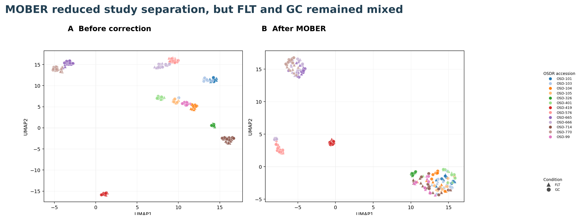

<strong>Figure 1. Study effects in the first GLARE analysis.</strong> Pooled skeletal-muscle sample representations before correction (left) and after MOBER (right). Colors denote OSDR accessions; triangles are FLT and circles are GC. MOBER reduced accession separation, but FLT and GC remained mixed.

## 4. Reactome-constrained expiMap analysis

### 4.1 Reference training and OSDR mapping

expiMap places biological knowledge directly into the neural network. Its conditional variational autoencoder uses a masked decoder that connects genes to predefined Reactome programs [4]. scArches maps query data into a trained reference while adding query-specific parameters [5]. Here, each bulk tissue profile was one observation. The resulting scores describe whole-tissue expression and cannot resolve cell types.

Separate models were trained for thymus, skin, liver, spleen, kidney, and skeletal muscle using tissue-matched, non-spaceflight ARCHS4 references. Series-aware sampling limited dominance by large GEO studies. Each model used about 2,000 highly variable genes and 319 to 387 mouse Reactome programs. OSDR profiles were then mapped with accession represented as a query condition. The main tissue sets ranged from 100 to 197 samples, with exclusions for duplicated liver cohorts and strain-confounded spleen samples.

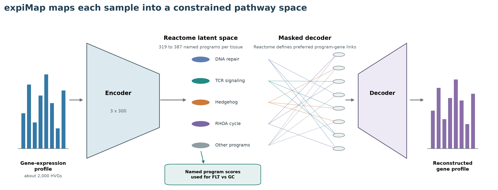

<strong>Figure 2. Reactome-constrained expiMap latent architecture.</strong> An OSDR profile passed through the encoder to produce named pathway scores. The Reactome mask constrained the decoder's program-gene links. The displayed pathway names are representative examples from separate tissue models.

### 4.2 Comparing pathway changes

Flight-ground pathway differences were first calculated within each project and then summarized with equal project weight. We considered a program consistent when its direction agreed across projects, repeated model runs, standard gene-set analyses, and broad cell-mixture adjustments [8]. Individual member genes were also reviewed.

The heatmap in Fig. 3 shows the study variation behind each tissue summary. Thymus and spleen programs were lower in every included accession. Skin had exceptions, while kidney programs were usually higher in flight. Raw score scales are not comparable among separately trained tissues.

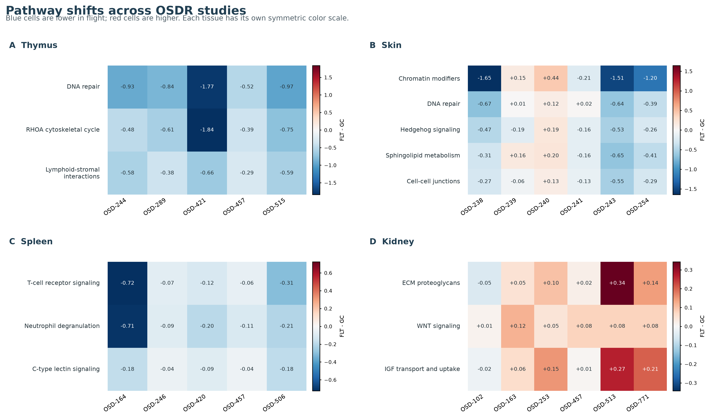

<strong>Figure 3. Accession-level effects for selected expiMap programs.</strong> Each cell is a decoder-oriented flight-minus-ground effect. Blue denotes lower scores in flight and red denotes higher scores. OSD-288 was excluded from spleen because strain and condition were confounded. Color scales are symmetric within each tissue and are not comparable across panels.

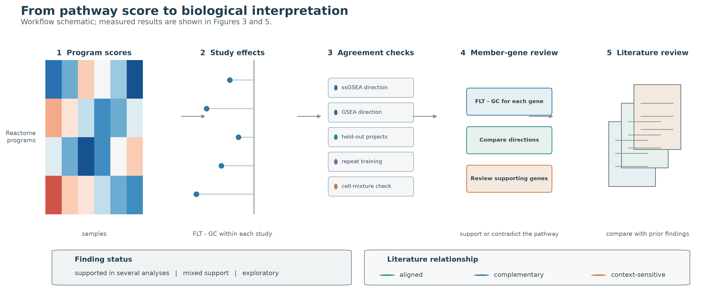

<strong>Figure 4. From pathway score to interpretation.</strong> Reported pathways were checked with single-sample GSEA (ssGSEA), preranked GSEA, held-out projects, repeated model training, and a cell-mixture sensitivity analysis. Member genes were reviewed for expression that supported or contradicted the pathway direction.

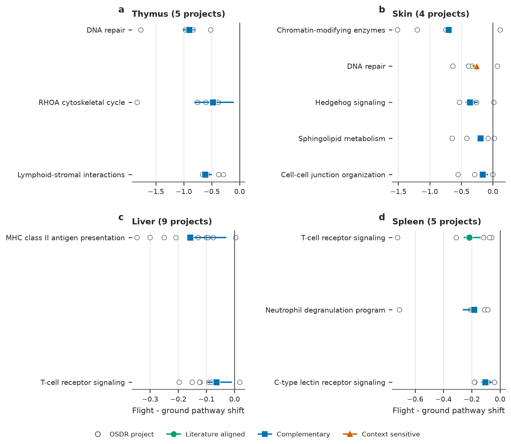

<strong>Figure 5. expiMap pathway shifts across projects and model runs.</strong> Open circles show individual projects. Colored segments show the range across three model runs. All displayed programs were lower in flight. Axes are tissue specific and should not be compared by raw scale.

### 4.3 Tissue findings

Thymus showed lower DNA-repair and RHOA cytoskeletal-cycle scores in all five projects and repeated model runs. Lower lymphoid-stromal interaction appeared consistently in expiMap but not in standard gene-set analysis. Together, these programs suggest reduced repair, motility, and niche coordination during thymic involution [19,20].

Skin generally showed lower chromatin regulation, DNA repair, Hedgehog signaling, sphingolipid metabolism, and cell-junction organization. The pattern links reported dermal atrophy and barrier disruption to reduced tissue maintenance [21,22].

Liver metabolism varied among studies, whereas lower adaptive immune communication was more reproducible [23,24]. MHC class II antigen presentation and T-cell receptor signaling were lower in eight of nine project summaries and remained lower after repeated modeling and accounting for broad differences in cell mixture.

Spleen gave the strongest agreement: T-cell receptor signaling, neutrophil degranulation, and C-type lectin receptor signaling were lower in all five unconfounded projects and were also supported by standard gene-set analysis. Together, these programs indicate lower T-cell activation, pathogen sensing, and innate effector transcription [25-27].

Kidney remained exploratory. ECM proteoglycan, WNT, and IGF transport scores were usually higher in flight, but standard gene-set analysis did not confirm them and accounting for broad cell mixture reduced the effects [28,29].

**Table 2. Main expiMap tissue findings.**

| Tissue | Flight-related pathway pattern | Biological interpretation |
|---|---|---|
| Thymus | Lower DNA repair, RHOA cycle, and lymphoid-stromal interaction | Impaired repair and movement may interrupt thymocyte selection and renewal |
| Skin | Lower chromatin regulation, DNA repair, Hedgehog, sphingolipid, and junction programs | Weak repair and barrier renewal may leave keratinocytes in a persistent stress state |
| Liver | Lower MHC II antigen presentation and T-cell receptor signaling | Metabolic stress may be coupled to reduced hepatic immune communication |
| Spleen | Lower T-cell receptor, neutrophil degranulation, and C-type lectin signaling | Altered immune-cell positioning or activation may reduce adaptive and innate responses |
| Kidney | Higher ECM proteoglycan, WNT, and IGF transport | An exploratory repair response could become fibrotic if growth signaling persists |

## 5. Conditional generative transcriptomics

### 5.1 Configurable benchmark

A useful generator had to reproduce mouse tissue structure, generate flight or ground-control profiles for specified study contexts, and improve analysis of real samples. The configurable benchmark varied expression scaling, feature sets, harmonization, training source, tissue scope, and conditioning [16-18]. Full choices are listed in Appendix A. The primary models were WGAN-GP, which trains a generator against a critic [11], and a DDIM based on the published bulk-expression diffusion architecture [12,13].

### 5.2 Data split and final model

The reference screen began with 997,515 ARCHS4 mouse profiles. Tissue mapping and healthy-preferred filtering yielded 17,244 profiles across 20 tissues. ARCHS4 partitions were separated by complete GEO series, known OSDR-linked series were excluded, and OSDR profiles were divided into training, validation, and test sets before preprocessing.

The model input used TPM, 974 mapped mouse L1000 landmark genes, and train-fitted MaxAbs scaling. A tissue-conditioned DDIM was pretrained on ARCHS4 and adapted to OSDR with separate tissue, condition, accession, and material inputs. None of the tested harmonization methods improved both fidelity and condition-effect recovery. The final model therefore used the uncorrected expression space and represented accession directly.

### 5.3 Comparing the generators

We compared whether each generator preserved gene relationships, covered the real expression distribution, resisted a real-versus-generated classifier, and reproduced tissue, study, and flight-ground patterns [14,15]. Classifier accuracy near 0.5 means that real and generated profiles are difficult to distinguish; lower Frechet distance means that their distributions are closer.

The WGAN-GP achieved correlation 0.976, F1 0.985, real-versus-generated accuracy 0.636, and normalized Frechet distance 0.144. The factorized DDIM achieved correlation 0.974, F1 0.997, real-versus-generated accuracy 0.475, and normalized Frechet distance 0.074. We chose DDIM because its profiles were harder to distinguish from real data and had the lower distributional distance. All four runs reproduced general expression and accession patterns; three reproduced flight-ground differences.

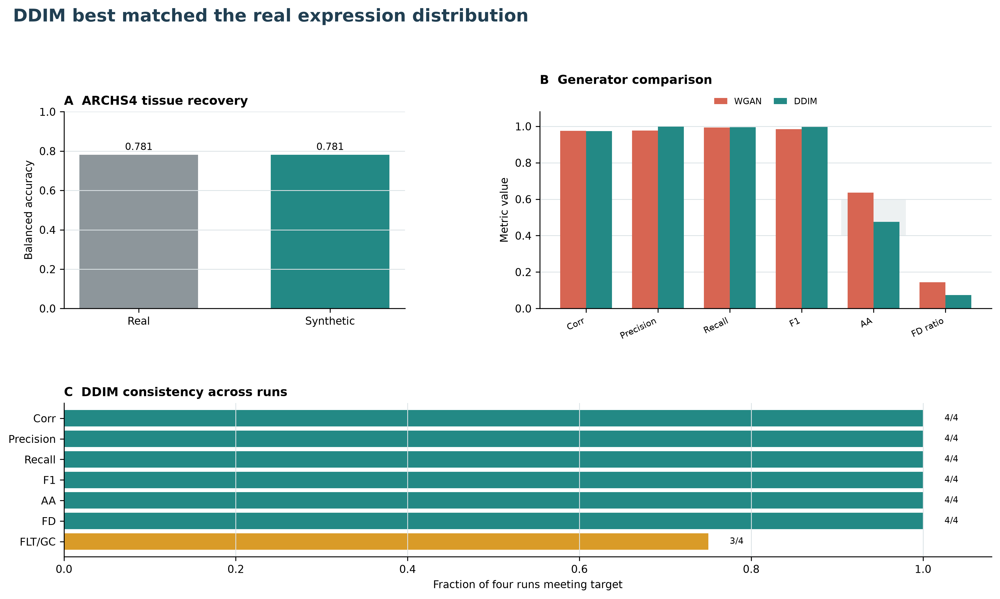

<strong>Figure 6. Comparing WGAN-GP and DDIM.</strong> DDIM profiles were harder to distinguish from real profiles and had a lower distributional distance. The lower panel shows consistency across four model runs.

Real and generated profiles occupied similar tissue-defined regions in PCA space (Fig. 7). Tissue structure dominated the projection, while flight and ground-control profiles largely overlapped.

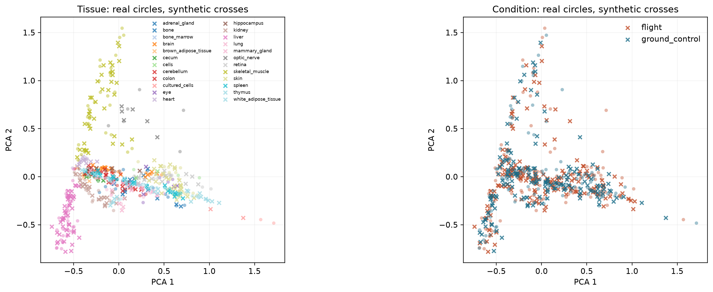

<strong>Figure 7. Real and synthetic OSDR expression in PCA space.</strong> Circles are real profiles and crosses are generated profiles. The left panel is colored by tissue and the right by flight or ground-control condition. Tissue accounts for more visible variation than condition.

### 5.4 Downstream use of synthetic profiles

The main analysis compared real-only and real-plus-synthetic classifiers within 27 tissues and muscle groups. Synthetic profiles entered training only, and performance was measured on real samples reserved for testing. Real-plus-synthetic training was no worse on all six measures in 18 of 27 analyses; 16 of those improved at least one measure.

Permutation importance and SHAP compared gene importance in the fitted real-only and real-plus-synthetic classifiers [30]. Promoted genes became important after synthetic training, while reinforced genes were important in both arms. Grouped versions tested Reactome sets jointly to reduce dilution among correlated genes. A separate consensus analysis combined repeated feature rankings and tested compact gene panels.

After feature selection, an LLM-assisted literature review labeled each candidate as aligning, complementary, ambiguous, or unmatched. Every label was checked against a traceable source.

Thymus, skin, and spleen had candidates in the matched gene, grouped Reactome, and consensus-panel analyses, so they formed the main biological results. Liver and soleus appeared in fewer analyses and were treated as secondary findings.

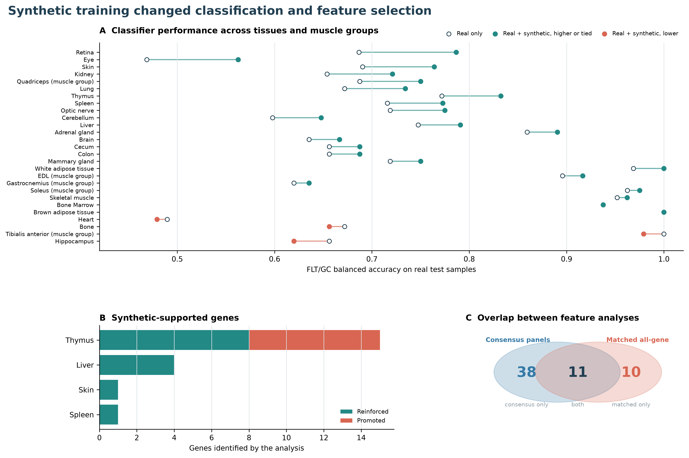

<strong>Figure 8. Tissue-specific synthetic utility and biological selection.</strong> (A) FLT/GC balanced accuracy for classifiers trained on real data or real plus synthetic data and tested on reserved real profiles. All 27 tissue and muscle-group analyses are shown. (B) Genes supported by both real-data association and classifier importance. (C) Overlap between the all-gene and consensus analyses.

### 5.5 Biological findings from synthetic-guided analysis

The matched gene-level screen identified 21 associations: 15 in thymus, four in liver, one in skin, and one in spleen. Thymus had the clearest agreement across all three feature analyses. Seven genes became important only after synthetic training, and the grouped analysis identified six flight-lower mitotic pathways. Real-plus-synthetic training improved balanced accuracy by 0.061, AUROC by 0.046, and average precision by 0.042. Flight-lower genes included *Nusap1*, *Stmn1*, *Birc5*, *Ccnb2*, *E2f2*, *Ube2c*, *Cdc20*, *Gmnn*, and *Kif20a*. The 15-gene set was enriched for mitotic cell cycle at FDR 0.0047. Together with the expiMap results, this suggests that spaceflight limits DNA repair and mitotic progression in rapidly dividing thymocytes. Lower RHOA and lymphoid-stromal programs could also reduce the movement and epithelial contacts needed for thymocyte selection and survival. As developing thymocytes decline, the epithelium receives less reciprocal support, which could further reduce proliferation and naive T-cell production [19,20]. This feedback provides a mechanism for thymic involution.

Skin results suggest a barrier-stress cycle. expiMap showed lower DNA repair, Hedgehog, sphingolipid, and cell-junction programs, which could slow keratinocyte renewal and weaken the lipid and physical barrier [21,22]. Damaged keratinocytes may then induce interferon signaling. Flight-higher *Plscr1* can amplify a subset of interferon-stimulated genes [31], while the combined signal from *Cflar*, *Fas*, *Birc2*, and *Stub1* points to engagement of the RIPK1-regulated decision between survival, apoptosis, and necroptosis [32]. Reduced repair could therefore allow damage to persist, followed by an interferon response and RIPK1-dependent removal of cells that cannot recover. Clearance would prevent damaged keratinocytes from remaining in the epidermis, but inflammatory cell death could recruit immune cells and further impair barrier repair.

Spleen contributed flight-higher *Loxl1*; its consensus panel also contained flight-higher *Rai14*, *Ptprk*, and *Myl9*. These genes have established roles in elastic-matrix maintenance, force sensing through F-actin and Hippo signaling, cell-cell junctions, and actomyosin-associated recruitment of CD69-positive cells [33-36]. One hypothesis is that altered mechanical loading prompts stromal or vascular cells to reinforce the elastic matrix, adjust junctions, and reorganize contractile structures. Because fibroblastic networks determine where immune cells reside and encounter antigen in the spleen [37], this remodeling could change T-cell, dendritic-cell, and neutrophil positioning. This would reduce productive contact among T cells, antigen-presenting cells, and neutrophils, offering an explanation for the lower T-cell receptor, C-type lectin, and neutrophil programs in expiMap. The response may help preserve splenic architecture while weakening immune surveillance.

Liver was a secondary gene-level result. Four flight-lower genes, *Grb10*, *Ppic*, *H2-DMa*, and *Gtf2a2*, were significant in the real-data analysis and important in both classifiers. Prior mouse studies connect spaceflight liver responses to lipid and insulin signaling, protein homeostasis, and lower RNA-polymerase pathways [38,39,43]. These genes fit a compensatory response to lipid and endoplasmic-reticulum stress. Lower GRB10 would release a brake on insulin, IGF, and mTOR signaling, which may help hepatocytes maintain nutrient handling [40]. Lower GTF2A2 is consistent with reduced basal transcription, while lower PPIC could limit stellate-cell activation and matrix deposition [41]. In resident antigen-presenting cells, lower H2-DMalpha would reduce MHC class II peptide loading [42]. Together with the lower T-cell receptor programs from expiMap, this pattern may reflect weaker immune and stromal activation alongside hepatocyte metabolic compensation. This may limit inflammation and fibrosis initially, although lipid and protein stress could persist.

Soleus produced a coherent result in the secondary consensus analysis. Unloading reduces the energy required for postural contraction, providing a direct explanation for lower *Bdh1*, *Ech1*, and *Decr1*, which support ketone and fatty-acid use. Lower *Bnip3* could also reduce removal of damaged mitochondria. The combined effect would lower oxidative endurance and favor the metabolic shift associated with soleus atrophy. Higher *Tpm1* may reflect remodeling of the thin-filament apparatus as the muscle adapts to reduced force demand [44,45]. Synthetic guidance reinforced this metabolic-to-contractile sequence already present in the real data.

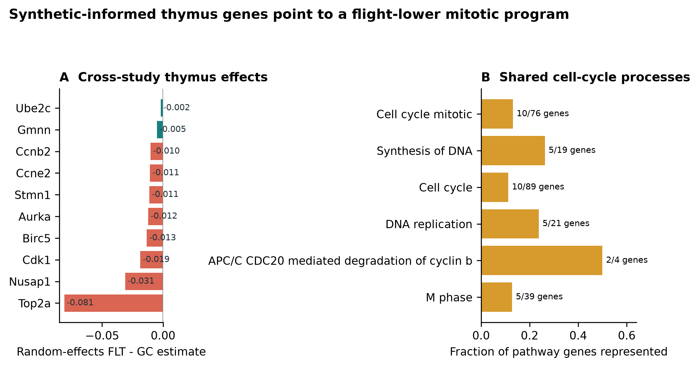

<strong>Figure 9. Synthetic-informed thymus program.</strong> Across-study flight-ground estimates for representative genes are shown at left. The genes point to mitotic and DNA-replication processes at right.

## 6. Integrated discussion

### 6.1 What each model contributed

The models answered different questions. GLARE showed how strongly study effects can shape an unsupervised representation, even after batch correction. This motivated expiMap, which made the latent space interpretable before training and produced pathway findings that could be compared across studies and with standard gene-set analysis. The diffusion model addressed limited tissue-specific sample sizes, reproduced the observed expression distribution, and improved some classifiers.

### 6.2 Mechanistic tissue hypotheses

The tissue models fell into three response patterns. Thymus and soleus showed loss of activity matched to reduced biological demand or renewal. In thymus, lower repair, mitosis, cytoskeletal movement, and stromal contact could form a self-reinforcing loss of developing T cells [19,20]. In soleus, unloading reduced oxidative substrate use and mitochondrial turnover while the contractile apparatus remodeled [44,45].

Skin and kidney suggested repair responses that may become harmful if they persist. Weak skin maintenance could trigger interferon signaling and RIPK1-dependent clearance of damaged keratinocytes, with inflammatory death further delaying barrier repair [21,22,31,32]. In kidney, WNT and IGF signaling may begin as tubular repair but promote fibroblast activation and matrix deposition if sustained [28,29]. The kidney model remains exploratory because conventional enrichment did not confirm the pathway shifts.

Spleen and liver showed distributed responses across tissue compartments. Remodeling of the splenic stromal and vascular scaffold could reposition immune cells and reduce productive contact among adaptive and innate effectors [33-37]. In liver, hepatocyte metabolic compensation occurred alongside lower stellate-cell activation, antigen presentation, and T-cell communication [38-43]. These models predict structural or metabolic adaptation with a possible cost to immune surveillance.

### 6.3 Limitations

This retrospective analysis depends on public metadata, and some tissues contain few independent projects. Incomplete or condition-aligned covariates cannot be fully corrected. Bulk expression also mixes cell abundance with cell state. expiMap adapts a single-cell architecture to bulk profiles with overlapping Reactome programs, and the generator is limited to the contexts and 974 genes used during training.

## 7. Conclusions

The project moved from an unsupervised model dominated by study effects to pathway-constrained and generative models that produced tissue-specific hypotheses. expiMap recovered reproducible pathway shifts, while DDIM generated realistic conditional profiles and improved selected real-sample classifiers and feature rankings. The strongest cross-method result was lower thymic repair and proliferation, consistent with involution and reduced naive T-cell output. Skin and spleen supported additional models of a barrier-damage and inflammatory-death cycle and remodeling of the immune niche; liver and soleus provided secondary metabolic hypotheses.

## Data and code availability

OSDR data were accessed through the public Biological Data API [1]. ARCHS4, Reactome, and Tabula Muris Senis are public resources [3,6,7]. GLARE code and validation are under `src/nasa_mouse_glare/`; expiMap workflows are under `src/nasa_mouse_expimap/`; conditional generation is under `src/nasa_mouse_generative/` and `src/nasa_mouse_diffusion/paper_parity/`. Report inputs and source hashes are recorded under `paper/slstp_internship_report/source_data/`.

## References

1. Gebre SG, Scott RT, Saravia-Butler AM, Lopez DK, Sanders LM, Costes SV. NASA open science data repository: open science for life in space. *Nucleic Acids Research*. 2025;53:D1697-D1710. doi:10.1093/nar/gkae1116.

2. Seo D, Strickland HF, Zhou M, et al. GLARE: discovering hidden patterns in spaceflight transcriptome using representation learning. *npj Microgravity*. 2025;11:76. doi:10.1038/s41526-025-00525-5.

3. The Tabula Muris Consortium. A single-cell transcriptomic atlas characterizes ageing tissues in the mouse. *Nature*. 2020;583:590-595. doi:10.1038/s41586-020-2496-1.

4. Lotfollahi M, Rybakov S, Hrovatin K, et al. Biologically informed deep learning to query gene programs in single-cell atlases. *Nature Cell Biology*. 2023;25:337-350. doi:10.1038/s41556-022-01072-x.

5. Lotfollahi M, Naghipourfar M, Luecken MD, et al. Mapping single-cell data to reference atlases by transfer learning. *Nature Biotechnology*. 2022;40:121-130. doi:10.1038/s41587-021-01001-7.

6. Lachmann A, Torre D, Keenan AB, et al. Massive mining of publicly available RNA-seq data from human and mouse. *Nature Communications*. 2018;9:1366. doi:10.1038/s41467-018-03751-6.

7. Milacic M, Beavers D, Conley P, et al. The Reactome Pathway Knowledgebase 2024. *Nucleic Acids Research*. 2024;52:D672-D678. doi:10.1093/nar/gkad1025.

8. Subramanian A, Tamayo P, Mootha VK, et al. Gene set enrichment analysis: a knowledge-based approach for interpreting genome-wide expression profiles. *Proceedings of the National Academy of Sciences USA*. 2005;102:15545-15550. doi:10.1073/pnas.0506580102.

9. Benjamini Y, Hochberg Y. Controlling the false discovery rate: a practical and powerful approach to multiple testing. *Journal of the Royal Statistical Society Series B*. 1995;57:289-300. doi:10.1111/j.2517-6161.1995.tb02031.x.

10. DerSimonian R, Laird N. Meta-analysis in clinical trials. *Controlled Clinical Trials*. 1986;7:177-188. doi:10.1016/0197-2456(86)90046-2.

11. Vinas R, Andres-Terre H, Lio P, Bryson K. Adversarial generation of gene expression data. *Bioinformatics*. 2022;38:730-737. doi:10.1093/bioinformatics/btab035.

12. Lacan A, Andre R, Sebag M, Hanczar B. In silico generation of gene expression profiles using diffusion models. *BMC Bioinformatics*. 2026. doi:10.1186/s12859-026-06470-8.

13. Song J, Meng C, Ermon S. Denoising diffusion implicit models. *International Conference on Learning Representations*. 2021. arXiv:2010.02502.

14. Heusel M, Ramsauer H, Unterthiner T, Nessler B, Hochreiter S. GANs trained by a two time-scale update rule converge to a local Nash equilibrium. *Advances in Neural Information Processing Systems*. 2017;30.

15. Kynkaanniemi T, Karras T, Laine S, Lehtinen J, Aila T. Improved precision and recall metric for assessing generative models. *Advances in Neural Information Processing Systems*. 2019;32.

16. Sanders LM, Chok H, Samson F, et al. Batch effect correction methods for NASA GeneLab transcriptomic datasets. *Frontiers in Astronomy and Space Sciences*. 2023;10:1200132. doi:10.3389/fspas.2023.1200132.

17. Ilangovan H, Kothiyal P, Hoadley KA, et al. Harmonizing heterogeneous transcriptomics datasets for machine learning-based analysis to identify spaceflown murine liver-specific changes. *npj Microgravity*. 2024;10:61. doi:10.1038/s41526-024-00379-3.

18. Dimitrieva S, Janssens R, Li G, et al. Biologically relevant integration of transcriptomics profiles from cancer cell lines, patient-derived xenografts, and clinical tumors using deep learning. *Science Advances*. 2025;11:eadn5596. doi:10.1126/sciadv.adn5596.

19. Horie K, Kato T, Kudo T, et al. Impact of spaceflight on the murine thymus and mitigation by exposure to artificial gravity during spaceflight. *Scientific Reports*. 2019;9:19866. doi:10.1038/s41598-019-56432-9.

20. Gridley DS, Mao XW, Stodieck LS, et al. Changes in mouse thymus and spleen after return from the STS-135 mission in space. *PLoS ONE*. 2013;8:e75097. doi:10.1371/journal.pone.0075097.

21. Cope H, Elsborg JD, Demharter S, et al. Transcriptomics analysis reveals molecular alterations underpinning spaceflight dermatology. *Communications Medicine*. 2024;4:106. doi:10.1038/s43856-024-00532-9.

22. Park J, Overbey EG, Narayanan SA, et al. Spatial multi-omics of human skin reveals KRAS and inflammatory responses to spaceflight. *Nature Communications*. 2024;15:4773. doi:10.1038/s41467-024-48625-2.

23. Shimizu R, Hirano I, Hasegawa A, et al. Nrf2 alleviates spaceflight-induced immunosuppression and thrombotic microangiopathy in mice. *Communications Biology*. 2023;6:875. doi:10.1038/s42003-023-05251-w.

24. da Silveira WA, Fazelinia H, Rosenthal SB, et al. Comprehensive multi-omics analysis reveals mitochondrial stress as a central biological hub for spaceflight impact. *Cell*. 2020;183:1185-1201.e20. doi:10.1016/j.cell.2020.11.002.

25. Gridley DS, Slater JM, Luo-Owen X, et al. Spaceflight effects on T lymphocyte distribution, function and gene expression. *Journal of Applied Physiology*. 2009;106:194-202. doi:10.1152/japplphysiol.91126.2008.

26. Hwang SA, Crucian B, Sams C, Actor JK. Post-spaceflight mouse splenocytes demonstrate altered activation properties and surface molecule expression. *PLoS ONE*. 2015;10:e0124380. doi:10.1371/journal.pone.0124380.

27. Wu F, Du H, Overbey E, et al. Single-cell analysis identifies conserved features of immune dysfunction in simulated microgravity and spaceflight. *Nature Communications*. 2024;15:4795. doi:10.1038/s41467-023-42013-y.

28. Finch RH, Vitry G, Siew K, et al. Spaceflight causes strain-dependent gene expression changes in the kidneys of mice. *npj Microgravity*. 2025;11:11. doi:10.1038/s41526-025-00465-0.

29. Siew K, Nestler KA, Nelson C, et al. Cosmic kidney disease: an integrated pan-omic, physiological and morphological study into spaceflight-induced renal dysfunction. *Nature Communications*. 2024;15:4923. doi:10.1038/s41467-024-49212-1.

30. Lundberg SM, Lee SI. A unified approach to interpreting model predictions. *Advances in Neural Information Processing Systems*. 2017;30.

31. Dong B, Zhou Q, Zhao J, et al. Phospholipid scramblase 1 potentiates the antiviral activity of interferon. *Journal of Virology*. 2004;78:8983-8993. doi:10.1128/JVI.78.17.8983-8993.2004.

32. Kumari S, Van TM, Preukschat D, et al. NF-kappaB inhibition in keratinocytes causes RIPK1-mediated necroptosis and skin inflammation. *Life Science Alliance*. 2021;4:e202000956. doi:10.26508/lsa.202000956.

33. Jeong W, Kwon H, Park SK, Lee IS, Jho EH. Retinoic acid-induced protein 14 links mechanical forces to Hippo signaling. *EMBO Reports*. 2024;25:4033-4061. doi:10.1038/s44319-024-00228-0.

34. Fearnley GW, Young KA, Edgar JR, et al. The homophilic receptor PTPRK selectively dephosphorylates multiple junctional regulators to promote cell-cell adhesion. *eLife*. 2019;8:e44597. doi:10.7554/eLife.44597.

35. Hayashizaki K, Kimura MY, Tokoyoda K, et al. Myosin light chains 9 and 12 are functional ligands for CD69 that regulate airway inflammation. *Science Immunology*. 2016;1:eaaf9154. doi:10.1126/sciimmunol.aaf9154.

36. Li Y, Wu B, Zou X. Mass cytometry and transcriptomic profiling reveal body-wide pathology induced by Loxl1 deficiency. *Cell Proliferation*. 2021;54:e13077. doi:10.1111/cpr.13077.

37. Alexandre YO, Schienstock D, Lee HJ, et al. A diverse fibroblastic stromal cell landscape in the spleen directs tissue homeostasis and immunity. *Science Immunology*. 2022;7:eabj0641. doi:10.1126/sciimmunol.abj0641.

38. Beheshti A, Chakravarty K, Fogle H, et al. Multi-omics analysis of multiple missions to space reveal a theme of lipid dysregulation in mouse liver. *Scientific Reports*. 2019;9:19195. doi:10.1038/s41598-019-55869-2.

39. Blaber EA, Pecaut MJ, Jonscher KR. Spaceflight activates autophagy programs and the proteasome in mouse liver. *International Journal of Molecular Sciences*. 2017;18:2062. doi:10.3390/ijms18102062.

40. Luo L, Jiang W, Liu H, et al. De-silencing Grb10 contributes to acute ER stress-induced steatosis in mouse liver. *Journal of Molecular Endocrinology*. 2018;60:285-297. doi:10.1530/JME-18-0018.

41. Yang X, Shu B, Zhou Y, Li Z, He C. Ppic modulates CCl4-induced liver fibrosis and TGF-beta-caused mouse hepatic stellate cell activation and is regulated by miR-137-3p. *Toxicology Letters*. 2021;350:52-61. doi:10.1016/j.toxlet.2021.06.021.

42. Felix NJ, Brickey WJ, Griffiths R, et al. H2-DMalpha(-/-) mice show the importance of major histocompatibility complex-bound peptide in cardiac allograft rejection. *Journal of Experimental Medicine*. 2000;192:31-40. doi:10.1084/jem.192.1.31.

43. Vitry G, Finch R, McStay G, et al. Muscle atrophy phenotype gene expression during spaceflight is linked to a metabolic crosstalk in both the liver and the muscle in mice. *iScience*. 2022;25:105213. doi:10.1016/j.isci.2022.105213.

44. Gambara G, Salanova M, Ciciliot S, et al. Gene expression profiling in slow-type calf soleus muscle of 30 days space-flown mice. *PLoS ONE*. 2017;12:e0169314. doi:10.1371/journal.pone.0169314.

45. Stein TP, Schluter MD, Galante AT, et al. Energy metabolism pathways in rat muscle under conditions of simulated microgravity. *Journal of Nutritional Biochemistry*. 2002;13:471-478. doi:10.1016/S0955-2863(02)00195-X.

## Appendix A. Generative design and secondary results

The benchmark exposed each choice in Table A1 as a parameter. Candidate settings were selected with validation data before the final OSDR test set was examined.

**Table A1. Main configurable dimensions.**

| Dimension | Implemented choices |
|---|---|
| Expression | Raw, CPM, TPM, log transformed, standardized, robust scaled, MaxAbs |
| Feature set | All mapped genes, HVG, Reactome, 974 mouse L1000 landmarks |
| Harmonization | None, within-study z, within plus global z, ComBat, ComBat-seq, MBatch variants, MOBER |
| Training source | OSDR only, ARCHS4 only, ARCHS4 pretraining plus OSDR adaptation |
| Scope | Pooled tissues or one model per tissue |
| Conditioning | FLT/GC, tissue, accession, material, muscle group, sex, platform or source when available |
| Model | WGAN-GP or factorized DDIM |

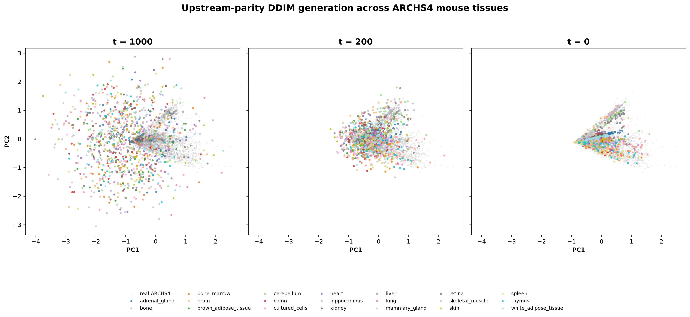

<strong>Figure S1. Tissue-conditioned DDIM reverse trajectory.</strong> Generated profiles move from the initial noise distribution at timestep 1,000 toward tissue-specific regions of a PCA fitted to real ARCHS4 expression at timestep 0. This plot visualizes the denoising process but does not replace quantitative fidelity metrics.

The soleus finding came from the secondary consensus analysis. All five genes had the same flight-ground direction in three accessions, and synthetic guidance reinforced a panel already supported by the real data.

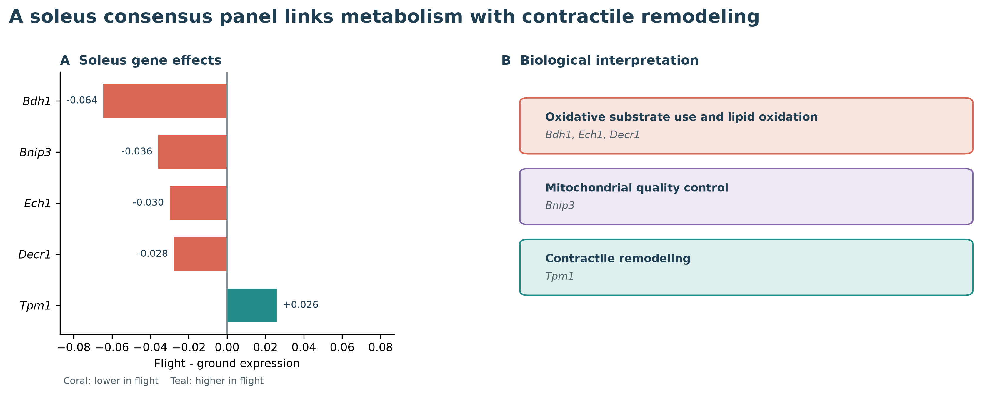

<strong>Figure S2. Secondary soleus consensus panel.</strong> Four genes were lower in flight and <em>Tpm1</em> was higher. The panel connects oxidative substrate use, mitochondrial quality control, lipid oxidation, and contractile remodeling.

