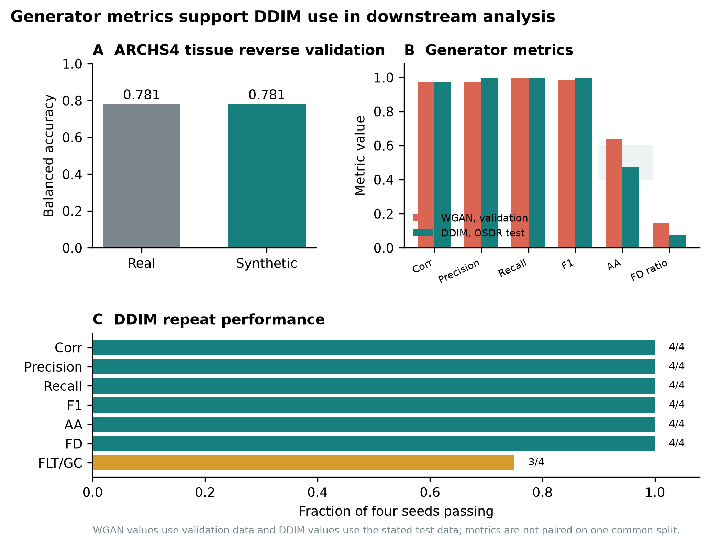
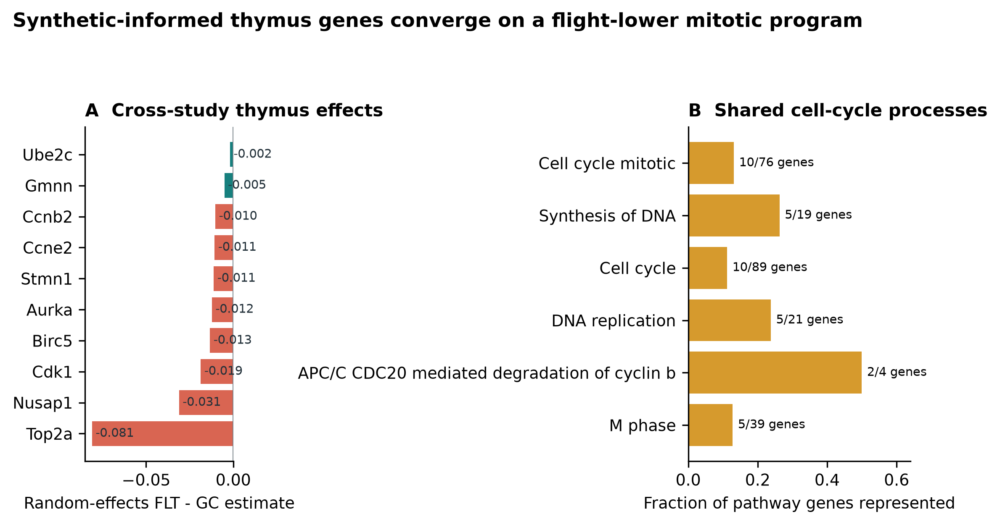
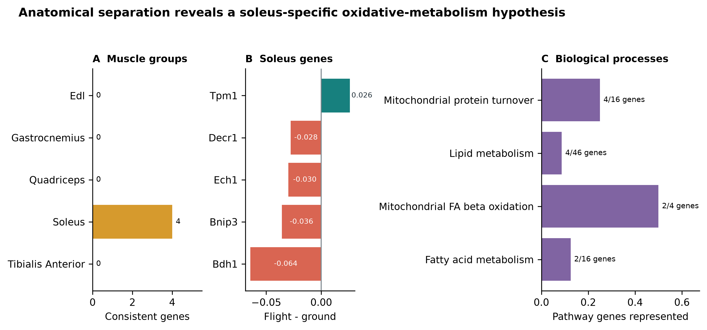
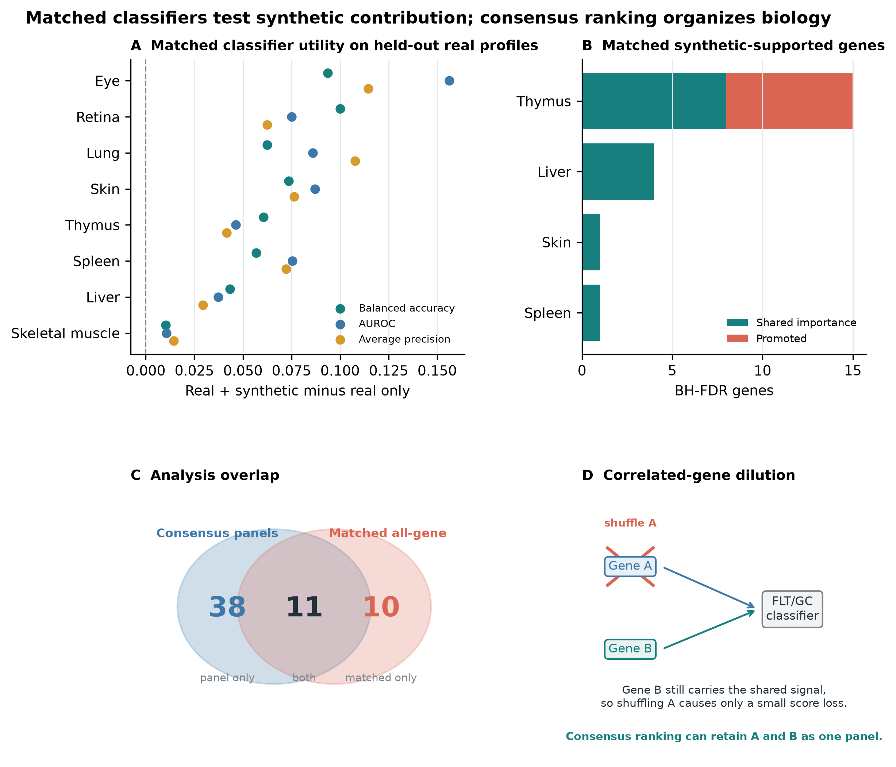

<h1>A configurable generative transcriptomics framework identifies tissue-dependent synthetic utility in mouse spaceflight RNA-seq</h1>

Benchmarking conditional WGAN and diffusion models across NASA OSDR mouse transcriptomes

Jason Trinh

Space Life Sciences Training Program, NASA Ames Research Center, Moffett Field, California, USA

Correspondence: jasontrinh@berkeley.edu

<strong>Research manuscript draft for author review.</strong> Author list, acknowledgments, repository release URL, and archival DOI require final review before submission.

## Abstract

**Background:** Mouse spaceflight studies provide access to tissues that cannot be sampled extensively from astronauts, but individual experiments are small and differ in design. We developed a configurable generative transcriptomics framework and asked whether synthetic expression could improve organ-specific flight analysis without treating generated profiles as new animals.

**Methods:** We assembled 1,610 mouse flight and ground-control bulk RNA-seq profiles through the NASA Open Science Data Repository API and audited all 997,515 profiles in ARCHS4 mouse. The framework varied expression transformations, feature spaces, harmonization, study scope, tissue structure, conditioning, and training regime. Paper-based WGAN-GP and diffusion implementations were compared using fidelity, real-versus-synthetic separability, distributional-distance, and FLT/GC-effect metrics; GeneJEPA was evaluated as a representation model because it has no expression decoder. The diffusion model used downstream was pretrained on 17,244 tissue-diverse ARCHS4 profiles. Downstream analysis compared pooled and tissue-specific uses of generated expression. Flight associations were tested with real profiles using accession-level random-effects models and Benjamini-Hochberg false-discovery control.

**Results:** None of nine matched liver harmonization arms provided adequate fidelity and conditional-effect recovery together. A calibrated study-conditioned WGAN-GP achieved correlation 0.976, precision 0.976, recall 0.994, F1 0.985, adversarial accuracy 0.636, and a Frechet-distance ratio of 0.144 on validation. Across four diffusion seeds, correlation was 0.974, precision 0.997, recall 0.996, F1 0.997, adversarial accuracy was 0.475, and the Frechet-distance ratio was 0.074. Diffusion was therefore used downstream because it was less distinguishable from real data and had lower distributional distance while retaining high fidelity. Pooled augmentation reduced balanced accuracy from 0.754 with real-only training to 0.737 with real-plus-generated training. Tissue-specific use was more informative: 49 real-data BH-FDR associations also entered stable synthetic-informed selection, including a flight-lower mitotic program in thymus and a soleus program with lower *Bdh1*, *Ech1*, *Bnip3*, and *Decr1* and higher *Tpm1*.

**Conclusions:** Model choice depended on joint fidelity and biological-effect recovery rather than one favorable metric. Diffusion provided the strongest distributionally validated generator, but its downstream value depended on tissue and mode of use. Synthetic expression worked better as a feature prior or regularizer than as additional biological sample size. The thymus, soleus, kidney, spleen, skin, and pooled skeletal-muscle results define testable hypotheses that require independent biological replication.

**Keywords:** spaceflight; bulk RNA-seq; synthetic data; diffusion model; skeletal muscle; thymus; NASA OSDR; ARCHS4

## Introduction

Spaceflight affects immune, musculoskeletal, metabolic, and barrier tissues through a combination of microgravity, radiation, confinement, altered nutrition, stress, and mission-specific procedures. Mouse flight experiments provide tissue access that is unavailable in astronauts, but their transcriptomic interpretation is difficult. Individual studies are small, missions differ in strain and duration, and condition labels can be entangled with study, material, genotype, or collection protocol. Pooling samples without preserving these design variables can convert study effects into apparent flight biology.

The NASA Open Science Data Repository (OSDR) now exposes sample metadata and processed assay data through a queryable biological API [1]. This makes it possible to assemble a cross-study cohort while retaining accession-level provenance. Public reference resources offer a second opportunity. ARCHS4 uniformly processes a large fraction of public human and mouse RNA-seq data [2], providing tissue-diverse reference profiles for pretraining models that would be underdetermined on OSDR alone.

Deep generative models can learn high-dimensional expression distributions. Conditional WGAN-GP models have reproduced tissue and cancer properties in GTEx and TCGA [3]. More recently, Lacan and colleagues adapted denoising diffusion probabilistic and implicit models to bulk transcriptomics and reported strong gene-correlation, neighborhood, adversarial, and downstream classification metrics [4]. GeneJEPA instead learns masked-gene representations without reconstructing expression [5]. These approaches solve different problems: a generator can sample expression, whereas a representation learner needs an additional decoder or generative objective before it can do so.

The model is only one part of the problem. Multi-study bulk RNA-seq can be represented as counts, CPM, TPM, or transformed and scaled expression; studies can be corrected, explicitly conditioned, modeled separately, or pooled. Published spaceflight workflows have used within-study standardization [24] and compared ComBat, ComBat-seq, and MBatch correction families [25]. MOBER offers a learned, inductive alternative based on an adversarial conditional variational autoencoder [26]. Any of these choices can improve one diagnostic while erasing flight-related structure or preserving study artifacts instead of biology.

We built a common framework around three model families and the preprocessing, harmonization, cohort, conditioning, and training choices surrounding them. Models were compared using correlation, neighborhood, adversarial, distributional, diversity, memorization, and FLT/GC-effect metrics. The OSDR-adapted DDIM was less distinguishable from real profiles and had lower distributional distance while maintaining high fidelity, so it was used for downstream analysis.

Synthetic expression is commonly presented as a remedy for small sample size. Generated profiles, however, are not new biological replicates. After choosing diffusion for downstream analysis, we separated three questions: whether one pooled augmentation strategy helped at all, whether different tissues benefited from different synthetic-data uses, and whether prioritized genes were associated with flight in real samples.

Our primary biological question was whether tissue-specific analysis could reveal spaceflight responses obscured by multi-tissue pooling.

The tissue-specific analysis supplied its most coherent biological programs in thymus and soleus. Kidney, spleen, skin, pooled skeletal muscle, and adrenal gland supplied narrower candidates. Results from the remaining tissues define the exploratory boundary of the approach.

## Materials and methods

### Data sources

The OSDR Biological Data API was used to identify *Mus musculus* bulk RNA-seq assays with flight or ground-control labels [1]. Tissue and material names were harmonized while preserving study provenance. The resulting cohort contained 1,610 biological profiles from 75 accessions: 835 flight and 775 ground control. Full-transcriptome expression was converted to transcripts per million before selecting a 974-gene mouse landmark panel.

The local ARCHS4 mouse resource contained 997,515 public RNA-seq profiles [2]. All nine GEO series linked from the API-derived OSDR metadata were excluded before reference selection, removing 108 otherwise eligible profiles and preventing cross-resource sample overlap. A healthy-preferred, tissue-balanced subset of 17,244 profiles spanning 20 tissue classes was then used for model pretraining. Complete GEO series were assigned to one reference role, producing 10,150 training, 2,466 validation, and 4,628 test profiles with no series overlap. This backbone was used for both the held-out test and the broad development screens.

**Table 1. Data scope.**

| Source | Profiles used | Biological scope | Role |
|---|---:|---|---|
| ARCHS4 mouse v2.5 | 17,244 | 20 tissue classes | Mouse tissue pretraining |
| NASA OSDR API | 1,610 | 75 accessions; 835 flight and 775 ground control | Spaceflight analysis |

### Configurable generative benchmark

The framework treated expression representation, feature space, harmonization, training source, cohort structure, conditioning, model family, and validation design as separate axes (Table 2). It was not an exhaustive Cartesian benchmark; lower-cost screens identified configurations for full training and repeat evaluation.

**Table 2. Configurable pipeline and selected analysis branch.**

| Axis | Alternatives represented in the framework | Selected branch for downstream analysis |
|---|---|---|
| Expression | Raw, CPM, TPM; log1p/log2p1; z-score, robust, or MaxAbs scaling | Full-transcriptome TPM, then train-fitted MaxAbs scaling |
| Feature space | All shared genes, fold-selected HVGs, Reactome genes, mapped mouse L1000 | 974 mapped mouse L1000 landmarks |
| Harmonization | None, two study-wise z-score schemes, ComBat, ComBat-seq, three MBatch methods, MOBER | No global batch correction; accession represented as a condition |
| Training data | OSDR only, ARCHS4 only, ARCHS4 pretraining plus OSDR adaptation | ARCHS4 pretraining plus OSDR adaptation |
| Cohort structure | One or multiple studies; pooled or per-tissue fitting | All eligible OSDR accessions in a pooled tissue-conditioned generator |
| Conditions | FLT/GC, tissue, study, material, muscle group, and available design covariates | Tissue, FLT/GC, accession, and material |
| Model | WGAN-GP, DDIM, GeneJEPA representation screen | Factorized conditional DDIM |
| Validation | Grouped evaluation, repeat generation, unconditional controls | Four-seed 293-profile OSDR test |

### Preprocessing and harmonization

Each generator received its paper-based preprocessing and a shared benchmark representation. The WGAN-GP branch used log-transformed expression with training-gene z-scores [3]. The diffusion branch used TPM, a mapped mouse landmark panel, and training-fitted MaxAbs scaling [4]. GeneJEPA used its sparse log-transformed token representation and a global nonzero-expression standardization [5]. All feature selection and transform statistics were fitted on training partitions.

Nine harmonization arms were compared in a matched liver experiment: no correction, two study-wise standardization schemes, ComBat, ComBat-seq, three MBatch methods, and MOBER [24-26]. Advancement required preservation of expression fidelity and FLT/GC effects, not simply reduced study separation. Methods without a natural frozen transform for a new batch were treated as transductive sensitivity analyses. Full transform definitions and results are provided in Supplementary Methods S7 and Supplementary Tables S13-S14.

### Model training and selection

We implemented paper-based WGAN-GP and DDIM generators [3,4,12,13]. GeneJEPA was evaluated as a representation model but not as a generator because its released architecture has no expression decoder [5]. The DDIM was first trained on the 17,244-profile ARCHS4 reference, then adapted to OSDR with tissue, FLT/GC, accession, and material conditions. Exact architectures, optimization schedules, adaptation stages, seeds, and hardware records are provided in Supplementary Methods S4-S7.

Complete GEO series and OSDR accessions were grouped when study-level separation was required. Candidate generators were evaluated for correlation structure, neighborhood precision and recall, external real-versus-synthetic separability, distributional distance, diversity, memorization, and recovery of FLT/GC effects [14,15]. Metrics were assessed independently and each model's evaluation split was reported. Exact thresholds are provided in Supplementary Methods S6. The factorized DDIM had lower adversarial accuracy and distributional distance than WGAN-GP while retaining high correlation and neighborhood fidelity; it generated FLT or GC expression for represented tissue and study contexts and supplied the downstream screens.

### Evaluation funnel and synthetic-guided analysis

Evaluation used three stages. First, we tested the most direct use of synthetic expression: pooled augmentation across all tissues. Individual tissue profiles were not averaged or collapsed; instead, they were combined in one FLT/GC classification problem governed by a common decision rule. The locked benchmark compared classifiers trained with real profiles, generated profiles, or real plus generated profiles. Second, because the pooled strategy did not improve performance, each tissue was evaluated separately with five candidate uses. Real-only ranking and fitting used observed OSDR profiles; generated-only ranking and fitting used DDIM profiles. Real-plus-generated training used consensus ranking and equal total real and synthetic weight. Both guided arms used real/synthetic consensus ranking: one fitted the classifier only on real profiles, while the other added condition-recentered generated profiles at 0.05 total synthetic weight. Nested development splits withheld profiles but retained representation from the same accessions. These are within-study development results. Synthetic attribution was retained only when the selected arm was nonworse than real-only training across balanced accuracy, AUROC, and average precision under the frozen eligibility rule.

Third, stable features from the selected tissue arm were compared with stable real-only features. Genes stable under both approaches were interpreted as reinforced. Genes stable only under the eligible synthetic-informed arm were interpreted as synthetic-promoted. "Synthetic-promoted" describes repeated feature selection; it does not mean that a gene was absent from real expression or biologically novel.

Flight-minus-ground effects were estimated within each OSDR study and then summarized with a random-effects model [16]. This kept mission-level contrasts separate before meta-analysis and prevented generated profiles from increasing the biological sample count.

Within each tissue, the 974 real-data gene-level meta-analysis P values were adjusted with the Benjamini-Hochberg procedure, and BH FDR below 0.05 defined the primary statistical inclusion rule [6]. Generated profiles were never entered as biological replicates. Synthetic selection status was recorded separately as reinforced, synthetic-promoted, real-only, or not stably selected. Accession-direction agreement, between-study heterogeneity, and leave-one-accession-out results were retained as interpretation and sensitivity measures rather than inclusion requirements. The complete BH-FDR inventory is provided in Supplementary Table S11, its synthetic-guided subset in Table S10, and tissue-level counts in Table S12. Reactome was used to group selected genes into biological processes [7].

We performed a targeted literature review for all 26 synthetic-promoted associations. The annotation pipeline first fixed the gene, tissue, and observed direction, then searched spaceflight or microgravity literature and relevant process terms. Each record received one mutually exclusive literature label: aligning, contradictory, complementary, ambiguous, or unsupported/potentially novel. A separate evidence-scope field distinguished exact gene-tissue-direction matches from process-level agreement, and the source relationship recorded whether a study was independent, reused public OSDR cohorts, or supplied mechanistic context only. A final interpretive-role field separated recovery of prior evidence from hypothesis extension. The label describes the relationship to published evidence, not the biological validity of the association. Unsupported means that the targeted search found no tissue-specific match, not that the gene lacks a plausible mechanism or is proven novel. Supplementary Tables S16-S17 contain the decisions and source inventory.

**Table 3. Evaluation stages and permitted interpretation.**

| Stage | Analysis | Data separation | Question answered | Permitted interpretation |
|---|---|---|---|---|
| 1 | Pooled utility benchmark | Locked profiles from represented studies | Does one synthetic-data policy help across tissues? | Method-level positive or negative result; no biological claim |
| 2 | Tissue-specific five-arm screen | Held-out profiles within represented accessions | Which synthetic use, if any, helps each tissue? | Developmental utility and stable feature nomination |
| 3 | Real-data random-effects BH FDR | FLT-GC effects estimated separately within each accession | Are nominated genes associated with flight in observed studies? | Real biological association; synthetic status reported separately |

## Results

### Generator metrics favored the OSDR-adapted diffusion model

The broad ARCHS4 DDIM retained tissue identity and passed most distributional tests on 4,628 held-out profiles, but its gene-correlation agreement missed the prespecified floor. It was therefore retained only as tissue-conditioned initialization. GeneJEPA also encoded tissue information, but its representation did not outperform expression directly and it could not generate profiles without an additional decoder.

No liver harmonization arm passed the joint fidelity and conditional-effect criteria (Supplementary Tables S13-S14). Some methods improved a single diagnostic while degrading neighborhood fidelity, real-versus-synthetic separability, or distributional distance. The selected path therefore retained TPM/MaxAbs expression without global correction and represented accession explicitly during OSDR adaptation.

WGAN-GP achieved correlation 0.976, F1 0.985, adversarial accuracy 0.636, and FD/real-P95 0.144. DDIM achieved correlation 0.974, F1 0.997, adversarial accuracy 0.475, and FD/real-P95 0.074. DDIM was therefore used downstream because it was less distinguishable from real data and had lower distributional distance while retaining high fidelity (Table 4).

<strong>Figure 1. Generator metrics and model choice.</strong> (A) Real-trained and synthetic-trained classifiers retained the same broad ARCHS4 tissue balanced accuracy. (B) WGAN-GP validation metrics and DDIM test metrics on their stated evaluation splits; adversarial accuracy closer to 0.5 indicates lower real-versus-synthetic separability. (C) Fraction of four DDIM generation seeds passing each general fidelity or FLT/GC-effect criterion. DDIM was used downstream because it combined near-chance adversarial accuracy, lower distributional distance, and high fidelity.

**Table 4. Generator metrics and model choice. Values are reported on each model's stated evaluation split and are not paired on one common split.**

| Model | Evaluation split | Corr. | Precision | Recall | F1 | AA | FD/real P95 | FLT/GC recovery | Decision |
|---|---|---:|---:|---:|---:|---:|---:|---:|---|
| Broad-reference DDIM | 4,628 held-out ARCHS4 profiles | 0.878 | 0.951 | 0.890 | 0.919 | 0.515 | 0.866 | NA | Initialization only |
| Study-conditioned WGAN-GP | 536-profile validation; 6 seeds | 0.976 | 0.976 | 0.994 | 0.985 | 0.636 | 0.144 | 6/6 | Not used downstream |
| Factorized DDIM | 293-profile OSDR test; 4 seeds | 0.974 | 0.997 | 0.996 | 0.997 | 0.475 | 0.074 | 3/4 | Used downstream |

### Diffusion generation recovered tissue-conditioned expression structure

The reverse trajectory provides a direct view of the model transforming noise into tissue-conditioned expression. In the ARCHS4 reference model, profiles moved from an overlapping noise cloud at timestep 1,000 toward the tissue-structured real-data manifold at timestep 0 (Fig. 2, top). After OSDR adaptation, locked real and generated profiles occupied similar tissue-defined regions, and flight and ground-control profiles remained interspersed within that broader structure (Fig. 2, bottom). These two-dimensional projections are descriptive: model selection used the full correlation, precision, recall, adversarial, Frechet-distance, and conditional-effect gates rather than visual similarity.

### Pooled augmentation motivated tissue-specific analysis

We first asked whether synthetic profiles could simply expand one multi-tissue FLT/GC training cohort. On the OSDR test, balanced accuracy was 0.754 with real-only training, 0.695 with generated-only training, and 0.737 with real-plus-generated training. The corresponding AUROCs were 0.820, 0.751, and 0.791. Pooled augmentation therefore did not improve the broad classifier.

This result is consistent with strong tissue variation in bulk expression and with flight responses that differ among tissues. A common classifier can dilute tissue-specific condition signals even when the generator itself is conditioned on tissue. We therefore moved from a single pooled augmentation policy to separate tissue-level analyses. When synthetic use was selected separately by tissue, several arms improved balanced accuracy, AUROC, and average precision within represented studies (Table 5). Different tissues selected different uses: spleen, skin, and soleus selected real-plus-generated training; pooled skeletal muscle selected feature guidance with a real-only classifier; kidney and thymus selected low-weight guided training; and lung and adrenal gland selected generated-only training. These are development-screen results because profiles, rather than complete studies, were withheld.

**Table 5. Selected tissue-specific development results. Every displayed synthetic-informed arm met the balanced-accuracy, AUROC, and average-precision eligibility rule. Complete canonical-tissue and muscle-group results are in Supplementary Tables S9 and S6.**

| Tissue | Selected synthetic use | Balanced accuracy, real to selected | AUROC, real to selected |
|---|---|---:|---:|
| Thymus | Low-weight guided training | 0.733 to 0.844 | 0.818 to 0.887 |
| Skeletal muscle, pooled | Feature-guided real-only classifier | 0.861 to 0.932 | 0.924 to 0.961 |
| Soleus | Real plus generated | 0.925 to 0.963 | 0.980 to 0.980 |
| Kidney | Low-weight guided training | 0.654 to 0.707 | 0.680 to 0.771 |
| Spleen | Real plus generated | 0.517 to 0.648 | 0.540 to 0.704 |
| Skin | Real plus generated | 0.671 to 0.756 | 0.691 to 0.768 |
| Lung | Generated only | 0.664 to 0.742 | 0.680 to 0.830 |
| Adrenal gland | Generated only | 0.781 to 0.922 | 0.906 to 0.984 |

  

    
    
  

  
<strong>Figure 2. Diffusion generation across reference pretraining and OSDR adaptation.</strong> Top: ARCHS4 tissue-conditioned profiles at DDIM timesteps 1,000, 200, and 0 in a PCA space fitted to real reference expression; gray points are real ARCHS4 profiles and colors identify generated tissue conditions. Bottom: OSDR test profiles for generation seed 5020; circles denote real profiles and crosses denote generated profiles, colored by tissue on the left and flight condition on the right. PCA views are descriptive and do not replace quantitative validation metrics.

### Synthetic-informed selection identified real-data associations

The real-data screen yielded 202 BH-FDR tissue-gene associations across 10 of 22 canonical tissue analyses and 257 across the five anatomical muscle groups. These are tissue-gene results rather than 459 unique or independent discoveries: a gene can be significant in more than one tissue, and pooled skeletal muscle overlaps its anatomical subgroups. Forty-nine associations also entered stable synthetic-informed selection: 26 were synthetic-promoted and 23 were reinforced by both real-only and synthetic-informed selection.

All 459 P values and FDR values came from real profiles. Synthetic data affected only whether a gene was repeatedly prioritized and, for eligible augmentation arms, classifier fitting. Synthetic labels were suppressed where the selected arm failed its metric gate; quadriceps, EDL, and liver therefore contribute real-data associations but no synthetic-informed claims. The complete inventory, including associations with mixed study directions, is provided in Supplementary Tables S10-S12.

The literature review classified 11 promoted associations as aligning, 13 as complementary, one as ambiguous, and one as unsupported/potentially novel; none was solely contradictory. Only three were exact same-gene, same-tissue, same-direction matches: flight-lower thymus *Ccnb2* and *Ccne2* [9], and flight-higher gastrocnemius *Nfkbia* [27]. The other eight aligning associations belonged to the flight-lower thymus cell-cycle program but had process-level rather than exact-gene support. *Birc5* was ambiguous because an earlier shuttle study reported higher thymic expression after flight [28], whereas later ISS work supported a lower cell-cycle program [9]. The complementary class includes thymus *Hsd17b11* and *Etv1*, which have relevant lipid-handling and T-cell mechanisms but no prior directional thymus-flight result [29,30]. Adrenal *Psmb8* was the only literature-unmatched association. Its immunoproteasome biology makes it plausible, but the search found no adrenal spaceflight match [31].

### Synthetic-informed thymus analysis identifies lower proliferative renewal

The thymus screen selected low-weight synthetic-guided training. Balanced accuracy increased from 0.733 to 0.844, AUROC from 0.818 to 0.887, and average precision from 0.862 to 0.918 across repeated within-study splits. Sixteen thymus associations passed real-data BH FDR and entered stable synthetic-informed selection: 13 were synthetic-promoted and three were reinforced.

The strongest coherent subset contained flight-lower *Nusap1*, *Stmn1*, *Birc5*, *Cdk1*, *Top2a*, *Ccnb2*, *Aurka*, and *Ccne2*, all promoted by synthetic guidance, together with reinforced *Ube2c* and *Gmnn* (Fig. 3A). Each had a lower random-effects estimate across the five thymus accessions and BH FDR below 0.05. Reactome analysis of the synthetic-supported set identified mitotic cell cycle, DNA replication, S phase, APC/C regulation, and G2/M control (Fig. 3B).

These genes were present and statistically supported in the real data. Synthetic guidance changed their repeated selection behavior and organized them into a coherent panel; it did not create independent evidence or establish de novo biological discovery.

Prior thymus studies report related biology, although the present result is more specific. STS-135 mouse thymus showed changes in cell-cycle and DNA-damage programs, including lower checkpoint-related expression [8]. A later ISS experiment reported marked thymus mass loss and partial artificial-gravity rescue of cell-cycle expression [9]. The current signature emphasizes mitotic completion and replication rather than acute apoptosis alone. Agreement across accessions suggests a shared thymus response despite study heterogeneity, but it does not identify the responsible cell population.

Two flight-higher promoted genes extend this interpretation without directly replicating earlier flight results. HSD17B11 localizes to lipid droplets and can support regulated lipolysis [29], while ETV1 regulates CD4+ T-cell activation and proliferation [30]. In a shrinking thymus with altered cell populations, these signals could reflect a shift in lipid handling, T-cell state, or relative cell abundance. They do not establish either gene as a driver of thymic involution.

Bulk thymus expression cannot distinguish lower transcription within proliferating thymocytes from loss or redistribution of proliferating cell populations. The defensible biological conclusion is lower abundance of a mitotic transcript program in flight, consistent with reduced proliferative renewal. Cell-resolved or histological confirmation is required to assign the effect to a cell-intrinsic mechanism.

<strong>Figure 3. Thymus response to spaceflight.</strong> (A) Real-data random-effects flight-minus-ground estimates for ten genes across five thymus accessions; coral denotes synthetic-promoted genes and teal denotes reinforced genes. (B) The synthetic-supported set converges on mitotic and DNA-replication processes.

### Anatomical separation exposes a soleus-specific metabolic program

Aggregate skeletal muscle concealed substantial anatomical heterogeneity. We therefore examined extensor digitorum longus, gastrocnemius, quadriceps, soleus, and tibialis anterior separately. Soleus produced the clearest biological pattern: its selected genes showed consistent flight effects across three accessions and converged on related metabolic processes.

The soleus screen selected real-plus-generated training. Balanced accuracy increased from 0.925 to 0.963, AUROC remained 0.980, and average precision increased from 0.980 to 0.986. Five BH-FDR genes were stable in both real-only and synthetic-guided selection: *Bdh1*, *Ech1*, *Bnip3*, and *Decr1* were lower in flight in all three accessions, while *Tpm1* was higher (Fig. 4B). Four genes passed leave-one-accession-out FDR; *Decr1* did not.

The model did not promote a soleus gene absent from stable real-only selection. Its contribution was reinforcement of a coherent existing pattern. Reactome connected the retained genes to mitochondrial protein turnover, mitochondrial fatty-acid beta-oxidation, and lipid metabolism (Fig. 4C). *Bdh1* and *Ech1* support oxidative substrate handling, *Bnip3* supports mitochondrial quality control, *Decr1* contributes to unsaturated fatty-acid oxidation, and *Tpm1* suggests contractile remodeling.

Prior 30-day spaceflight profiling of mouse soleus reported a slow-to-fast shift and broad changes in oxidative metabolism, PPAR signaling, and contractile genes [10]. Unloading studies have also reported reduced soleus fatty-acid oxidation [11]. This is literature-supported panel reinforcement rather than de novo gene discovery.

Unlike thymus, soleus was represented during model development. Its cross-study consistency makes it a focused biological hypothesis, but an entirely unseen soleus study is still needed for independent confirmation.

<strong>Figure 4. Skeletal-muscle and soleus response.</strong> (A) Number of synthetic-informed genes that also pass real leave-one-accession-out FDR in each anatomical muscle group. (B) Five reinforced soleus BH-FDR genes with consistent real flight effects. (C) Their strongest shared biological processes center on mitochondrial turnover and lipid metabolism.

### Other muscle groups provide narrower hypotheses

The pooled skeletal-muscle screen selected synthetic-guided feature ranking and improved balanced accuracy, AUROC, and average precision by 0.071, 0.036, and 0.037. Twelve BH-FDR genes were synthetic-informed, nine of which passed leave-one-accession-out sensitivity. The associated gene sets included interferon signaling and sialic-acid metabolism. Because pooled muscle combines anatomical groups with distinct physiology, this result is interpreted alongside, rather than instead of, the soleus analysis.

Among the remaining anatomical groups, tibialis anterior retained a real-plus-generated arm and gastrocnemius retained a low-weight guided arm. Tibialis anterior reinforced *Cdkn1a*, *St3gal5*, and *Bnip3* and promoted *Cebpd*; gastrocnemius promoted *Fhl2* and *Nfkbia*. None of these genes passed leave-one-accession-out FDR. EDL and quadriceps selected real-only arms, so their BH-FDR genes remain in the complete real-data inventory but are not attributed to the synthetic workflow.

### Spleen screen nominates adhesion and cytoskeletal genes

The spleen screen selected real-plus-generated training. Balanced accuracy increased from 0.517 to 0.648, AUROC from 0.540 to 0.704, and average precision from 0.589 to 0.749. Synthetic guidance promoted flight-higher *Rai14*, *Ptprk*, and *Myl9* and reinforced flight-higher *Loxl1*. *Rai14*, *Ptprk*, and *Loxl1* had the same direction in all six studies; *Myl9* agreed in five of six. None passed leave-one-accession-out FDR, and the set did not produce significant Reactome enrichment.

The four genes provide a tentative structural hypothesis rather than a pathway claim. RAI14 links actin-associated mechanosensing to Hippo signaling, PTPRK regulates cell-cell junctions, MYL9 contributes to actomyosin contractility, and LOXL1 supports elastic extracellular-matrix maintenance [21-23]. Their shared direction is compatible with altered adhesion, mechanics, or tissue architecture, but the present bulk data cannot identify a common source cell or establish one mechanism.

### Other organ responses were heterogeneous

Lung produced large repeated development-screen gains and cell-cycle, senescence, and PI3K/AKT-related enrichment, but no selected gene passed the real-data BH-FDR screen. We therefore treat the lung result as predictive development evidence without a supported gene-level biological claim.

Skin selected real-plus-generated training and promoted flight-higher *Plscr1*. *Plscr1* passed BH FDR and had the same direction in all six studies, although it did not pass leave-one-accession-out FDR. Broader selected sets were enriched for G1/S and DNA-repair processes, consistent with prior OSDR skin analyses reporting strong mission, strain, recovery-interval, and anatomical-site dependence [17]. This is a literature-aligned developmental candidate rather than a confirmed transferable signal.

Kidney produced the clearest secondary gene-level result. *Slc37a4* was reinforced by both selection arms and was higher in flight in all six kidney accessions. Synthetic guidance also promoted flight-higher *Inpp4b*; it passed BH FDR and remained significant in leave-one-accession-out analysis, although one of six accession effects was negative. The selected pair did not yield significant Reactome enrichment. *Slc37a4* supports renal glucose handling, while *Inpp4b* nominates phosphoinositide signaling. Both require independent study confirmation and should be interpreted alongside prior reports of strain-dependent lipid, ECM, TGF-beta, Wnt, and nephron-remodeling responses [18-20].

Adrenal gland produced flight-lower synthetic-promoted *Psmb8* and reinforced *Tspan4*, each with the same direction in all three studies but neither passing leave-one-accession-out FDR. PSMB8 is an interferon-inducible immunoproteasome subunit linked to inflammation and adipocyte homeostasis [31]. Lower adrenal *Psmb8* is therefore a biologically plausible immune, proteostasis, or tissue-composition hypothesis, but it remains unmatched by adrenal spaceflight literature. Retina showed repeated predictive gains and selected-set enrichment but no synthetic-informed BH-FDR gene. Liver selected the real-only arm: its 19 real-data BH-FDR genes remain in the complete inventory, but none support a synthetic-guided claim. Quadriceps and EDL likewise selected real-only arms.

<strong>Figure 5. Tissue evidence.</strong> (A) Repeated development-screen changes relative to real-only models for selected tissues. (B) BH-FDR genes promoted or reinforced by the synthetic workflow; synthetic labels are suppressed where the generated arm failed its metric gate. (C) Thymus and soleus provide the clearest process-level hypotheses, kidney supplies a focused secondary pair, and spleen, skin, and adrenal gland remain exploratory.

**Table 6. Selected synthetic-guided biological interpretations by tissue. Complete real-data BH-FDR results are in Supplementary Tables S11-S12.**

| Tissue | Main signal | Interpretation |
|---|---|---|
| Thymus | Lower mitotic genes; APC/C, G2/M, and DNA replication | Coherent synthetic-informed panel supported by real-data BH FDR |
| Soleus | Reinforced FLT-lower *Bdh1*, *Ech1*, *Bnip3*, and *Decr1*; FLT-higher *Tpm1* | Coherent mitochondrial and lipid-metabolism program; no promoted gene |
| Skeletal muscle, pooled | 12 synthetic-informed BH-FDR genes; interferon and sialic-acid terms | Developmental complement to the anatomically specific soleus result |
| Kidney | Promoted *Inpp4b* and reinforced *Slc37a4*, both FLT-higher | Focused renal metabolic-signaling hypothesis |
| Spleen | Promoted *Rai14*, *Ptprk*, and *Myl9*; reinforced *Loxl1* | Developmental adhesion/cytoskeletal hypothesis |
| Skin | Promoted FLT-higher *Plscr1* plus cell-cycle/DNA-repair enrichment | Literature-aligned developmental candidate |
| Adrenal gland | Promoted *Psmb8* and reinforced *Tspan4*, both FLT-lower | Literature-unmatched but mechanistically plausible immune/proteostasis candidate |
| Tibialis anterior | Reinforced *Cdkn1a*, *St3gal5*, and *Bnip3*; promoted *Cebpd* | Exploratory stress and metabolic response |
| Gastrocnemius | Promoted *Fhl2* and *Nfkbia* | Exploratory two-gene result without a coherent pathway |
| Lung | Generated-only development improved all three predictive metrics | Predictive development result without a BH-FDR gene in the 974-gene panel |
| Retina | Predictive and pathway gains without a synthetic-informed BH-FDR gene | Exploratory gene/pathway mismatch |
| Quadriceps, EDL, liver | Screen retained real-only arms | Real-data BH-FDR associations are not synthetic-guided findings |

## Discussion

### Generator metrics favored diffusion for downstream analysis

Both WGAN-GP and DDIM reproduced expression structure, but DDIM was less distinguishable from real profiles and had lower distributional distance. OSDR adaptation was needed because the broad ARCHS4 model retained tissue identity but missed the correlation target. Harmonization also showed that reducing study structure could damage expression neighborhoods or FLT/GC effects, so accession was represented explicitly. These results support using DDIM for this analysis; they do not establish universal superiority over adversarial training.

### What synthetic data added

Pooled augmentation did not improve FLT/GC classification, consistent with organ-specific responses being obscured by one decision rule. Tissue-specific analysis was more informative, but no single synthetic-data use worked across organs. Depending on the tissue, generated profiles contributed through direct augmentation, low-weight regularization, or feature ranking.

These results support synthetic expression as a regularizer or feature prior, not as additional biological sample size. All associations were tested in observed profiles after estimating FLT/GC effects separately by accession. A reinforced gene was selected with and without synthetic guidance; a promoted gene was selected stably only with guidance. Neither label establishes novelty or replaces validation in an independent experiment.

The literature annotation separates recovery of known biology from hypothesis extension. Exact matches show that the ranking procedure can recover prior directional findings, while complementary associations supply candidates within related processes. The ambiguous *Birc5* result shows why process agreement cannot resolve every gene across missions. The classification does not score biological plausibility: *Hsd17b11* and *Etv1* have relevant mechanisms but no directional thymus-flight precedent, while *Psmb8* remains literature-unmatched despite a plausible immunoproteasome role. These are testable interpretations rather than novelty claims.

### Thymus and soleus define the clearest biological hypotheses

The thymus result refines established spaceflight immune biology. Prior work documents thymic involution and altered cell-cycle expression [8,9]. The current signature concentrates on cyclins, CDK1, UBE2C, BIRC5, NUSAP1, geminin, APC/C-mediated protein turnover, and G2/M control. Together these support lower proliferative renewal or a lower proportion of cycling thymocytes. Because the data are bulk, composition and cell-intrinsic regulation remain inseparable.

The soleus result addresses a different physiological axis. Weight-bearing slow muscle is especially sensitive to unloading. Lower *Bdh1*, *Ech1*, *Bnip3*, and *Decr1* together with higher *Tpm1* describe reduced oxidative substrate handling, altered mitochondrial quality control, and contractile remodeling. This is compatible with known soleus atrophy, altered lipid metabolism, and slow-to-fast transition [10,11]. Synthetic guidance reinforced this compact fatty-acid-oxidation panel across soleus studies.

### Secondary and negative tissue results

The other tissues define the method's exploratory boundary. Kidney supplied a focused two-gene hypothesis, while spleen, skin, and adrenal gland supplied narrower candidates without comparable pathway coherence. Retina and lung improved in development without a synthetic-informed BH-FDR gene, and liver, quadriceps, and EDL selected real-only arms. Follow-up should prioritize the thymus mitotic panel and soleus metabolic panel, then test kidney *Inpp4b* and *Slc37a4* and the spleen structural candidates.

### Limitations

The tissue screens withheld profiles within represented accessions, so they measure development utility rather than transfer to a new mission, strain, or processing protocol. The configurable matrix was a gated search rather than a full factorial benchmark, and the selected path should not be interpreted as a universal model optimum.

The 974-gene landmark panel excludes potentially relevant genes. FDR was controlled within each tissue family, and heterogeneous study effects weaken a common-response interpretation even when the pooled association is significant. Bulk data also cannot separate cell-intrinsic regulation from changes in cell composition. Finally, the generator represents only tissue, condition, accession, and material contexts seen during adaptation. Independent studies and targeted experiments are required to confirm the proposed programs; detailed sensitivity analyses and safeguards are provided in the supplement.

## Conclusions

Synthetic expression was useful only when its role was selected for the tissue and evaluated against real-only training. A pooled augmentation policy failed. Thymus and soleus provide the clearest process-level hypotheses, while kidney *Inpp4b* and *Slc37a4* remain focused secondary candidates.

Skin, spleen, pooled skeletal muscle, adrenal gland, gastrocnemius, and tibialis anterior provide narrower developmental hypotheses. Lung and retina improved during development but lacked a corresponding synthetic-informed BH-FDR gene in the landmark panel. Quadriceps, EDL, and liver do not support synthetic-guided claims because their real-only arms were retained. Independent biological data are needed to test all of these hypotheses.

## Data and code availability

OSDR data were accessed through the public Biological Data API [1]. ARCHS4 and Reactome are public resources [2,7]. Repository scripts are under `src/nasa_mouse_rna_diffusion/`; frozen run outputs are under `outputs/generative_benchmark/`; this paper package is under `paper/synthetic_guided_spaceflight/`. The figure and table builder is `nasa_mouse_rna_diffusion.build_synthetic_guided_paper`. Public repository URL and archival DOI will be added after author review.

## Ethics statement

This study is a secondary computational analysis of publicly available animal-study data. No new animals were used.

## Competing interests

The author declares no competing interests.

## Acknowledgments

The author acknowledges the NASA Open Science Data Repository, GeneLab data-processing teams, original flight-study investigators, ARCHS4, Reactome, and the developers of the evaluated generative-model implementations. Program and mentor acknowledgments require final author review.

## References

1. NASA Open Science Data Repository. OSDR Biological Data API. <https://visualization.osdr.nasa.gov/biodata/api/>. Accessed July 28, 2026.
2. Lachmann A, Torre D, Keenan AB, et al. Massive mining of publicly available RNA-seq data from human and mouse. *Nature Communications*. 2018;9:1366. <https://doi.org/10.1038/s41467-018-03751-6>.
3. Viñas R, Andrés-Terré H, Liò P, Bryson K. Adversarial generation of gene expression data. *Bioinformatics*. 2022;38:730-737. <https://doi.org/10.1093/bioinformatics/btab035>.
4. Lacan A, André R, Sebag M, Hanczar B. In silico generation of gene expression profiles using diffusion models. *BMC Bioinformatics*. 2026. <https://doi.org/10.1186/s12859-026-06470-8>.
5. Litman E, Myers T, Agarwal V, et al. GeneJEPA: A predictive world model of the transcriptome. *bioRxiv*. 2025. <https://doi.org/10.1101/2025.10.14.682378>.
6. Benjamini Y, Hochberg Y. Controlling the false discovery rate: a practical and powerful approach to multiple testing. *Journal of the Royal Statistical Society Series B*. 1995;57:289-300. <https://doi.org/10.1111/j.2517-6161.1995.tb02031.x>.
7. Milacic M, Beavers D, Conley P, et al. The Reactome Pathway Knowledgebase 2024. *Nucleic Acids Research*. 2024;52:D672-D678. <https://doi.org/10.1093/nar/gkad1025>.
8. Gridley DS, Mao XW, Stodieck LS, et al. Changes in mouse thymus and spleen after return from the STS-135 mission in space. *PLoS ONE*. 2013;8:e75097. <https://doi.org/10.1371/journal.pone.0075097>.
9. Horie K, Kato T, Kudo T, et al. Impact of spaceflight on the murine thymus and mitigation by exposure to artificial gravity during spaceflight. *Scientific Reports*. 2019;9:19866. <https://doi.org/10.1038/s41598-019-56432-9>.
10. Gambara G, Salanova M, Ciciliot S, et al. Gene expression profiling in slow-type calf soleus muscle of 30 days space-flown mice. *PLoS ONE*. 2017;12:e0169314. <https://doi.org/10.1371/journal.pone.0169314>.
11. Stein TP, Schluter MD, Grindeland RE, Moran MM, Baer LA, Wade CE. Rate controlling steps in fatty acid oxidation by unloaded rodent soleus muscle. *Journal of Gravitational Physiology*. 2002;9:P165-P166. PMID: 15002531.
12. Ho J, Jain A, Abbeel P. Denoising diffusion probabilistic models. *Advances in Neural Information Processing Systems*. 2020;33:6840-6851.
13. Song J, Meng C, Ermon S. Denoising diffusion implicit models. *International Conference on Learning Representations*. 2021. <https://arxiv.org/abs/2010.02502>.
14. Heusel M, Ramsauer H, Unterthiner T, Nessler B, Hochreiter S. GANs trained by a two time-scale update rule converge to a local Nash equilibrium. *Advances in Neural Information Processing Systems*. 2017;30.
15. Kynkäänniemi T, Karras T, Laine S, Lehtinen J, Aila T. Improved precision and recall metric for assessing generative models. *Advances in Neural Information Processing Systems*. 2019;32.
16. DerSimonian R, Laird N. Meta-analysis in clinical trials. *Controlled Clinical Trials*. 1986;7:177-188. <https://doi.org/10.1016/0197-2456(86)90046-2>.
17. Cope H, Elsborg J, Demharter S, et al. Transcriptomics analysis reveals molecular alterations underpinning spaceflight dermatology. *Communications Medicine*. 2024;4:106. <https://doi.org/10.1038/s43856-024-00532-9>.
18. Finch RH, Vitry G, Siew K, et al. Spaceflight causes strain-dependent gene expression changes in the kidneys of mice. *npj Microgravity*. 2025;11:11. <https://doi.org/10.1038/s41526-025-00465-0>.
19. Siew K, et al. Cosmic kidney disease: an integrated pan-omic, physiological and morphological study into spaceflight-induced renal dysfunction. *Nature Communications*. 2024;15:4923. <https://doi.org/10.1038/s41467-024-49212-1>.
20. Suzuki N, Iwamura Y, Nakai T, et al. Gene expression changes related to bone mineralization, blood pressure and lipid metabolism in mouse kidneys after space travel. *Kidney International*. 2022;101:92-105. <https://doi.org/10.1016/j.kint.2021.09.031>.
21. Jeong W, Kwon H, Park SK, Lee IS, Jho EH. Retinoic acid-induced protein 14 links mechanical forces to Hippo signaling. *EMBO Reports*. 2024;25:4033-4061. <https://doi.org/10.1038/s44319-024-00228-0>.
22. Fearnley GW, Young KA, Edgar JR, et al. The homophilic receptor PTPRK selectively dephosphorylates multiple junctional regulators to promote cell-cell adhesion. *eLife*. 2019;8:e44597. <https://doi.org/10.7554/eLife.44597>.
23. Liu X, Zhao Y, Gao J, et al. Elastic fiber homeostasis requires lysyl oxidase-like 1 protein. *Nature Genetics*. 2004;36:178-182. <https://doi.org/10.1038/ng1297>.
24. Ilangovan H, Kothiyal P, Hoadley KA, et al. Harmonizing heterogeneous transcriptomics datasets for machine learning-based analysis to identify spaceflown murine liver-specific changes. *npj Microgravity*. 2024;10:61. <https://doi.org/10.1038/s41526-024-00379-3>.
25. Sanders LM, Chok H, Samson F, et al. Batch effect correction methods for NASA GeneLab transcriptomic datasets. *Frontiers in Astronomy and Space Sciences*. 2023;10:1200132. <https://doi.org/10.3389/fspas.2023.1200132>.
26. Dimitrieva S, Janssens R, Li G, et al. Biologically relevant integration of transcriptomics profiles from cancer cell lines, patient-derived xenografts, and clinical tumors using deep learning. *Science Advances*. 2025;11:eadn5596. <https://doi.org/10.1126/sciadv.adn5596>.
27. Allen DL, Bandstra ER, Harrison BC, et al. Effects of spaceflight on murine skeletal muscle gene expression. *Journal of Applied Physiology*. 2009;106:582-595. <https://doi.org/10.1152/japplphysiol.90780.2008>.
28. Gridley DS, Slater JM, Luo-Owen X, et al. Spaceflight effects on T lymphocyte distribution, function and gene expression. *Journal of Applied Physiology*. 2009;106:194-202. <https://doi.org/10.1152/japplphysiol.91126.2008>.
29. Keenan SN, Suriani ND, Fidelito G, et al. HSD17B11 regulates PLIN5-ATGL mediated lipolysis, but not hepatic lipid metabolism in mice. *Journal of Lipid Research*. 2025;66:100943. <https://doi.org/10.1016/j.jlr.2025.100943>.
30. Shi Y, Wang S, Yan Y, et al. ETV1 drives CD4+ T cell-mediated intestinal inflammation in inflammatory bowel disease through amino acid transporter Slc7a5. *Advanced Science*. 2026;13:e11595. <https://doi.org/10.1002/advs.202511595>.
31. Kitamura A, Maekawa Y, Uehara H, et al. A mutation in the immunoproteasome subunit PSMB8 causes autoinflammation and lipodystrophy in humans. *Journal of Clinical Investigation*. 2011;121:4150-4160. <https://doi.org/10.1172/JCI58414>.
