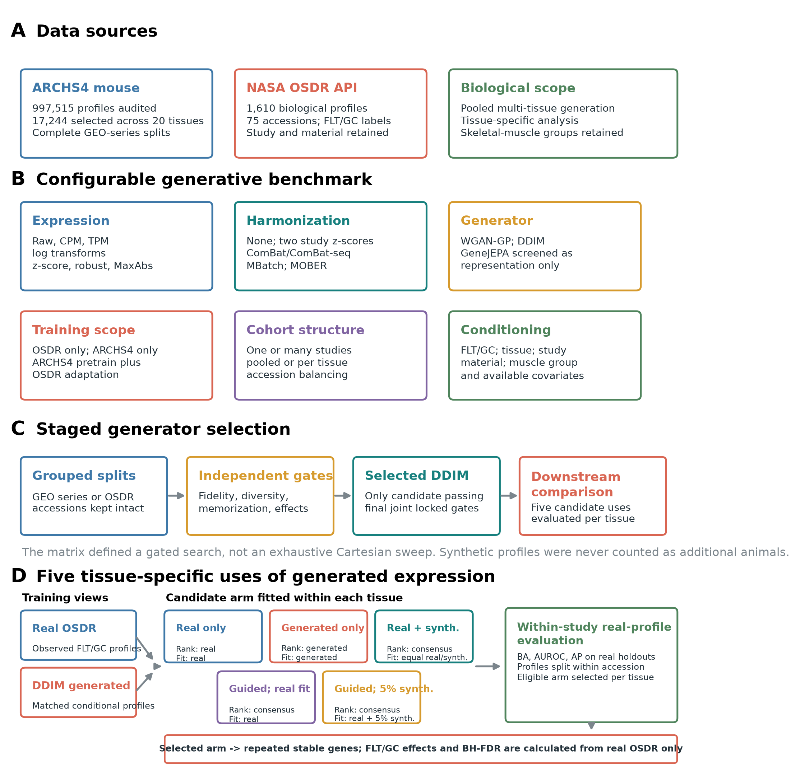
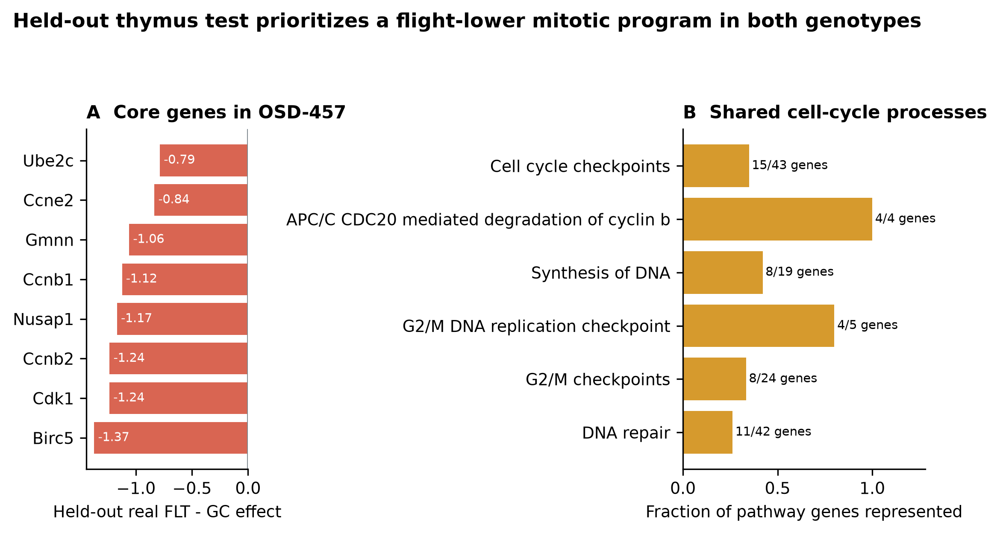
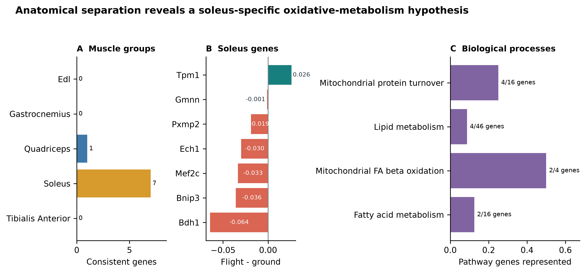
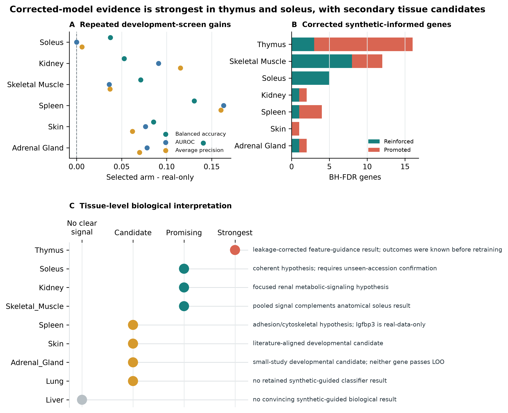

<h1>A configurable generative transcriptomics framework reveals thymic proliferative suppression and soleus metabolic remodeling in spaceflown mice</h1>

Benchmarking conditional WGAN and diffusion models across NASA OSDR mouse transcriptomes

Jason Trinh

Space Life Sciences Training Program, NASA Ames Research Center, Moffett Field, California, USA

Correspondence: jasontrinh@berkeley.edu

<strong>Research manuscript draft for author review.</strong> Author list, acknowledgments, repository release URL, and archival DOI require final review before submission.

## Abstract

**Background:** Mouse spaceflight studies provide access to tissues that cannot be sampled extensively from astronauts, but individual experiments are small and differ in design. We developed a configurable generative transcriptomics framework and asked whether synthetic expression could improve organ-specific flight analysis without treating generated profiles as new animals.

**Methods:** We assembled 1,610 mouse flight and ground-control bulk RNA-seq profiles through the NASA Open Science Data Repository API and audited all 997,515 profiles in ARCHS4 mouse. The framework varied expression transformations, feature spaces, harmonization, study scope, tissue structure, conditioning, and training regime. Paper-based WGAN-GP and diffusion implementations were screened with grouped validation, independent fidelity and effect-recovery gates, and locked testing; GeneJEPA was evaluated as a representation model because it has no expression decoder. The selected diffusion model was pretrained on 17,244 tissue-diverse ARCHS4 profiles and adapted with tissue, flight status, study, and material conditioning. Downstream evaluation moved from pooled augmentation to tissue-specific synthetic use, real-only cross-study association testing, and complete-study transfer.

**Results:** None of nine matched liver harmonization arms passed all fidelity and conditional-effect gates. A calibrated study-conditioned WGAN-GP achieved correlation 0.976, precision 0.976, recall 0.994, and F1 0.985 on validation, but remained distinguishable from real data (adversarial accuracy 0.636) and failed accession-aware effect recovery; its locked test was not opened. The adapted diffusion model was the only generator to pass the final joint locked gates. Across four seeds, correlation was 0.974, precision 0.997, recall 0.996, F1 0.997, adversarial accuracy 0.475, and the Frechet-distance ratio was 0.074. A pooled augmentation policy did not improve classification, whereas tissue-specific selection improved development metrics in several tissues. Whole-study transfer narrowed the biological evidence to thymus: in OSD-457, balanced accuracy increased from 0.500 to 0.833 and AUROC from 0.840 to 0.979. Flight thymus showed lower expression of eight mitotic genes and lower APC/C, G2/M-checkpoint, and DNA-replication programs. Soleus provided a coherent developmental result involving lower *Bdh1*, *Ech1*, *Bnip3*, and *Decr1* with higher *Tpm1*.

**Conclusions:** Model choice depended on joint fidelity and biological-effect recovery rather than one favorable metric. Diffusion provided the strongest validated generator, but synthetic data added the most information when used as a tissue-specific feature prior rather than apparent sample size. The findings support reduced thymic proliferative renewal, reinforce a soleus mitochondrial and contractile response, and nominate focused renal and spleen candidates for prospective testing.

**Keywords:** spaceflight; bulk RNA-seq; synthetic data; thymus; soleus; kidney; NASA OSDR; ARCHS4

## Introduction

Spaceflight affects immune, musculoskeletal, metabolic, and barrier tissues through a combination of microgravity, radiation, confinement, altered nutrition, stress, and mission-specific procedures. Mouse flight experiments provide tissue access that is unavailable in astronauts, but their transcriptomic interpretation is difficult. Individual studies are small, missions differ in strain and duration, and condition labels can be entangled with study, material, genotype, or collection protocol. Pooling samples without preserving these design variables can convert study effects into apparent flight biology.

The NASA Open Science Data Repository (OSDR) now exposes sample metadata and processed assay data through a queryable biological API [1]. This makes it possible to assemble a cross-study cohort without relying on a precombined raw HDF5 object and to retain accession-level provenance. Public reference resources offer a second opportunity. ARCHS4 uniformly processes a large fraction of public human and mouse RNA-seq data [2], providing tissue-diverse reference profiles for pretraining models that would be underdetermined on OSDR alone.

Deep generative models can learn high-dimensional expression distributions. Conditional WGAN-GP models have reproduced tissue and cancer properties in GTEx and TCGA [3]. More recently, Lacan and colleagues adapted denoising diffusion probabilistic and implicit models to bulk transcriptomics and reported strong gene-correlation, neighborhood, adversarial, and downstream classification metrics [4]. GeneJEPA instead learns masked-gene representations without reconstructing expression [5]. These approaches solve different problems: a generator can sample expression, whereas a representation learner needs an additional decoder or generative objective before it can do so.

The model is only one part of the problem. Multi-study bulk RNA-seq can be represented as counts, CPM, TPM, or transformed and scaled expression; studies can be corrected, explicitly conditioned, modeled separately, or pooled. Published spaceflight workflows have used within-study standardization [31] and compared ComBat, ComBat-seq, and MBatch correction families [32]. MOBER offers a learned, inductive alternative based on an adversarial conditional variational autoencoder [33]. Any of these choices can improve one diagnostic while erasing flight-related structure or making held-out studies unrealistically easy to distinguish.

We built a common framework around three model families and the preprocessing, harmonization, cohort, conditioning, and training choices surrounding them. The search was staged rather than exhaustive: inexpensive screens removed unsuitable branches before paper-duration training and locked evaluation. Models were required to pass correlation, neighborhood, adversarial, distributional, diversity, memorization, and FLT/GC-effect gates independently. No composite score allowed one strong metric to compensate for another weak one.

Synthetic expression is commonly presented as a remedy for small sample size. Generated profiles, however, are not new biological replicates. After model selection, we separated four downstream questions: whether one pooled augmentation strategy helped at all, whether different tissues benefited from different synthetic-data uses, whether prioritized genes were associated with flight in real samples, and whether a frozen policy transferred to an entirely excluded study.

Our primary biological questions were whether this approach could clarify the tissue response to spaceflight, whether anatomical separation would expose muscle-specific responses hidden by pooling, and whether the resulting signals complemented pathway-level findings from expiMap.

The clearest findings arose in thymus and soleus. Thymus supplied a held-out test in a study excluded from ARCHS4 pretraining, OSDR adaptation, and feature-policy development. Soleus supplied a cross-study metabolic signal that is biologically coherent but still needs confirmation in a newly collected or fully unseen study. Kidney, pooled skeletal muscle, spleen, skin, and adrenal gland supplied secondary developmental candidates. Results from the remaining tissues define the exploratory boundary of the approach.

<strong>Figure 1. Configurable generative transcriptomics framework.</strong> (A) ARCHS4 supplied tissue-diverse reference profiles and the NASA OSDR API supplied flight and ground-control profiles with study provenance. (B) Configurable axes covered expression representation, harmonization, model family, training scope, cohort structure, and conditioning. (C) GEO series and OSDR accessions were grouped during model selection. The selected DDIM then supported tissue-specific synthetic-use analysis; biological effects and false-discovery rates always came from real OSDR samples.

## Materials and methods

### Data sources

The OSDR Biological Data API was used to identify *Mus musculus* bulk RNA-seq assays with flight or ground-control labels [1]. Tissue and material names were harmonized while preserving study provenance. The resulting cohort contained 1,610 biological profiles from 75 accessions: 835 flight and 775 ground control. Full-transcriptome expression was converted to transcripts per million before selecting a 974-gene mouse landmark panel. No raw integrated OSDR H5 file was used.

The local ARCHS4 mouse resource contained 997,515 public RNA-seq profiles [2]. All nine GEO series linked from the API-derived OSDR metadata were excluded before reference selection, removing 108 otherwise eligible profiles and preventing cross-resource sample overlap. A healthy-preferred, tissue-balanced subset of 17,244 profiles spanning 20 tissue classes was then used for model pretraining. Complete GEO series were assigned to one reference role, producing 10,150 training, 2,466 validation, and 4,628 test profiles with no series overlap. This backbone was used for both the held-out test and the broad development screens.

**Table 1. Data scope.**

| Source | Profiles used | Biological scope | Role |
|---|---:|---|---|
| ARCHS4 mouse v2.5 | 17,244 | 20 tissue classes | Mouse tissue pretraining |
| NASA OSDR API | 1,610 | 75 accessions; 835 flight and 775 ground control | Spaceflight analysis |

### Configurable generative benchmark

The framework separated decisions that are often bundled into one model configuration. Expression could be represented as raw counts, CPM, or TPM and then left untransformed or subjected to log, z-score, robust, or MaxAbs transformations. Feature spaces included all shared genes, fold-selected highly variable genes, Reactome genes, and mapped mouse L1000 landmarks. Cohorts could contain one study, a selected multi-study subset, or every eligible accession. Models could be pooled with tissue conditioning or fitted per tissue, with optional FLT/GC, study, material, muscle-group, sex, assay, platform, and source inputs.

Three training regimes were available: OSDR only, ARCHS4 only, and ARCHS4 pretraining followed by OSDR adaptation. The design matrix also included unconditional controls and study-conditioned versus study-unconditioned models. It defined a staged search rather than an exhaustive Cartesian sweep. Smoke tests and lower-cost screens removed branches before paper-duration training, repeat evaluation, and locked testing.

**Table 2. Configurable pipeline and selected analysis branch.**

| Axis | Alternatives represented in the framework | Selected branch for downstream analysis |
|---|---|---|
| Expression | Raw, CPM, TPM; log1p/log2p1; z-score, robust, or MaxAbs scaling | Full-transcriptome TPM, then train-fitted MaxAbs scaling |
| Feature space | All shared genes, fold-selected HVGs, Reactome genes, mapped mouse L1000 | 974 mapped mouse L1000 landmarks |
| Harmonization | None, two study-wise z-score schemes, ComBat, ComBat-seq, three MBatch methods, MOBER | No global batch correction; accession represented as a condition |
| Training data | OSDR only, ARCHS4 only, ARCHS4 pretraining plus OSDR adaptation | ARCHS4 pretraining plus OSDR adaptation |
| Cohort structure | One or multiple studies; pooled or per-tissue fitting | All eligible OSDR accessions in a pooled tissue-conditioned generator |
| Conditions | FLT/GC, tissue, study, material, muscle group, and available design covariates | Tissue, FLT/GC, accession, and material |
| Model | WGAN-GP, DDIM, GeneJEPA representation screen | Factorized conditional DDIM |
| Validation | Grouped validation, repeat generation, locked test, unconditional controls | Four-seed 293-profile locked OSDR test |

### Preprocessing and harmonization

Each generator received its paper-based preprocessing and a shared benchmark representation. The WGAN-GP branch used log-transformed expression with training-gene z-scores [3]. The diffusion branch used TPM, a mapped mouse landmark panel, and training-fitted MaxAbs scaling [4]. GeneJEPA used its sparse log-transformed token representation and a global nonzero-expression standardization [5]. All feature selection and transform statistics were fitted on training partitions.

Nine harmonization arms were compared in a matched liver diffusion experiment: no correction, the within-study standardization used by Ilangovan et al. [31], a mentor-proposed within-study then global z-score, ComBat, ComBat-seq, MBatch Median Polish, MBatch Empirical Bayes, MBatch ANOVA [32], and MOBER [33]. ComBat, ComBat-seq, and MBatch do not provide a natural frozen transform for a new batch, so their held-out applications were labeled transductive sensitivity analyses. MOBER supplied an inductive learned projection. A harmonizer could advance only if it preserved both expression fidelity and FLT/GC effects; reduced study separation alone was insufficient.

### Model implementations and training regimes

The WGAN-GP reproduced the Viñas et al. generator and critic topology: 64-dimensional noise, two 256-unit hidden layers, five critic updates per generator update, gradient-penalty weight 10, and the released RMSProp settings [3]. The diffusion branch reproduced the 974-landmark architecture of Lacan et al., with two 8,192-unit hidden blocks, 1,000 diffusion timesteps, quadratic noise schedule, Adam optimization, OneCycle scheduling, mixed precision, and exponential moving average [4,13,14]. The ARCHS4 reference model was trained for 15,000 epochs on an NVIDIA A100.

GeneJEPA was evaluated with its released 768-dimensional, 24-block architecture [5]. It has no expression decoder, so it could be assessed for tissue representation but could not produce synthetic RNA-seq profiles. It was not treated as a third generator, and no unvalidated decoder was attached.

### Model validation and selection

Complete GEO series were grouped in ARCHS4 splits, and complete OSDR accessions were grouped for model selection where the protocol required study-level separation. Candidate generators were evaluated with gene-correlation agreement, precision, recall, F1, external real-versus-synthetic adversarial accuracy, and Frechet distance in a real-fitted mouse expression embedding [15,16]. Diversity and nearest-neighbor memorization were tested separately. Conditional models also had to recover pooled FLT/GC effects and accession-aware skeletal-muscle effects.

The nominal fidelity gates were correlation at least 0.98, precision at least 0.95, recall at least 0.85, F1 at least 0.90, adversarial accuracy from 0.40 to 0.60, and Frechet distance no greater than the 95th percentile of real-versus-real splits. For small OSDR partitions, correlation was also compared with a prespecified finite-sample real-bootstrap floor; the absolute 0.98 target remained reported. Metrics were gated independently, with no composite score or compensating rank. A locked test was opened only after a candidate passed its preceding selection stage.

### Selected conditional diffusion model

The selected generator was the only candidate to pass the final joint locked gates. It used the 17,244-profile ARCHS4 backbone and a factorized OSDR adaptation with tissue, FLT/GC, accession, and material inputs. This allowed generation of flight or ground-control expression for represented tissue and study contexts. A designated accession-excluded adaptation was used for the fixed lung/thymus experiment; the broad adaptation supplied the repeated all-tissue and anatomical-muscle development screens. Exact training stages, calibration, seeds, and hardware records are provided in the supplementary methods.

### Evaluation funnel and synthetic-guided analysis

Evaluation used four stages. First, a pooled locked benchmark compared real-only, generated-only, and real-plus-generated training. This asked whether one synthetic-data policy generalized across tissues. Second, each tissue was evaluated separately with five candidate uses: real-only training, generated-only training, real-plus-generated training, synthetic-guided feature ranking with a real-only classifier, and guided training with generated profiles assigned 0.05 total weight. Nested development splits withheld profiles but retained representation from the same accessions. These are within-study development results, not evidence of transfer to a new study. Synthetic attribution was retained only when the selected arm was nonworse than real-only training across balanced accuracy, AUROC, and average precision under the frozen eligibility rule.

Third, stable features from the selected tissue arm were compared with stable real-only features. Genes stable under both approaches were interpreted as reinforced. Genes stable only under the eligible synthetic-informed arm were interpreted as synthetic-promoted. "Synthetic-promoted" describes repeated feature selection; it does not mean that a gene was absent from real expression or biologically novel.

Fourth, whole-study transfer was tested by excluding complete OSDR accessions from generator adaptation and classifier development. This is stricter than holding out profiles from represented studies because the test study contributes no training context. An earlier accession-held-out augmentation screen and its expanded skeletal-muscle evaluation were retained as context, while the fixed lung and thymus experiment supplied the primary transfer test.

Flight-minus-ground effects were estimated within each OSDR study and then summarized with a random-effects model [17]. Within each tissue, the 974 gene-level meta-analysis P values were adjusted with the Benjamini-Hochberg procedure, and BH FDR below 0.05 defined the primary statistical inclusion rule [6]. Benjamini-Hochberg correction controls the expected proportion of false discoveries among the reported genes while retaining more power than family-wise error correction. Synthetic selection status was then recorded separately as reinforced, synthetic-promoted, real-only, or not stably selected. Accession-direction agreement, between-study heterogeneity, and leave-one-accession-out results were retained as interpretation and sensitivity measures rather than inclusion requirements. The complete BH-FDR inventory is provided in Supplementary Table S17, its synthetic-guided subset in Table S16, and tissue-level counts in Table S18. Reactome was used to group selected genes into biological processes [7].

### Interpretation of the four stages

The stages answer different questions and should not be collapsed into one performance claim. Development screens identify where and how synthetic data may be useful. Real-only random-effects tests establish association in the observed studies. Complete-study transfer asks whether a frozen policy applies outside its development studies and therefore provides the strongest validation.

**Table 3. Evaluation stages and permitted interpretation.**

| Stage | Analysis | Data separation | Question answered | Permitted interpretation |
|---|---|---|---|---|
| 1 | Pooled utility benchmark | Locked profiles from represented studies | Does one synthetic-data policy help across tissues? | Method-level positive or negative result; no biological claim |
| 2 | Tissue-specific five-arm screen | Held-out profiles within represented accessions | Which synthetic use, if any, helps each tissue? | Developmental utility and stable feature nomination |
| 3 | Real-data random-effects BH FDR | FLT-GC effects estimated separately within each accession | Are nominated genes associated with flight in observed studies? | Real biological association; synthetic status reported separately |
| 4 | Whole-study transfer | Complete OSDR accessions absent from adaptation and policy development | Does a frozen synthetic-informed policy transfer to a new study context? | Strongest synthetic-utility evidence; still requires prospective replication |

Signals supported by Stages 2 and 3 but lacking Stage 4 evidence are described as developmental or exploratory. Generative findings were also compared with the separate expiMap pathway analysis [12] to identify convergent and complementary tissue responses.

For a secondary spleen comparison, study-level *Igfbp3* effects were checked against full-transcriptome TPM values. Healthy sorted-cell and single-cell references, GSE156162 and E-MTAB-7703, were then examined to identify the normal spleen populations expressing *Igfbp3* [18,19]. The model did not select *Igfbp3*, so this analysis is reported as real-data context rather than a synthetic-guided finding.

## Results

### Broad-reference and representation screens defined the starting point

The ARCHS4 diffusion model retained broad tissue information. Classifiers trained on real and synthetic reference profiles each achieved balanced accuracy 0.781 on 4,628 held-out profiles from complete GEO series. Precision was 0.951, recall 0.890, F1 0.919, adversarial accuracy 0.515, and the Frechet-distance ratio was 0.866. Gene-correlation agreement was 0.878 and failed its prespecified floor. We therefore retained the model only as tissue-conditioned initialization and required OSDR adaptation to pass a separate validation sequence.

The GeneJEPA duration screen achieved held-out tissue balanced accuracy 0.703, compared with 0.839 from expression in that screen. This indicated that the representation contained tissue information but did not outperform the input expression. More importantly for the present objective, the released model had no expression decoder and could not enter the synthetic-generation comparison.

### Harmonization improved individual metrics but not the full conditional objective

The matched liver benchmark used the same conditional diffusion architecture, seed, 974 genes, and 119/50 training/validation profiles for each arm; the 70-profile locked test was not used for this screen. None of the nine harmonization strategies passed all independent fidelity, pooled-condition, and accession-effect gates (Fig. 2D; Supplementary Tables S21-S22).

The mentor two-stage z-score was the most balanced conventional arm, with correlation 0.348, precision 0.440, recall 1.000, F1 0.611, adversarial accuracy 0.690, and Frechet ratio 0.977. MOBER produced the highest correlation, 0.808, but precision was 0.260, F1 was 0.413, adversarial accuracy was 0.770, and the Frechet ratio was 33.311. ComBat, ComBat-seq, and the MBatch methods had correlations near zero and Frechet ratios from 44.716 to 205.470. Thus better alignment on one statistic did not produce a usable conditional generator. The final path retained TPM/MaxAbs expression without global batch correction and represented accession explicitly during OSDR adaptation.

### Diffusion passed the joint gates that rejected WGAN-GP

The calibrated study-conditioned WGAN-GP had strong validation correlation, precision, recall, and F1: 0.976, 0.976, 0.994, and 0.985 across six generation seeds. Its Frechet ratio was also low at 0.144. However, external adversarial accuracy was 0.636, outside the accepted 0.40-0.60 interval, so real and generated profiles remained separable. Pooled FLT/GC-effect recovery passed in all six repeats, but the skeletal-muscle accession-aware gate passed in none. No WGAN repeat passed the full fidelity gate, and its locked test remained unopened.

The OSDR-adapted DDIM passed all six locked fidelity criteria in each of four generation repeats. Mean correlation was 0.974, precision 0.997, recall 0.996, F1 0.997, adversarial accuracy 0.475, and Frechet ratio 0.074. Correlation remained below the absolute paper target of 0.98 but exceeded the prespecified finite-sample real-bootstrap floor in all four repeats. Pooled FLT/GC-effect recovery passed in three of four repeats, and skeletal-muscle accession-effect recovery passed in all four. Diffusion was therefore selected because it passed the final joint gates, not because every individual value was numerically better than WGAN-GP (Table 4).

<strong>Figure 2. Generator benchmarking and selection.</strong> (A) Real-trained and synthetic-trained classifiers retained the same broad ARCHS4 tissue balanced accuracy. (B) Calibrated WGAN-GP validation metrics and DDIM locked-test metrics; these are consecutive selection stages, not a paired test-set comparison. The shaded band marks the accepted adversarial-accuracy interval. (C) Fraction of four locked DDIM generation seeds passing each fidelity and effect-recovery gate. (D) Correlation and F1 in the nine-arm matched liver harmonization benchmark. Dashed lines mark the absolute targets; no harmonization arm passed the joint criteria.

**Table 4. Staged generator selection. WGAN-GP failed validation, so its locked test was not opened; DDIM values are from the later locked test and are not a paired comparison on the same split.**

| Model | Evaluation split | Corr. | Precision | Recall | F1 | AA | FD/real P95 | FLT/GC gate | Accession gate | Decision |
|---|---|---:|---:|---:|---:|---:|---:|---:|---:|---|
| Broad-reference DDIM | 4,628 held-out ARCHS4 profiles | 0.878 | 0.951 | 0.890 | 0.919 | 0.515 | 0.866 | NA | NA | Retained only as initialization |
| Study-conditioned WGAN-GP | 536-profile validation; 6 seeds | 0.976 | 0.976 | 0.994 | 0.985 | 0.636 | 0.144 | 6/6 | 0/6 | Rejected; test unopened |
| Factorized DDIM | 293-profile locked OSDR test; 4 seeds | 0.974 | 0.997 | 0.996 | 0.997 | 0.475 | 0.074 | 3/4 | 4/4 | Selected |

### Diffusion generation recovered tissue-conditioned expression structure

The reverse trajectory provides a direct view of the model transforming noise into tissue-conditioned expression. In the ARCHS4 reference model, profiles moved from an overlapping noise cloud at timestep 1,000 toward the tissue-structured real-data manifold at timestep 0 (Fig. 3, top). After OSDR adaptation, locked real and generated profiles occupied similar tissue-defined regions, and flight and ground-control profiles remained interspersed within that broader structure (Fig. 3, bottom). These two-dimensional projections are descriptive: model selection used the full correlation, precision, recall, adversarial, Frechet-distance, and conditional-effect gates rather than visual similarity.

### Pooled augmentation failed, but tissue-specific synthetic use helped during development

A single pooled augmentation policy was not useful. On the locked OSDR test, balanced accuracy was 0.754 with real-only training, 0.695 with generated-only training, and 0.737 with real-plus-generated training. This negative result did not imply that every tissue responded identically. When synthetic use was selected separately by tissue, several arms improved balanced accuracy, AUROC, and average precision within represented studies (Table 5). Different tissues selected different uses: spleen, skin, and soleus selected real-plus-generated training; pooled skeletal muscle selected feature guidance with a real-only classifier; kidney and thymus selected low-weight guided training; and lung and adrenal gland selected generated-only training. These are development-screen results because profiles, rather than complete studies, were withheld.

**Table 5. Selected tissue-specific development results. Every displayed synthetic-informed arm met the balanced-accuracy, AUROC, and average-precision eligibility rule. Full results are in Supplementary Table S20.**

| Tissue | Selected synthetic use | Balanced accuracy, real to selected | AUROC, real to selected |
|---|---|---:|---:|
| Thymus | Low-weight guided training | 0.733 to 0.844 | 0.818 to 0.887 |
| Skeletal muscle, pooled | Feature-guided real-only classifier | 0.861 to 0.932 | 0.924 to 0.961 |
| Soleus | Real plus generated | 0.925 to 0.963 | 0.980 to 0.980 |
| Kidney | Low-weight guided training | 0.654 to 0.707 | 0.680 to 0.771 |
| Spleen | Real plus generated | 0.517 to 0.648 | 0.540 to 0.704 |
| Skin | Real plus generated | 0.671 to 0.756 | 0.691 to 0.768 |
| Lung | Generated only | 0.664 to 0.742 | 0.680 to 0.830 |
| Adrenal gland | Generated only | 0.781 to 0.922 | 0.906 to 0.984 |

  

    
    
  

  
<strong>Figure 3. Diffusion generation across reference pretraining and OSDR adaptation.</strong> Top: ARCHS4 tissue-conditioned profiles at DDIM timesteps 1,000, 200, and 0 in a PCA space fitted to real reference expression; gray points are real ARCHS4 profiles and colors identify generated tissue conditions. Bottom: locked OSDR profiles for generation seed 5020; circles denote real profiles and crosses denote generated profiles, colored by tissue on the left and flight condition on the right. PCA views are descriptive and do not replace the quantitative validation gates.

### Synthetic-informed selection identified real-data associations

The real-data screen yielded 202 BH-FDR tissue-gene associations across 10 of 22 canonical tissue analyses and 257 across the five anatomical muscle groups. These are tissue-gene results rather than 459 unique or independent discoveries: a gene can be significant in more than one tissue, and pooled skeletal muscle overlaps its anatomical subgroups. Forty-nine associations also entered stable synthetic-informed selection: 26 were synthetic-promoted and 23 were reinforced by both real-only and synthetic-informed selection.

All 459 P values and FDR values came from real profiles. Synthetic data affected only whether a gene was repeatedly prioritized and, for eligible augmentation arms, classifier fitting. Synthetic labels were suppressed where the selected arm failed its metric gate; quadriceps, EDL, and liver therefore contribute real-data associations but no synthetic-informed claims. The complete inventory, including associations with mixed study directions, is provided in Supplementary Tables S16-S18.

### Whole-study transfer narrowed the evidence to thymus

The development gains did not uniformly transfer to excluded studies. In an initial six-tissue feature-guidance transfer screen, only lung and thymus met the advancement rule. Liver and kidney gained balanced accuracy but lost AUROC, while retina and skin did not improve. In the fixed follow-up, thymus improved on all three metrics, whereas lung balanced accuracy declined from 0.400 to 0.350 and the result was rejected.

Separate frozen augmentation experiments reached the same general conclusion. Heart balanced accuracy improved in a five-profile test, but AUROC and average precision were unchanged, making this a small exploratory result. Pooled skeletal muscle improved in the first two-accession test, but extension of the same recipe to all 11 eligible held-out accessions changed balanced accuracy only from 0.655 to 0.658 while AUROC fell from 0.718 to 0.690. Spleen also failed its initial held-out criterion. Thus tissue-specific development gains identify useful hypotheses, but only thymus supplied a strong retained whole-study result.

**Table 6. Selected complete-accession tests. Experiments used separately frozen policies and are shown to distinguish initial gains from broader transfer.**

| Tissue and experiment | Accessions / profiles | Synthetic use | Balanced accuracy, real to informed | AUROC, real to informed | Interpretation |
|---|---:|---|---:|---:|---|
| Thymus, fixed test | 1 / 24 | Feature guidance | 0.500 to 0.833 | 0.840 to 0.979 | Retained primary transfer result |
| Lung, fixed test | 1 / 20 | Low-weight guidance | 0.400 to 0.350 | 0.450 to 0.470 | Failed confirmation |
| Heart, early screen | 1 / 5 | Real plus generated | 0.333 to 0.583 | 0.667 to 0.667 | Exploratory because of test size |
| Skeletal muscle, initial | 2 / 24 | Real plus generated | 0.875 to 0.917 | 0.958 to 0.972 | Initial gain |
| Skeletal muscle, full extension | 11 / 159 | Real plus generated | 0.655 to 0.658 | 0.718 to 0.690 | Initial gain did not generalize |
| Spleen, initial | 2 / 29 | Real plus generated | 0.750 to 0.725 | 0.766 to 0.794 | Failed criterion |

### Thymus shows lower proliferative renewal during spaceflight

OSD-457 provided the strongest result. Its GEO series and every other OSDR-linked GEO series were excluded from ARCHS4 pretraining, and OSD-457 was excluded from OSDR adaptation and feature-policy development. In this held-out test, synthetic-guided gene selection improved separation of flight and ground-control thymus samples from balanced accuracy 0.500 to 0.833 and AUROC 0.840 to 0.979. The result held in both wild-type and Nrf2-knockout mice. Flight effects were closely aligned between the two genotypes.

The core genes *Birc5*, *Ccne2*, *Gmnn*, *Ube2c*, *Cdk1*, *Nusap1*, *Ccnb1*, and *Ccnb2* were lower in flight in both strata (Fig. 4A). These were not genes absent from the real-data analysis: all eight were among its 26 highest-ranked candidates, including four among the top ten. Synthetic guidance instead assembled a broader, coherent cell-cycle panel that transferred more effectively to the study-excluded test. Together, these genes regulate DNA replication, chromosome progression, mitotic entry, and completion of cell division. Reactome analysis connected them to APC/C-mediated cyclin degradation, G2/M checkpoints, DNA synthesis, and broader cell-cycle control (Fig. 4B).

We interpret the study-held-out result as panel-level reinforcement and organization, not de novo gene discovery. In the repeated development screen, *Birc5*, *Cdk1*, *Nusap1*, *Ccne2*, and *Ccnb2* crossed the stable-selection threshold only with synthetic guidance; *Gmnn* and *Ube2c* were reinforced by both arms; and *Ccnb1* remained BH-significant but did not cross either stability threshold. These labels describe repeated selection behavior and do not override the stronger held-out result. The complete cross-analysis mapping is provided in Supplementary Table S19.

Prior thymus studies report related biology, although the present result is more specific. STS-135 mouse thymus showed changes in cell-cycle and DNA-damage programs, including lower checkpoint-related expression [8]. A later ISS experiment reported marked thymus mass loss and partial artificial-gravity rescue of cell-cycle expression [9]. The current signature emphasizes mitotic completion and replication rather than acute apoptosis alone. Agreement between genotype strata suggests that the predictive signature is not confined to one Nrf2 background, but it does not prove Nrf2 independence.

Bulk thymus expression cannot distinguish lower transcription within proliferating thymocytes from loss or redistribution of proliferating cell populations. The defensible biological conclusion is lower abundance of a mitotic transcript program in flight, consistent with reduced proliferative renewal. Cell-resolved or histological confirmation is required to assign the effect to a cell-intrinsic mechanism.

<strong>Figure 4. Thymus response to spaceflight.</strong> (A) Flight-minus-ground effects in real OSD-457 profiles for eight cell-cycle genes that were lower in both wild-type and Nrf2-knockout mice. (B) The genes converge on a mitotic and DNA-replication process family.

### Anatomical separation exposes a soleus-specific metabolic program

Aggregate skeletal muscle concealed substantial anatomical heterogeneity. We therefore examined extensor digitorum longus, gastrocnemius, quadriceps, soleus, and tibialis anterior separately. Soleus produced the clearest biological pattern: its selected genes showed consistent flight effects across three accessions and converged on related metabolic processes.

The soleus screen selected real-plus-generated training. Balanced accuracy increased from 0.925 to 0.963, AUROC remained 0.980, and average precision increased from 0.980 to 0.986. Five BH-FDR genes were stable in both real-only and synthetic-guided selection: *Bdh1*, *Ech1*, *Bnip3*, and *Decr1* were lower in flight in all three accessions, while *Tpm1* was higher (Fig. 5B). Four genes passed leave-one-accession-out FDR; *Decr1* did not.

The model did not promote a soleus gene absent from stable real-only selection. Its contribution was reinforcement of a coherent existing pattern. Reactome connected the retained genes to mitochondrial protein turnover, mitochondrial fatty-acid beta-oxidation, and lipid metabolism (Fig. 5C). *Bdh1* and *Ech1* support oxidative substrate handling, *Bnip3* supports mitochondrial quality control, *Decr1* contributes to unsaturated fatty-acid oxidation, and *Tpm1* suggests contractile remodeling.

Prior 30-day spaceflight profiling of mouse soleus reported a slow-to-fast shift and broad changes in oxidative metabolism, PPAR signaling, and contractile genes [10]. Unloading studies have also reported reduced soleus fatty-acid oxidation [11]. This is literature-supported panel reinforcement rather than de novo gene discovery.

Unlike thymus, soleus was represented during model development. Its cross-study consistency makes it a focused biological hypothesis, but an entirely unseen soleus study is still needed for independent confirmation.

<strong>Figure 5. Skeletal-muscle and soleus response.</strong> (A) Number of synthetic-informed genes that also pass real leave-one-accession-out FDR in each anatomical muscle group. (B) Five reinforced soleus BH-FDR genes with consistent real flight effects. (C) Their strongest shared biological processes center on mitochondrial turnover and lipid metabolism.

### Other muscle groups provide narrower hypotheses

The pooled skeletal-muscle screen selected synthetic-guided feature ranking and improved balanced accuracy, AUROC, and average precision by 0.071, 0.036, and 0.037. Twelve BH-FDR genes were synthetic-informed, nine of which passed leave-one-accession-out sensitivity. The associated gene sets included interferon signaling and sialic-acid metabolism. Because pooled muscle combines anatomical groups with distinct physiology, this result is interpreted alongside, rather than instead of, the soleus analysis.

Among the remaining anatomical groups, tibialis anterior retained a real-plus-generated arm and gastrocnemius retained a low-weight guided arm. Tibialis anterior reinforced *Cdkn1a*, *St3gal5*, and *Bnip3* and promoted *Cebpd*; gastrocnemius promoted *Fhl2* and *Nfkbia*. None of these genes passed leave-one-accession-out FDR. EDL and quadriceps selected real-only arms, so their BH-FDR genes, including quadriceps *Rbm6*, are retained in the complete real-data inventory but are not attributed to the synthetic workflow.

### Spleen screen nominates adhesion and cytoskeletal genes

The spleen screen selected real-plus-generated training. Balanced accuracy increased from 0.517 to 0.648, AUROC from 0.540 to 0.704, and average precision from 0.589 to 0.749. Synthetic guidance promoted flight-higher *Rai14*, *Ptprk*, and *Myl9* and reinforced flight-higher *Loxl1*. *Rai14*, *Ptprk*, and *Loxl1* had the same direction in all six studies; *Myl9* agreed in five of six. None passed leave-one-accession-out FDR, and the set did not produce significant Reactome enrichment.

The four genes provide a tentative structural hypothesis rather than a pathway claim. RAI14 links actin-associated mechanosensing to Hippo signaling, PTPRK regulates cell-cell junctions, MYL9 contributes to actomyosin contractility, and LOXL1 supports elastic extracellular-matrix maintenance [25-27]. Their shared direction is compatible with altered adhesion, mechanics, or tissue architecture, but the present bulk data cannot identify a common source cell or establish one mechanism.

*Igfbp3* remains a notable but separate real-data association. It was higher in flight in all six eligible spleen studies, with a random-effects FDR of `1.76e-9`; the largest FDR after removing one study at a time was `0.00385`. A full-transcriptome TPM sensitivity calculation showed 9% to 63% higher group means in flight. Healthy references localized baseline *Igfbp3* mainly to fibroblastic reticular, collagen-producing, and perivascular stromal populations [18,19], and spaceflight proteomics has reported increased IGFBP3 in serum and femur under microgravity relative to onboard artificial gravity [20]. However, the synthetic workflow did not select *Igfbp3*. It is therefore retained as a real-data stromal hypothesis, not evidence that synthetic guidance discovered or reinforced the gene.

### Other organ responses were heterogeneous

Lung produced large repeated development-screen gains and cell-cycle, senescence, and PI3K/AKT-related enrichment, but no selected gene passed the real-data BH-FDR screen. More importantly, the fixed OSD-900 test lost balanced accuracy and failed its validation gate. Lung therefore demonstrates why within-study separation and pathway enrichment cannot substitute for study-held-out transfer.

Skin selected real-plus-generated training and promoted flight-higher *Plscr1*. *Plscr1* passed BH FDR and had the same direction in all six studies, although it did not pass leave-one-accession-out FDR. Broader selected sets were enriched for G1/S and DNA-repair processes, consistent with prior OSDR skin analyses reporting strong mission, strain, recovery-interval, and anatomical-site dependence [21]. This is a literature-aligned developmental candidate rather than a confirmed transferable signal.

Kidney produced the clearest secondary gene-level result. *Slc37a4* was reinforced by both selection arms and was higher in flight in all six kidney accessions. Synthetic guidance also promoted flight-higher *Inpp4b*; it passed BH FDR and remained significant in leave-one-accession-out analysis, although one of six accession effects was negative. The selected pair did not yield significant Reactome enrichment. *Slc37a4* supports renal glucose handling, while *Inpp4b* nominates phosphoinositide signaling. Both require prospective study-level confirmation and should be interpreted alongside prior reports of strain-dependent lipid, ECM, TGF-beta, Wnt, and nephron-remodeling responses [22-24].

Adrenal gland produced flight-lower synthetic-promoted *Psmb8* and reinforced *Tspan4*, each with the same direction in all three studies but neither passing leave-one-accession-out FDR. Retina showed repeated predictive gains and selected-set enrichment but no synthetic-informed BH-FDR gene. Liver selected the real-only arm: its 19 real-data BH-FDR genes remain in the complete inventory, but none support a synthetic-guided claim. Quadriceps and EDL likewise selected real-only arms.

### Comparison with expiMap shows convergence and complementarity

The evidence distribution differs from the separate expiMap analysis. Both approaches prioritize thymus. expiMap produced its broadest pathway evidence in thymus, skin, spleen, and kidney, whereas the generative workflow added its clearest complementary result in soleus and a focused kidney pair. The methods examine different biological representations: expiMap tests predefined pathway activity, while synthetic guidance helps prioritize individual genes and their shared processes.

<strong>Figure 6. Tissue evidence.</strong> (A) Repeated development-screen changes relative to real-only models for selected tissues. (B) BH-FDR genes promoted or reinforced by the synthetic workflow; synthetic labels are suppressed where the generated arm failed its metric gate. (C) Thymus remains the strongest result, soleus and pooled muscle provide the clearest process-level complement, kidney supplies a focused secondary pair, and spleen, skin, and adrenal gland remain developmental.

**Table 7. Selected synthetic-guided biological interpretations by tissue. Complete real-data BH-FDR results are in Supplementary Tables S17-S18.**

| Tissue | Main signal | Interpretation |
|---|---|---|
| Thymus | Lower mitotic genes; APC/C, G2/M, and DNA replication | Strongest result; supports reduced proliferative renewal |
| Soleus | Reinforced FLT-lower *Bdh1*, *Ech1*, *Bnip3*, and *Decr1*; FLT-higher *Tpm1* | Coherent mitochondrial and lipid-metabolism program; no promoted gene |
| Skeletal muscle, pooled | 12 synthetic-informed BH-FDR genes; interferon and sialic-acid terms | Developmental complement to the anatomically specific soleus result |
| Kidney | Promoted *Inpp4b* and reinforced *Slc37a4*, both FLT-higher | Focused renal metabolic-signaling hypothesis |
| Spleen | Promoted *Rai14*, *Ptprk*, and *Myl9*; reinforced *Loxl1* | Developmental adhesion/cytoskeletal hypothesis |
| Skin | Promoted FLT-higher *Plscr1* plus cell-cycle/DNA-repair enrichment | Literature-aligned developmental candidate |
| Adrenal gland | Promoted *Psmb8* and reinforced *Tspan4*, both FLT-lower | Three-study developmental candidate |
| Tibialis anterior | Reinforced *Cdkn1a*, *St3gal5*, and *Bnip3*; promoted *Cebpd* | Exploratory stress and metabolic response |
| Gastrocnemius | Promoted *Fhl2* and *Nfkbia* | Exploratory two-gene result without a coherent pathway |
| Lung | Within-study pathway candidates but failed OSD-900 transfer | No retained study-held-out synthetic-guided result |
| Retina | Predictive and pathway gains without a synthetic-informed BH-FDR gene | Exploratory gene/pathway mismatch |
| Quadriceps, EDL, liver | Screen retained real-only arms | Real-data BH-FDR associations are not synthetic-guided findings |

## Discussion

### Generator selection required more than distributional correlation

The benchmark separated generative quality into independent requirements. The WGAN-GP reproduced mean structure and local neighborhoods well, and its correlation was slightly higher than the final DDIM mean. It nevertheless remained distinguishable by an external real-versus-synthetic classifier and did not recover skeletal-muscle effects consistently across accessions. Conversely, the broad ARCHS4 DDIM preserved tissue identity and passed most distributional tests while missing the correlation-structure gate. Neither result alone justified biological use.

OSDR adaptation changed that balance. The factorized DDIM was the only candidate to combine near-chance external adversarial accuracy, high precision and recall, low relative Frechet distance, pooled FLT/GC recovery, and accession-aware muscle-effect recovery. The WGAN and DDIM values were obtained at consecutive stages because the WGAN failed before the locked test was opened. The evidence supports the selected diffusion lineage; it does not establish that diffusion will outperform adversarial training under every matched architecture or dataset.

The harmonization benchmark reached a similar conclusion. Study-wise transformations and learned correction could improve individual diagnostics, but none preserved the complete conditional objective on the fixed liver split. MOBER's high correlation coexisted with poor neighborhood precision, external separability, and excessive distributional distance. The two-stage z-score was more balanced but still failed the fidelity and effect gates. Explicitly representing study context proved more defensible here than forcing one globally corrected expression space.

### What synthetic data added

The pooled benchmark and tissue-specific screens answer different questions. Adding the same generated cohort across tissues did not improve classification. In tissue-specific development, however, direct augmentation, low-weight augmentation, generated-only training, and feature guidance each helped at least one tissue. No single use of synthetic expression worked across tissues.

Whole-study transfer was much more selective. The initial pooled-muscle gain disappeared when the same frozen augmentation recipe was extended to 11 accessions, and lung failed fixed confirmation despite a strong development screen. Thymus was the exception: synthetic-guided feature selection transferred to OSD-457 and organized real-supported genes into a coherent cell-cycle panel. These results support synthetic data as a tissue-specific regularizer or feature prior, not as independent biological sample size.

In thymus, the central genes already ranked strongly in real data. The synthetic-guided panel transferred after the study was removed from both reference pretraining and OSDR adaptation and converged on one interpretable cell-cycle process. The development-screen labels describe which genes crossed repeated selection thresholds and are not claims of biological novelty.

Soleus produced reinforcement rather than discovery. The synthetic arm retained the same five BH-FDR genes as stable real-only selection and sharpened balanced accuracy without improving AUROC. Independently selected genes converged on mitochondrial turnover and fatty-acid metabolism; the model did not nominate a new soleus gene.

Kidney provides the clearest promotion result outside thymus. Synthetic guidance added *Inpp4b* to reinforced *Slc37a4*, and the real-data association for *Inpp4b* survived leave-one-accession-out analysis. Spleen provides a weaker multi-gene example: *Rai14*, *Ptprk*, and *Myl9* were promoted and *Loxl1* reinforced, but none passed LOO FDR and no pathway was significant. The previously emphasized *Igfbp3* association remains biologically interesting but does not demonstrate synthetic contribution. Quadriceps and EDL selected real-only arms and therefore no longer support synthetic-guided claims.

### Thymus and soleus define the strongest organ responses

The thymus result refines established spaceflight immune biology. Prior work documents thymic involution and altered cell-cycle expression [8,9]. The current signature concentrates on cyclins, CDK1, UBE2C, BIRC5, NUSAP1, geminin, APC/C-mediated protein turnover, and G2/M control. Together these support lower proliferative renewal or a lower proportion of cycling thymocytes. Because the data are bulk, composition and cell-intrinsic regulation remain inseparable.

The soleus result addresses a different physiological axis. Weight-bearing slow muscle is especially sensitive to unloading. Lower *Bdh1*, *Ech1*, *Bnip3*, and *Decr1* together with higher *Tpm1* describe reduced oxidative substrate handling, altered mitochondrial quality control, and contractile remodeling. This is compatible with known soleus atrophy, altered lipid metabolism, and slow-to-fast transition [10,11]. It is complementary to expiMap because synthetic guidance reinforced a compact fatty-acid-oxidation panel observed consistently across soleus studies.

### Secondary and negative tissue results

The other tissues constrain the method's scope. Kidney combines one promoted and one reinforced gene but lacks pathway enrichment. Spleen combines strong within-study predictive gains with four BH-FDR genes, yet none survives the stricter LOO criterion. Skin promotes one directionally consistent gene while broader pathway enrichment remains heterogeneous. Adrenal gland has only three studies. Retina has predictive and pathway gains without a synthetic-informed BH-FDR gene. Lung fails the study-held-out test despite strong development-screen separation. Liver, quadriceps, and EDL select real-only arms.

A new thymus study should test the fixed eight-gene panel prospectively. Soleus experiments should quantify the five-gene mitochondrial and contractile panel together with fatty-acid oxidation. Kidney should test *Inpp4b* and *Slc37a4* jointly in an unseen mission. Spleen should test *Rai14*, *Ptprk*, *Myl9*, and *Loxl1* in stroma-preserving assays, while *Igfbp3* should be evaluated separately as a real-data-derived stromal hypothesis. Lung requires a prospectively genotype-stratified study rather than further tuning on OSD-900.

### Limitations

No tissue currently has a completely prospective independent biological test. OSD-457 was excluded from ARCHS4 pretraining, OSDR adaptation, and feature-policy development. Because its outcome had been examined during earlier model development, it still requires prospective replication. All other BH-FDR findings were identified within the broader model-development domain and still lack equivalent study-excluded testing. Agreement across represented real studies supports focused follow-up but does not establish transfer to a new mission or study.

The configurable matrix was executed as a gated search, not as a full factorial benchmark. Selected shared and paper-based preprocessing arms, nine liver harmonization arms, study-conditioning policies, and the leading WGAN and DDIM configurations were trained to completion. Consequently, the study identifies a validated model path rather than a universal optimum across every possible transformation and hyperparameter combination. WGAN-GP and DDIM final values also come from different selection stages because opening the WGAN locked test after failed validation would have violated the protocol.

The analysis used a 974-gene landmark panel, so relevant genes outside that panel could not be discovered. BH FDR was controlled separately within each declared tissue family, not once across every tissue-gene combination in the project. Direction disagreement and high heterogeneity do not remove a BH-significant association, but they reduce confidence that its pooled effect represents a common response across missions. Bulk tissue also cannot distinguish a transcriptional change within a cell type from a change in cell composition. The thymus result could reflect lower expression in proliferating thymocytes, fewer proliferating thymocytes, or both. The spleen structural candidates likewise cannot distinguish altered expression from altered stromal or contractile-cell abundance.

Finally, the generator represents tissues and study contexts available during training. The ARCHS4 reference failed its strict correlation-structure gate. After OSDR adaptation, the locked within-study test passed its finite-sample fidelity rule, but the preceding validation screen missed its correlation floor and muscle accession-effect gate. The broad tissue screens measure interpolation within represented studies and remain hypothesis-generating. The model should not be assumed to reproduce a new mission, strain, or sample-processing protocol without additional testing. Exact model limitations, sensitivity analyses, and statistical safeguards are documented in the supplementary methods.

## Conclusions

Synthetic expression was useful only when its role was selected for the tissue and evaluated against real-only training. A pooled augmentation policy failed, and most development gains did not establish whole-study transfer. The strongest retained use was thymus feature guidance; soleus supplied a coherent development-stage reinforcement result. The analysis supports a flight-lower thymus mitotic program, reinforces soleus mitochondrial lipid metabolism and contractile remodeling, and identifies kidney *Inpp4b* and *Slc37a4* as focused secondary candidates.

Thymus remains the strongest result because it survived complete OSDR-series removal from reference pretraining and accession exclusion from adaptation. Soleus supplies the clearest complementary process-level result. Pooled skeletal muscle, kidney, spleen, skin, adrenal gland, gastrocnemius, and tibialis anterior provide developmental hypotheses requiring unseen-study validation. Quadriceps, EDL, and liver do not support synthetic-guided claims because their real-only arms were retained. Lung failed transfer to OSD-900, and pooled-muscle augmentation did not improve the full 11-accession benchmark. The framework rejected those negative cases instead of converting every synthetic-data gain into a biological claim.

## Data and code availability

OSDR data were accessed through the public Biological Data API [1]. ARCHS4 and Reactome are public resources [2,7]. Repository scripts are under `src/nasa_mouse_rna_diffusion/`; frozen run outputs are under `outputs/generative_benchmark/`; this paper package is under `paper/synthetic_guided_spaceflight/`. The figure and table builder is `nasa_mouse_rna_diffusion.build_synthetic_guided_paper`. SHA-256 hashes of every frozen analysis input are included in `source_data/frozen_input_manifest.tsv`. Public repository URL and archival DOI will be added after author review.

## Ethics statement

This study is a secondary computational analysis of publicly available animal-study data. No new animals were used.

## Competing interests

The author declares no competing interests.

## Acknowledgments

The author acknowledges the NASA Open Science Data Repository, GeneLab data-processing teams, original flight-study investigators, ARCHS4, Reactome, and the developers of the evaluated generative-model implementations. Program and mentor acknowledgments require final author review.

## References

1. NASA Open Science Data Repository. OSDR Biological Data API. <https://visualization.osdr.nasa.gov/biodata/api/>. Accessed July 28, 2026.
2. Lachmann A, Torre D, Keenan AB, et al. Massive mining of publicly available RNA-seq data from human and mouse. *Nature Communications*. 2018;9:1366. <https://doi.org/10.1038/s41467-018-03751-6>.
3. Viñas R, Andrés-Terré H, Liò P, Bryson K. Adversarial generation of gene expression data. *Bioinformatics*. 2022;38:730-737. <https://doi.org/10.1093/bioinformatics/btab035>.
4. Lacan A, André R, Sebag M, Hanczar B. In silico generation of gene expression profiles using diffusion models. *BMC Bioinformatics*. 2026. <https://doi.org/10.1186/s12859-026-06470-8>.
5. Litman E, Myers T, Agarwal V, et al. GeneJEPA: A predictive world model of the transcriptome. *bioRxiv*. 2025. <https://doi.org/10.1101/2025.10.14.682378>.
6. Benjamini Y, Hochberg Y. Controlling the false discovery rate: a practical and powerful approach to multiple testing. *Journal of the Royal Statistical Society Series B*. 1995;57:289-300. <https://doi.org/10.1111/j.2517-6161.1995.tb02031.x>.
7. Milacic M, Beavers D, Conley P, et al. The Reactome Pathway Knowledgebase 2024. *Nucleic Acids Research*. 2024;52:D672-D678. <https://doi.org/10.1093/nar/gkad1025>.
8. Gridley DS, Mao XW, Stodieck LS, et al. Changes in mouse thymus and spleen after return from the STS-135 mission in space. *PLoS ONE*. 2013;8:e75097. <https://doi.org/10.1371/journal.pone.0075097>.
9. Horie K, Kato T, Kudo T, et al. Impact of spaceflight on the murine thymus and mitigation by exposure to artificial gravity during spaceflight. *Scientific Reports*. 2019;9:19866. <https://doi.org/10.1038/s41598-019-56432-9>.
10. Gambara G, Salanova M, Ciciliot S, et al. Gene expression profiling in slow-type calf soleus muscle of 30 days space-flown mice. *PLoS ONE*. 2017;12:e0169314. <https://doi.org/10.1371/journal.pone.0169314>.
11. Stein TP, Schluter MD, Grindeland RE, Moran MM, Baer LA, Wade CE. Rate controlling steps in fatty acid oxidation by unloaded rodent soleus muscle. *Journal of Gravitational Physiology*. 2002;9:P165-P166. PMID: 15002531.
12. Lotfollahi M, Rybakov S, Hrovatin K, et al. Biologically informed deep learning to query gene programs in single-cell atlases. *Nature Cell Biology*. 2023;25:337-350. <https://doi.org/10.1038/s41556-022-01072-x>.
13. Ho J, Jain A, Abbeel P. Denoising diffusion probabilistic models. *Advances in Neural Information Processing Systems*. 2020;33:6840-6851.
14. Song J, Meng C, Ermon S. Denoising diffusion implicit models. *International Conference on Learning Representations*. 2021. <https://arxiv.org/abs/2010.02502>.
15. Heusel M, Ramsauer H, Unterthiner T, Nessler B, Hochreiter S. GANs trained by a two time-scale update rule converge to a local Nash equilibrium. *Advances in Neural Information Processing Systems*. 2017;30.
16. Kynkäänniemi T, Karras T, Laine S, Lehtinen J, Aila T. Improved precision and recall metric for assessing generative models. *Advances in Neural Information Processing Systems*. 2019;32.
17. DerSimonian R, Laird N. Meta-analysis in clinical trials. *Controlled Clinical Trials*. 1986;7:177-188. <https://doi.org/10.1016/0197-2456(86)90046-2>.
18. Pezoldt J, Wiechers C, Erhard F, et al. Single-cell transcriptional profiling of splenic fibroblasts reveals subset-specific innate immune signatures in homeostasis and during viral infection. *Communications Biology*. 2021;4:1355. <https://doi.org/10.1038/s42003-021-02882-9>.
19. Cheng HW, Onder L, Novkovic M, et al. Origin and differentiation trajectories of fibroblastic reticular cells in the splenic white pulp. *Nature Communications*. 2019;10:1739. <https://doi.org/10.1038/s41467-019-09728-3>.
20. Kimura Y, Nakai Y, Ino Y, Akiyama T, Ryo A, Hirano H. Identification of gravity-responsive serum proteins in spaceflight mice using a quantitative proteomic approach with data-independent acquisition mass spectrometry. *Proteomics*. 2024;24:2300214. <https://doi.org/10.1002/pmic.202300214>.
21. Cope H, Elsborg J, Demharter S, et al. Transcriptomics analysis reveals molecular alterations underpinning spaceflight dermatology. *Communications Medicine*. 2024;4:106. <https://doi.org/10.1038/s43856-024-00532-9>.
22. Finch RH, Vitry G, Siew K, et al. Spaceflight causes strain-dependent gene expression changes in the kidneys of mice. *npj Microgravity*. 2025;11:11. <https://doi.org/10.1038/s41526-025-00465-0>.
23. Siew K, et al. Cosmic kidney disease: an integrated pan-omic, physiological and morphological study into spaceflight-induced renal dysfunction. *Nature Communications*. 2024;15:4923. <https://doi.org/10.1038/s41467-024-49212-1>.
24. Suzuki N, Iwamura Y, Nakai T, et al. Gene expression changes related to bone mineralization, blood pressure and lipid metabolism in mouse kidneys after space travel. *Kidney International*. 2022;101:92-105. <https://doi.org/10.1016/j.kint.2021.09.031>.
25. Jeong W, Kwon H, Park SK, Lee IS, Jho EH. Retinoic acid-induced protein 14 links mechanical forces to Hippo signaling. *EMBO Reports*. 2024;25:4033-4061. <https://doi.org/10.1038/s44319-024-00228-0>.
26. Fearnley GW, Young KA, Edgar JR, et al. The homophilic receptor PTPRK selectively dephosphorylates multiple junctional regulators to promote cell-cell adhesion. *eLife*. 2019;8:e44597. <https://doi.org/10.7554/eLife.44597>.
27. Liu X, Zhao Y, Gao J, et al. Elastic fiber homeostasis requires lysyl oxidase-like 1 protein. *Nature Genetics*. 2004;36:178-182. <https://doi.org/10.1038/ng1297>.
28. Machour FE, Abu-Zhayia ER, Awwad SW, et al. RBM6 splicing factor promotes homologous recombination repair of double-strand breaks and modulates sensitivity to chemotherapeutic drugs. *Nucleic Acids Research*. 2021;49:11708-11727. <https://doi.org/10.1093/nar/gkab976>.
29. Benbarche S, Bello Pineda JM, Baquero Galvis L, et al. GPATCH8 modulates mutant SF3B1 mis-splicing and pathogenicity in hematologic malignancies. *Molecular Cell*. 2024;84:1886-1903.e10. <https://doi.org/10.1016/j.molcel.2024.04.006>.
30. Wiltshire C, Matsushita M, Tsukada S, Gillespie DAF, May GHW. A new c-Jun N-terminal kinase (JNK)-interacting protein, Sab (SH3BP5), associates with mitochondria. *Biochemical Journal*. 2002;367:577-585. <https://doi.org/10.1042/BJ20020553>.
31. Ilangovan H, Kothiyal P, Hoadley KA, et al. Harmonizing heterogeneous transcriptomics datasets for machine learning-based analysis to identify spaceflown murine liver-specific changes. *npj Microgravity*. 2024;10:61. <https://doi.org/10.1038/s41526-024-00379-3>.
32. Sanders LM, Chok H, Samson F, et al. Batch effect correction methods for NASA GeneLab transcriptomic datasets. *Frontiers in Astronomy and Space Sciences*. 2023;10:1200132. <https://doi.org/10.3389/fspas.2023.1200132>.
33. Dimitrieva S, Janssens R, Li G, et al. Biologically relevant integration of transcriptomics profiles from cancer cell lines, patient-derived xenografts, and clinical tumors using deep learning. *Science Advances*. 2025;11:eadn5596. <https://doi.org/10.1126/sciadv.adn5596>.
