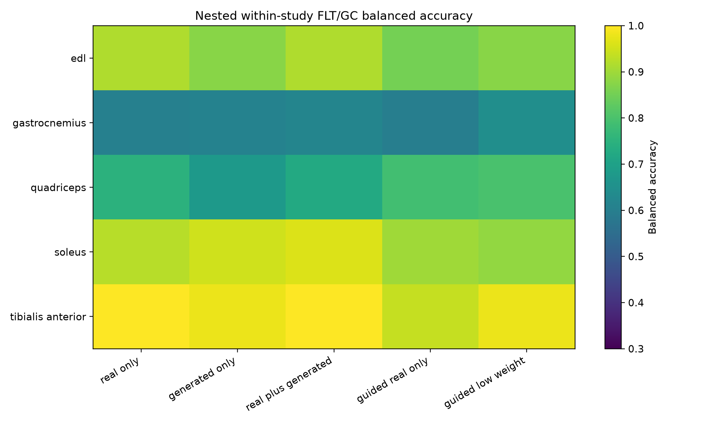
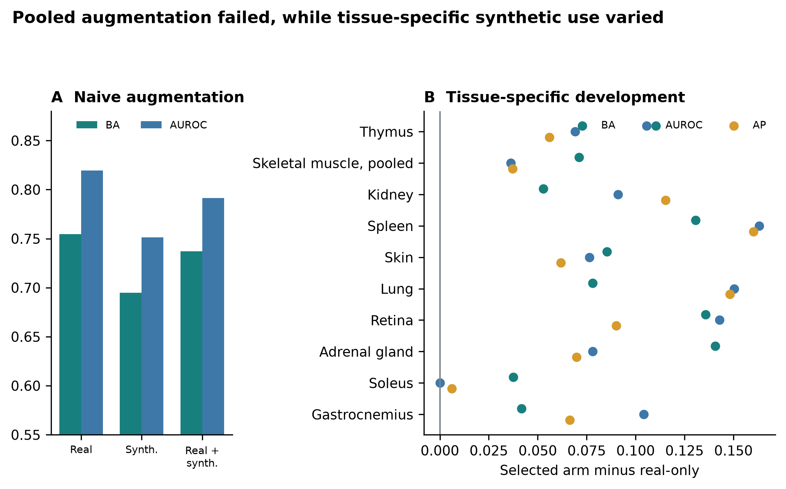

# Supplementary methods

**A configurable generative transcriptomics framework for spaceflown mice**

Jason Trinh

This document records data roles, model configurations, evaluation gates, statistical safeguards, and supporting results.

## S1. OSDR discovery and expression ingestion

OSDR data came from the [Biological Data API](https://visualization.osdr.nasa.gov/biodata/api/). Eligible profiles were *Mus musculus* bulk RNA-seq with a resolvable flight or ground-control label, processed RSEM expected counts, and tissue or material metadata sufficient for canonicalization.

The API returned 1,631 rows; aggregation of 21 technical replicates left 1,610 biological profiles (835 flight and 775 ground control) from 75 accessions and 24 canonical material classes.

## S2. ARCHS4 cohort audit

The source file, `assets/archs4/mouse_gene_v2.5.h5`, contained 997,515 profiles and 53,511 genes. Three reference cohorts were eligible:

| Cohort | Profiles | GEO series | Intended use |
|---|---:|---:|---|
| Control only | 23,614 | 3,213 | Conservative sensitivity cohort |
| Healthy preferred | 62,299 | 5,307 | Primary pretraining source |
| Broad | 134,250 | 15,111 | Diversity sensitivity cohort |

Nine GEO series linked to eligible OSDR accessions were excluded before selection. This removed 108 ARCHS4 profiles, including all 53 selected profiles from GSE152382 (OSD-457). The paper-parity run selected 17,244 healthy-preferred profiles across 20 tissues. Complete GEO-series grouping assigned 10,150 profiles to training, 2,466 to validation, and 4,628 to test without series overlap.

## S3. Landmark panel and normalization

Full-transcriptome TPM was calculated with GENCODE vM39 mouse gene lengths.
Landmark selection occurred after TPM calculation and used a deterministic
974-gene mouse mapping of the human L1000 panel. Training-set MaxAbs scaling was
applied after landmark selection.

## S4. ARCHS4 DDIM configuration

The full configuration is `configs/rna_diffusion/archs4_mouse_paper_parity_osdr_disjoint.yaml`. Architecture and optimization matched the paper-parity implementation; only reference exclusion and grouped splitting changed.

| Component | Value |
|---|---|
| Input genes | 974 |
| Hidden layers | 8,192; 8,192 |
| Parameters | 227,109,786 |
| Dropout | 0.1 |
| Diffusion steps | 1,000 |
| Beta schedule | Quadratic, 0.0001 to 0.02 |
| Objective | Summed noise MSE |
| Optimizer | Adam |
| Learning rate | 0.0004783833151836702 |
| Scheduler | OneCycle |
| Batch size | 2,048 |
| Epochs / optimizer steps | 15,000 / 75,000 |
| AMP | Enabled |
| EMA | 0.999 |
| Device | NVIDIA A100-SXM4-40GB |
| Runtime | 6,083 seconds |
| Peak allocated GPU memory | 5.93 GB |

## S5. Factorized OSDR adaptation

The accepted configuration, `configs/rna_diffusion/osdr_factorized_study_lora512_correlation_refine_osdr_disjoint.yaml`, used the Section S4 backbone. A base adapter received 12,000 domain and 4,000 condition steps before the correlation-refinement stage below. All-tissue and muscle-group screens used the refined adapter.

| Component | Value |
|---|---|
| Backbone | Completed ARCHS4 paper-parity DDIM |
| Conditioning | Tissue, FLT/GC, accession, material type |
| Domain adapter | LoRA rank 512, alpha 512 |
| Domain stage | 4,000 steps, LR 0.00002 |
| Condition stage | 1,000 steps, LR 0.00002 |
| Batch size | 512 |
| Condition dropout | 0.15 |
| Correlation regularization | Weight 10, 256 genes, timestep <= 200 |
| Sampling | 100 DDIM steps for evaluation |

The split contained 781 training, 536 validation, and 293 locked-test profiles. Every test accession appeared in training, so results measure within-study interpolation. The calibrator used train-only global alignment, hierarchically shrunk accession and tissue means, positive missing-covariance residual noise, no condition-specific fit of means or covariance, and zero clipping for downstream expression.

## S6. Distribution and condition gates

Four generation seeds (5020-5023) were declared before opening the locked test. Metrics were gated independently.

| Metric | Gate |
|---|---|
| Gene-correlation agreement | Paper target >= 0.98; finite-sample real-bootstrap floor also reported |
| Precision | >= 0.95 |
| Recall | >= 0.85 |
| F1 | >= 0.90 |
| Adversarial accuracy | 0.40 to 0.60 |
| FD / real-split P95 | <= 1.0 |
| Pooled effect recovery | Correlation >= 0.30 and direction >= 0.55 |
| Muscle accession recovery | Correlation >= 0.30 and direction >= 0.55 |
| Memorization | Generated fraction below train LOO P01 <= 0.05 |

Exact repeats are in `source_data/table_s2_locked_ddim_repeats.tsv`. Locked-test means were correlation 0.9744, precision 0.9974, recall 0.9957, F1 0.9966, adversarial accuracy 0.4753, and FD/real-P95 0.0740. All repeats exceeded the finite-sample correlation floor of 0.9497, although the mean missed the paper target of 0.98. Pooled FLT/GC recovery passed in three of four repeats and muscle accession recovery in all four. The preceding validation screen missed its stricter correlation and muscle gates, so broad biological screens remain developmental. Adversarial accuracy denotes an external nearest-neighbor real-versus-synthetic classifier, not the WGAN critic; 0.5 indicates chance separation.

## S7. Configurable benchmark and comparator models

The 463-row experiment planner varied inputs, normalization, transformation, scaling, genes, harmonization, training data, accession and tissue scope, FLT/GC and study conditioning, balancing, seed, and synthetic ratio. Lower-cost screens identified branches for full training.

### Liver harmonization benchmark

Nine arms used the same 974-gene DDIM, seed, A100 device, and split: 119 training, 50 validation, and 70 unopened locked-test profiles. No arm passed all fidelity, pooled-condition, and accession-effect gates.

| Method | Corr. | Precision | Recall | F1 | AA | FD/real P95 | Fidelity gate | Accession gate |
|---|---:|---:|---:|---:|---:|---:|---|---|
| No harmonization, TPM | 0.283 | 0.200 | 0.960 | 0.331 | 0.850 | 2.052 | Fail | Fail |
| Ilangovan study z-score | 0.278 | 0.160 | 1.000 | 0.276 | 0.770 | 0.716 | Fail | Fail |
| Mentor two-stage z-score | 0.348 | 0.440 | 1.000 | 0.611 | 0.690 | 0.977 | Fail | Fail |
| ComBat | 0.004 | 0.040 | 1.000 | 0.077 | 0.810 | 63.185 | Fail | Fail |
| ComBat-seq | 0.067 | 0.020 | 1.000 | 0.039 | 0.850 | 156.647 | Fail | Fail |
| MBatch Median Polish | 0.009 | 0.020 | 1.000 | 0.039 | 0.930 | 205.470 | Fail | Fail |
| MBatch Empirical Bayes | 0.001 | 0.000 | 1.000 | 0.000 | 0.850 | 60.625 | Fail | Fail |
| MBatch ANOVA | -0.003 | 0.020 | 1.000 | 0.039 | 0.870 | 44.716 | Fail | Fail |
| MOBER | 0.808 | 0.260 | 1.000 | 0.413 | 0.770 | 33.311 | Fail | Fail |

ComBat, ComBat-seq, and MBatch were transductive; MOBER was inductive. None passed the joint criteria. Tables S13-S14 contain full labels and metrics.

### WGAN-GP and GeneJEPA screens

The WGAN used the Viñas et al. topology: 64-dimensional noise, two 256-unit generator and critic layers, five critic updates, gradient-penalty weight 10, and batch size 32. RMSProp used learning rate 0.0005, alpha 0.9, and epsilon 1e-7 for at most 2,000 epochs. Released-code early stopping began at epoch 1, ran every five epochs, and allowed ten failed checks. Across six seeds, mean correlation, precision, recall, F1, adversarial accuracy, and FD/real-P95 were 0.9759, 0.9764, 0.9938, 0.9850, 0.6362, and 0.1439. Pooled FLT/GC recovery passed 6/6 repeats; accession-aware muscle recovery passed 0/6. These are validation metrics; no separate WGAN test metrics were generated. Table S15 contains exact repeats.

GeneJEPA used the released 768-dimensional architecture with 512 latents, 24 blocks, 12 heads, 4,096 tokens, mask ratio 0.45, minimum context 512, and minimum target size 16 per block. Its one-epoch mouse screen used 43,744 replacement-sampled exposures, batch size 92 with two-step gradient accumulation, learning rate 0.0001, weight decay 0.0002, cosine scheduling with 5% warmup, bfloat16 AMP, EMA 0.992 to 0.9995 after 2,000 warmup steps, no weighted sampling, and similarity/variance/covariance weights 1/25/1. Held-out tissue balanced accuracy was 0.703 versus 0.839 from expression. It has no expression decoder.

## S8. Generated-feature workflow

The funnel tested pooled utility, tissue development, and real-data association. Pooled classifiers used real, generated, or combined profiles. Tissue screens compared `real_only`, `generated_only`, equal-weight `real_plus_generated`, consensus-ranked `guided_real_only`, and `guided_low_weight` with recentered synthetic profiles at 0.05 total weight.

Eight outer splits evaluated real profiles within accession-condition strata; inner loops selected feature count, regularization, and ranking. Eligibility required nonworse balanced accuracy, AUROC, and average precision versus real-only; ties met this rule without a mean gain. Accessions could occur in both partitions, so this tested within-study development rather than study transfer.

Stable genes required selection frequency >= 0.50 and sign agreement >= 0.75. Reinforced genes were stable in real-only and selected synthetic-guided arms with matching directions and a real meta-effect. Synthetic-promoted genes were stable only with eligible guidance and had a real meta-effect. These labels classify selection, not novelty; random-effects and LOO tests followed.

<!-- BEGIN GENERATED TISSUE UTILITY TABLES -->

**Supplementary Table S9. Complete canonical-tissue utility screen.**

| Tissue | n (FLT/GC) | Selected arm | BA real/selected | AUROC real/selected | AP real/selected | Status |
|---|---|---|---|---|---|---|
| Adrenal gland | 31 (16/15) | Generated only | 0.781 / 0.922 | 0.906 / 0.984 | 0.918 / 0.988 | Eligible improvement |
| Bone | 30 (15/15) | Guided ranking; real fit | 0.656 / 0.734 | 0.797 / 0.828 | 0.858 / 0.865 | Eligible improvement |
| Bone marrow | 20 (10/10) | Generated only | 0.969 / 1.000 | 1.000 / 1.000 | 1.000 / 1.000 | Eligible improvement |
| Brain | 45 (22/23) | Generated only | 0.688 / 0.740 | 0.712 / 0.802 | 0.731 / 0.788 | Eligible improvement |
| Brown adipose tissue | 20 (10/10) | Generated only | 1.000 / 1.000 | 1.000 / 1.000 | 1.000 / 1.000 | Eligible tie |
| Cecum | 16 (8/8) | Real only | 0.875 / 0.875 | 0.938 / 0.938 | 0.958 / 0.958 | Real-only retained |
| Cerebellum | 44 (23/21) | Generated only | 0.529 / 0.602 | 0.621 / 0.696 | 0.729 / 0.764 | Eligible improvement |
| Colon | 45 (23/22) | Real only | 0.656 / 0.656 | 0.677 / 0.677 | 0.730 / 0.730 | Real-only retained |
| Eye | 18 (9/9) | Generated only | 0.594 / 0.781 | 0.562 / 0.781 | 0.729 / 0.865 | Eligible improvement |
| Heart | 42 (21/21) | Generated only | 0.594 / 0.719 | 0.625 / 0.750 | 0.642 / 0.778 | Eligible improvement |
| Hippocampus | 30 (16/14) | Generated only | 0.698 / 0.703 | 0.740 / 0.781 | 0.849 / 0.864 | Eligible improvement |
| Kidney | 111 (56/55) | Guided ranking; 5% synthetic | 0.654 / 0.707 | 0.680 / 0.771 | 0.683 / 0.799 | Eligible improvement |
| Liver | 197 (101/96) | Real only | 0.721 / 0.721 | 0.764 / 0.764 | 0.773 / 0.773 | Real-only retained |
| Lung | 63 (32/31) | Generated only | 0.664 / 0.742 | 0.680 / 0.830 | 0.684 / 0.833 | Eligible improvement |
| Mammary gland | 20 (8/12) | Generated only | 0.771 / 0.885 | 0.854 / 0.958 | 0.875 / 0.958 | Eligible improvement |
| Optic nerve | 29 (19/10) | Guided ranking; 5% synthetic | 0.769 / 0.819 | 0.863 / 0.950 | 0.950 / 0.983 | Eligible improvement |
| Retina | 63 (37/26) | Guided ranking; 5% synthetic | 0.587 / 0.723 | 0.620 / 0.762 | 0.756 / 0.846 | Eligible improvement |
| Skeletal muscle, pooled | 149 (74/75) | Guided ranking; real fit | 0.861 / 0.932 | 0.924 / 0.961 | 0.908 / 0.945 | Eligible improvement |
| Skin | 125 (66/59) | Real + generated | 0.671 / 0.756 | 0.691 / 0.768 | 0.747 / 0.808 | Eligible improvement |
| Spleen | 86 (44/42) | Real + generated | 0.517 / 0.648 | 0.540 / 0.704 | 0.589 / 0.749 | Eligible improvement |
| Thymus | 94 (51/43) | Guided ranking; 5% synthetic | 0.733 / 0.844 | 0.818 / 0.887 | 0.862 / 0.918 | Eligible improvement |
| White adipose tissue | 20 (10/10) | Generated only | 1.000 / 1.000 | 1.000 / 1.000 | 1.000 / 1.000 | Eligible tie |

**Supplementary Table S6. Complete anatomical muscle-group utility screen.**

| Tissue | n (FLT/GC) | Selected arm | BA real/selected | AUROC real/selected | AP real/selected | Status |
|---|---|---|---|---|---|---|
| EDL | 24 (12/12) | Real only | 0.917 / 0.917 | 1.000 / 1.000 | 1.000 / 1.000 | Real-only retained |
| Gastrocnemius | 25 (10/15) | Guided ranking; 5% synthetic | 0.604 / 0.646 | 0.646 / 0.750 | 0.731 / 0.798 | Eligible improvement |
| Quadriceps | 35 (18/17) | Real only | 0.750 / 0.750 | 0.880 / 0.880 | 0.916 / 0.916 | Real-only retained |
| Soleus | 41 (22/19) | Real + generated | 0.925 / 0.963 | 0.980 / 0.980 | 0.980 / 0.986 | Eligible improvement |
| Tibialis anterior | 24 (12/12) | Real + generated | 1.000 / 1.000 | 1.000 / 1.000 | 1.000 / 1.000 | Eligible tie |

Sample counts are shown as total development profiles followed by flight/ground-control counts. Small cohorts and ceiling-level scores remain exploratory even when a synthetic arm is eligible.

<!-- END GENERATED TISSUE UTILITY TABLES -->

## S9. Random-effects reporting and LOO sensitivity

For gene `g` and accession `a`, the real effect was `delta[g,a] = mean(FLT,g,a) - mean(GC,g,a)`. Accession effects were combined by random-effects meta-analysis. Within each tissue, Benjamini-Hochberg adjustment was applied to 974 gene-level P values; BH FDR < 0.05 was the primary rule. Generated profiles never entered this model.

The inventory annotates reinforced, synthetic-promoted, real-only, synthetic-selected without real-direction support, and unselected associations. It also reports study count, direction fraction, `tau2`, and `I2`; mixed directions qualify but do not negate a significant pooled effect. LOO refitted the model after removing each accession. LOO stability required maximum LOO FDR < 0.05 without sign reversal and was a sensitivity label, not an inclusion rule.

## S10. Reactome analysis

The official mouse GMT was generated from `ReactomePathways.txt` and
`Ensembl2Reactome_All_Levels.txt`, restricted to *Mus musculus*, `R-MMU-*`
pathways, and `ENSMUSG*` genes.

Hypergeometric enrichment used the 974-gene landmark panel as background.
Benjamini-Hochberg FDR was applied separately by tissue and selected-gene set.
Reactome parent and child terms overlap. Counts of significant rows are therefore
not counts of independent biological discoveries.

## S11. Skeletal-muscle group analysis

The factorized DDIM and three frozen synthetic development views were
reused. No additional neural network was trained for the muscle-group screen.

| Group | Profiles | Accessions | FLT | GC |
|---|---:|---:|---:|---:|
| EDL | 24 | 2 | 12 | 12 |
| Gastrocnemius | 25 | 3 | 10 | 15 |
| Quadriceps | 35 | 4 | 18 | 17 |
| Soleus | 41 | 3 | 22 | 19 |
| Tibialis anterior | 24 | 2 | 12 | 12 |

Table S6 gives the exact utility results. Soleus reinforced FLT-lower `Bdh1`, `Ech1`, `Bnip3`, and `Decr1` and FLT-higher `Tpm1` across all three accessions. All except `Decr1` passed LOO sensitivity; `Mef2c` and `Pxmp2` were not promoted. Gastrocnemius promoted `Fhl2` and `Nfkbia`; tibialis anterior reinforced `Cdkn1a`, `St3gal5`, and `Bnip3` and promoted `Cebpd`. None passed LOO FDR. EDL and quadriceps retained real-only arms.

LOO refitted only the real-data meta-analysis; it did not remove an accession from generator adaptation. The muscle findings therefore remain developmental pending a fully excluded study.

## S12. Random-effects BH-FDR gene inventories

Table S11 contains all real-data random-effects associations with BH FDR < 0.05; Table S12 gives counts for every analysis unit. The 459 tissue-gene rows comprise 202 associations across 10 of 22 canonical tissues and 257 across five muscle groups. They are not independent discoveries because genes and samples can recur across analyses. Direction was unanimous for 363 rows and mixed for 96; this was an annotation, not a filter.

| Analysis unit | BH-FDR genes | FLT higher | FLT lower | Unanimous direction | Synthetic-promoted | Reinforced |
|---|---:|---:|---:|---:|---:|---:|
| Adrenal gland | 22 | 1 | 21 | 21 | 1 | 1 |
| Eye | 8 | 4 | 4 | 8 | 0 | 1 |
| Heart | 4 | 2 | 2 | 4 | 0 | 0 |
| Kidney | 3 | 3 | 0 | 1 | 1 | 1 |
| Liver | 19 | 8 | 11 | 0 | 0 | 0 |
| Retina | 5 | 5 | 0 | 5 | 0 | 0 |
| Skeletal muscle, pooled | 26 | 12 | 14 | 5 | 4 | 8 |
| Skin | 3 | 2 | 1 | 1 | 1 | 0 |
| Spleen | 34 | 32 | 2 | 21 | 3 | 1 |
| Thymus | 78 | 37 | 41 | 57 | 13 | 3 |
| EDL | 136 | 14 | 122 | 130 | 0 | 0 |
| Gastrocnemius | 15 | 8 | 7 | 13 | 2 | 0 |
| Quadriceps | 29 | 25 | 4 | 22 | 0 | 0 |
| Soleus | 29 | 5 | 24 | 27 | 0 | 5 |
| Tibialis anterior | 48 | 42 | 6 | 48 | 1 | 3 |

Table S10 is the 49-row synthetic-informed subset: 26 promoted and 23 reinforced results with supporting real effects. Attribution was suppressed when the generated arm failed eligibility. The remaining inventory contains 34 real-only selections, 370 BH-significant unselected results, and six synthetic selections without real-direction support. Below, direction is the real random-effects estimate; an asterisk marks disagreement among accessions.

**Synthetic-promoted genes**

| Analysis unit | FLT higher | FLT lower |
|---|---|---|
| Adrenal gland | None | `Psmb8` |
| Kidney | `Inpp4b`\* | None |
| Skeletal muscle, pooled | None | `Klhl21`\*, `Mapkapk5`\*, `Reep5`\*, `Itgb5`\* |
| Skin | `Plscr1` | None |
| Spleen | `Rai14`, `Myl9`\*, `Ptprk` | None |
| Thymus | `Hsd17b11`\*, `Etv1` | `Nusap1`, `Stmn1`, `Birc5`, `Cdk1`, `Top2a`, `Ccnb2`, `Aurka`, `Ccne2`, `Kif20a`, `Pcna`, `Ccnf` |
| Gastrocnemius | `Nfkbia` | `Fhl2` |
| Tibialis anterior | `Cebpd` | None |

**Reinforced genes**

| Analysis unit | FLT higher | FLT lower |
|---|---|---|
| Adrenal gland | None | `Tspan4` |
| Eye | None | `Klhl21` |
| Kidney | `Slc37a4` | None |
| Skeletal muscle, pooled | `Sox4`, `Cebpd`\*, `Sh3bp5`, `Prkcd`, `Arid5b`\*, `Sesn1`\*, `Tle1`\* | `Bphl`\* |
| Spleen | `Loxl1` | None |
| Thymus | `Snx7` | `Ube2c`, `Gmnn` |
| Soleus | `Tpm1` | `Bdh1`, `Ech1`, `Bnip3`, `Decr1` |
| Tibialis anterior | `Cdkn1a`, `St3gal5`, `Bnip3` | None |

Heart, liver, retina, EDL, and quadriceps had BH-FDR genes but none was synthetic-informed. Bone, bone marrow, brain, brown adipose tissue, cecum, cerebellum, colon, hippocampus, lung, mammary gland, optic nerve, and white adipose tissue had no BH-FDR gene in the landmark panel. Tables S11-S12 retain the complete results, including pooled muscle, liver's 19 real-only associations, skin's promoted `Plscr1`, and the null lung inventory.

Machine-readable Tables S1-S17 are under `source_data/`.

## S13. Targeted literature annotation of promoted genes

The literature screen covered all 26 synthetic-promoted tissue-gene associations in Table S10. Searches used the gene symbol and synonyms together with the tissue, spaceflight or microgravity, and relevant process terms. Primary studies were preferred for directional and mechanistic claims. Public OSDR reanalyses were retained as context but were not counted as independent confirmation.

Each association received one mutually exclusive literature label. Aligning evidence agreed with the observed direction or same-tissue process; the `evidence_scope` column distinguishes exact matches from process-level agreement. Contradictory evidence had an opposing prior result without comparable supporting evidence. Complementary evidence connected the gene to a reported spaceflight process or a relevant mechanism without reproducing the same gene-tissue-direction result. Ambiguous evidence was mixed. Unsupported/potentially novel means that the targeted search found no tissue-specific match; it is not proof of novelty or a judgment that the gene lacks a plausible mechanism. The `interpretive_role` column records whether the result recovers prior evidence, extends a hypothesis, is context dependent, or remains literature unmatched.

| Literature label | Associations | Interpretation |
|---|---:|---|
| Aligning | 11 | Three exact matches and eight same-tissue process-level matches |
| Complementary | 13 | Related spaceflight process or gene mechanism; not replication |
| Ambiguous | 1 | Mixed direct and process-level evidence for thymus `Birc5` |
| Unsupported/potentially novel | 1 | No adrenal spaceflight match found for `Psmb8`; mechanism remains plausible |
| Contradictory | 0 | No association had only opposing evidence |

The three exact same-gene, same-tissue, same-direction matches were thymus `Ccnb2`, thymus `Ccne2`, and gastrocnemius `Nfkbia`. The first two came from published two-mission thymus RNA-seq that may overlap the present OSDR aggregate, so they are literature alignment rather than independent replication. The `Nfkbia` result came from an independent shuttle mission and microarray/PCR platform. Thymus `Hsd17b11` and `Etv1` were classified as complementary because primary studies support lipid-handling and CD4+ T-cell mechanisms, respectively, without a directional thymus-flight match. Adrenal `Psmb8` remained literature unmatched, although its interferon-inducible immunoproteasome function supports an exploratory immune, proteostasis, or tissue-composition interpretation. Table S16 records each classification, interpretive role, scope, relationship to the current data, and interpretation. Table S17 supplies the 19-source bibliography and states whether each source is independent, potentially overlapping, or mechanistic context only. The deterministic builder is `nasa_mouse_rna_diffusion.annotate_promoted_gene_literature`.

## S14. Supplementary figures

<strong>Figure S1. Repeated nested muscle-group balanced accuracy.</strong> Each row is a muscle group and each column is a downstream use of real or generated profiles. Arm selection also required nonworse AUROC and average precision.

<strong>Figure S2. Downstream utility of generated expression.</strong> (A) Direct pooled augmentation on the locked real-profile test. (B) Selected-arm changes in balanced accuracy, AUROC, and average precision across repeated tissue-specific development splits. All evaluations used real profiles.

