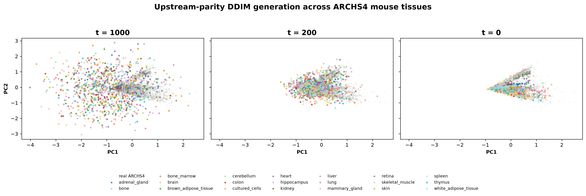
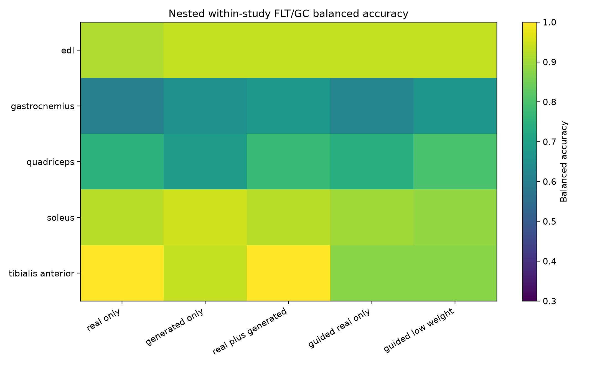
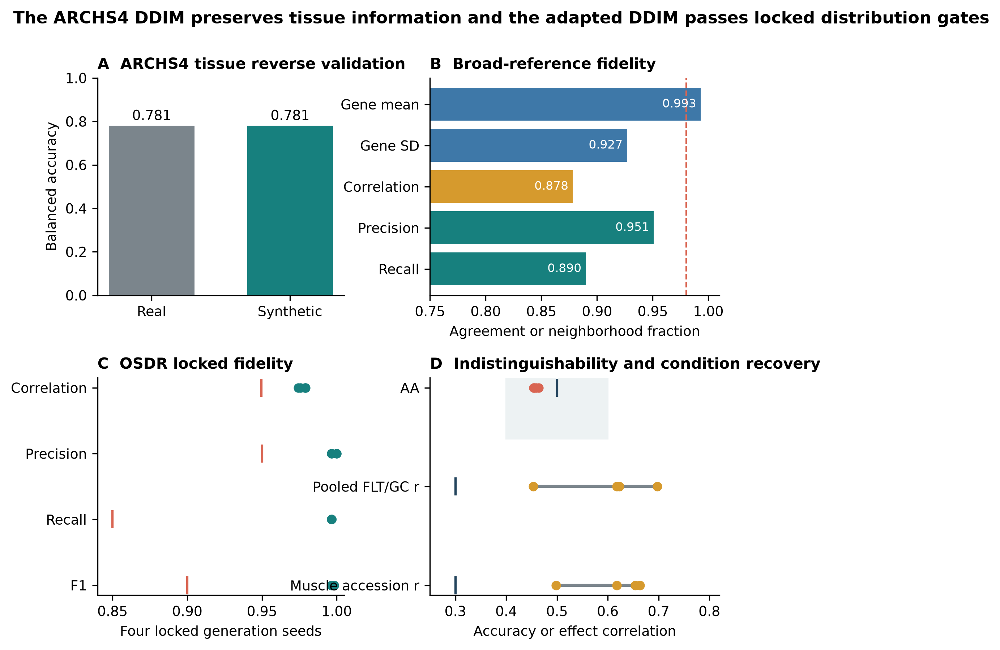
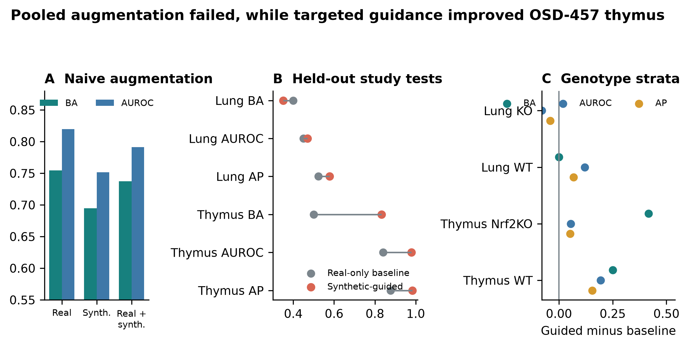

<div class="title-page">

<h1>Supplementary methods</h1>

<p class="subtitle">Synthetic-guided feature discovery in mouse spaceflight transcriptomics</p>

<p class="authors">Jason Trinh</p>

<p class="draft-note"><strong>Frozen analysis supplement.</strong> This document records exact data roles, architecture, evaluation gates, statistical safeguards, output locations, and rebuild commands. It does not rerun training.</p>

</div>

## S1. Reproducibility contract

The manuscript builder consumes completed outputs and fails when a required file
or a key expected result is missing. It does not:

- query the OSDR API;
- preprocess expression;
- train or fine-tune a neural network;
- sample a new synthetic cohort;
- rerun feature selection;
- recalculate random-effects statistics from raw profiles.

The exact frozen inputs and SHA-256 hashes are in
`source_data/frozen_input_manifest.tsv`. Figure hashes are in
`source_data/figure_build_manifest.tsv`.

## S2. OSDR discovery and expression ingestion

OSDR data were obtained through the Biological Data API documented at
<https://visualization.osdr.nasa.gov/biodata/api/>. The repository implementation
and endpoint notes are in `docs/osdr_api.md`.

Eligibility required:

- `Mus musculus`;
- transcription profiling by bulk RNA sequencing;
- a resolvable spaceflight/flight or ground-control label;
- processed RSEM expected-count output;
- sample-level tissue or material metadata sufficient for canonicalization.

No raw combined OSDR HDF5 file was used. The API audit outputs are:

```text
outputs/generative_benchmark/data_audit/osdr/osdr_canonical_metadata.tsv
outputs/generative_benchmark/data_audit/osdr/osdr_inventory_summary.json
outputs/generative_benchmark/data_audit/osdr/osdr_tissue_alias_audit.tsv
outputs/generative_benchmark/data_audit/osdr/osdr_tissue_inventory.tsv
```

The API returned 1,631 profile rows. Twenty-one technical replicates were
aggregated, leaving 1,610 biological profiles, 835 flight and 775 ground control,
from 75 accessions and 24 canonical material classes.

## S3. ARCHS4 cohort audit

The source file was `assets/archs4/mouse_gene_v2.5.h5`, containing 997,515
profiles and 53,511 genes. The complete audit files are:

```text
outputs/generative_benchmark/data_audit/archs4/archs4_full_profile_audit.tsv.gz
outputs/generative_benchmark/data_audit/archs4/archs4_control_only_balanced.tsv.gz
outputs/generative_benchmark/data_audit/archs4/archs4_healthy_preferred_balanced.tsv.gz
outputs/generative_benchmark/data_audit/archs4/archs4_broad_balanced.tsv.gz
```

The three eligible reference cohorts contained:

| Cohort | Profiles | GEO series | Intended use |
|---|---:|---:|---|
| Control only | 23,614 | 3,213 | Conservative sensitivity cohort |
| Healthy preferred | 62,299 | 5,307 | Primary pretraining source |
| Broad | 134,250 | 15,111 | Diversity sensitivity cohort |

The paper-parity run selected 17,244 healthy-preferred profiles across 20 tissue
classes with whole-series assignment to 9,796 training, 2,448 validation, and
5,000 test profiles.

## S4. Landmark panel and normalization

Full-transcriptome TPM was calculated with
`data/reference/gencode_vM39_mouse_gene_lengths.tsv`. Landmark selection occurred
after TPM calculation. The deterministic 974-gene panel and the human-to-mouse
mapping audit are:

```text
data/diffusion/l974_mouse_paper_parity.tsv
data/diffusion/l1000_human_to_mouse_ensembl.tsv
```

Training-set MaxAbs scaling was applied after landmark selection. The ARCHS4
prepared matrix is:

```text
outputs/generative_benchmark/data/lacan_diffusion/archs4_mouse_paper_parity_l974.h5
```

The OSDR factorized matrix and profile metadata are:

```text
outputs/generative_benchmark/data/lacan_diffusion/osdr_factorized_within_study_replicated_validation_l974.h5
outputs/generative_benchmark/data/lacan_diffusion/osdr_factorized_within_study_replicated_validation_l974.samples.tsv.gz
```

## S5. ARCHS4 DDIM configuration

The full configuration is
`configs/rna_diffusion/archs4_mouse_paper_parity.yaml`. The official source commit
was `cde890154698fcea96c924804aaff04af3351b48`.

| Component | Value |
|---|---|
| Input genes | 974 |
| Hidden layers | 8,192; 8,192 |
| Parameters | 227,109,786 |
| Dropout | 0.1 |
| Diffusion steps | 1,000 |
| Beta schedule | Quadratic, 0.0001 to 0.02 |
| Objective | Summed noise MSE |
| Optimizer | Adam |
| Learning rate | 0.0004783833151836702 |
| Scheduler | OneCycle |
| Batch size | 2,048 |
| Epochs / optimizer steps | 15,000 / 75,000 |
| AMP | Enabled |
| EMA | 0.999 |
| Device | NVIDIA A100-SXM4-40GB |
| Runtime | 5,987 seconds |
| Peak allocated GPU memory | 5.93 GB |

Run directory:

```text
outputs/generative_benchmark/runs/lacan_diffusion/archs4_mouse_paper_parity_seed1234/
```

## S6. Factorized OSDR adaptation

The accepted configuration is
`configs/rna_diffusion/osdr_factorized_study_lora512_correlation_refine.yaml`.

| Component | Value |
|---|---|
| Backbone | Completed ARCHS4 paper-parity DDIM |
| Conditioning | Tissue, FLT/GC, accession, material type |
| Domain adapter | LoRA rank 512, alpha 512 |
| Domain stage | 4,000 steps, LR 0.00002 |
| Condition stage | 1,000 steps, LR 0.00002 |
| Batch size | 512 |
| Condition dropout | 0.15 |
| Correlation regularization | Weight 10, 256 genes, timestep <= 200 |
| Sampling | 100 DDIM steps for evaluation |

The data split contained 781 training, 536 validation, and 293 locked-test
profiles. Every test accession was represented in training. Results therefore
measure within-study interpolation.

The accepted calibrator used:

1. train-only global alignment;
2. hierarchically shrunk accession and tissue means;
3. positive missing-covariance residual noise;
4. no condition-specific fit of calibrator means or covariance;
5. explicit clipping at zero for accepted downstream expression.

Run directory:

```text
outputs/generative_benchmark/runs/lacan_diffusion/osdr_factorized_study_lora512_correlation_refine_seed2020/
```

## S7. Distribution and condition gates

Four generation seeds, 5020-5023, were declared before the locked test was
opened. Every metric was gated independently.

| Metric | Gate |
|---|---|
| Gene-correlation agreement | At least min(0.98, real-bootstrap P05) |
| Precision | >= 0.95 |
| Recall | >= 0.85 |
| F1 | >= 0.90 |
| Adversarial accuracy | 0.40 to 0.60 |
| FD / real-split P95 | <= 1.0 |
| Pooled effect recovery | Correlation >= 0.30 and direction >= 0.55 |
| Muscle accession recovery | Correlation >= 0.30 and direction >= 0.55 |
| Memorization | Generated fraction below train LOO P01 <= 0.05 |

The exact repeat rows are in `source_data/table_s2_locked_ddim_repeats.tsv`.

The term "adversarial accuracy" refers to an external nearest-neighbor
real-versus-synthetic classifier, not the WGAN training critic. A result near 0.5
indicates that this external discriminator cannot reliably separate the two
cohorts.

## S8. WGAN-GP and GeneJEPA screens

The WGAN used the Viñas et al. topology: 64-dimensional noise, two 256-unit
generator and critic layers, five critic updates, gradient-penalty weight 10,
RMSProp learning rate 0.0005, and batch size 32. The strongest study-conditioned
validation result had external adversarial accuracy 0.6362. Because no calibration
variant jointly fixed adversarial accuracy and retained the correlation floor, and
because accession-aware FLT/GC recovery failed, its locked test remained unopened.

```text
outputs/generative_benchmark/runs/vinas_wgan_gp/osdr_matched_study_conditioned_seed2020/
```

The exact-architecture GeneJEPA duration screen used 4,096 genes and 43,744
replacement-sampled training exposures. It reached 0.703 held-out tissue balanced
accuracy versus 0.839 from expression. It is representation-only and has no
expression decoder.

```text
outputs/generative_benchmark/runs/genejepa/matrix_phase_0_genejepa_exact_mouse_one_epoch_f2e01cf1f130d5cb/
```

## S9. Generated-feature workflow

Five arms were compared:

1. `real_only`;
2. `generated_only`;
3. `real_plus_generated`, equal total real and synthetic weight;
4. `guided_real_only`, real classifier with real/synthetic consensus ranking;
5. `guided_low_weight`, real plus recentered synthetic profiles at 0.05 total
   synthetic weight.

Splits were nested within accession-by-condition strata. The inner loop selected
feature count, regularization, and rank method. The outer loop measured balanced
accuracy, AUROC, and average precision separately. No composite score was used.

Stable genes had selection frequency at least 0.50 and coefficient-sign agreement
at least 0.75. Generated-supported status did not constitute biological evidence.
Real random-effects and LOO tests were applied afterward.

Primary workflow documentation:

```text
docs/generated_feature_guidance_workflow.md
```

## S10. Independent confirmation

The confirmation protocol is frozen at:

```text
outputs/generative_benchmark/analyses/generated_feature_guidance_confirmation_v1/protocol.md
```

Test accessions:

| Tissue | Accession | Profiles | FLT | GC |
|---|---|---:|---:|---:|
| Lung | OSD-900 | 20 | 10 | 10 |
| Thymus | OSD-457 | 24 | 12 | 12 |

Both accessions were removed from all generator-adaptation roles. The existing
15,000-epoch ARCHS4 checkpoint was reused, and only the 5,000-step OSDR adaptation
was rerun. OSD-464 lung and OSD-244 thymus were fixed validation studies.

The deployed thymus classifier used real profiles only. Synthetic data changed
feature ranking. The deployed lung classifier used a recentered synthetic view at
0.05 total sample weight.

Genotype assignment was audited after the primary result:

| Tissue | Stratum | Profiles | FLT | GC |
|---|---|---:|---:|---:|
| Lung | KO | 10 | 5 | 5 |
| Lung | WT | 10 | 5 | 5 |
| Thymus | Nrf2KO | 12 | 6 | 6 |
| Thymus | WT | 12 | 6 | 6 |

## S11. Random-effects and LOO rules

For gene \(g\) in accession \(a\), the real flight effect was:

```text
delta[g,a] = mean(real expression[g] | FLT,a)
           - mean(real expression[g] | GC,a)
```

Accession effects were combined with a random-effects model. Benjamini-Hochberg
FDR was calculated within each declared tissue/gene family. The LOO analysis
removed each accession, repeated the random-effects fit, and retained the maximum
FDR and any sign reversal.

A strict stable gene required:

- full-data random-effects FDR < 0.05;
- maximum LOO FDR < 0.05;
- no LOO sign reversal;
- a generated-informed selection status;
- agreement between the real effect and generated direction.

Generated profiles were never included in the random-effects model.

## S12. Reactome analysis

The official mouse GMT is:

```text
data/pathways/reactome_current_mouse_ensembl.gmt
```

It was generated from official `ReactomePathways.txt` and
`Ensembl2Reactome_All_Levels.txt`, restricted to *Mus musculus*, `R-MMU-*`
pathways, and `ENSMUSG*` genes.

Hypergeometric enrichment used the 974-gene landmark panel as background.
Benjamini-Hochberg FDR was applied separately by tissue and selected-gene set.
Reactome parent and child terms overlap. Counts of significant rows are therefore
not counts of independent biological discoveries.

## S13. Skeletal-muscle group analysis

The fixed DDIM and three frozen synthetic development views were reused. No neural
network was retrained.

| Group | Profiles | Accessions | FLT | GC |
|---|---:|---:|---:|---:|
| EDL | 24 | 2 | 12 | 12 |
| Gastrocnemius | 25 | 3 | 10 | 15 |
| Quadriceps | 35 | 4 | 18 | 17 |
| Soleus | 41 | 3 | 22 | 19 |
| Tibialis anterior | 24 | 2 | 12 | 12 |

The full report is `docs/synthetic_skeletal_muscle_group_analysis.md`. Key frozen
outputs are:

```text
outputs/generative_benchmark/analyses/within_study_generated_feature_stability_muscle_groups_v1/
```

The seven soleus genes in the manuscript are the intersection of
synthetic-selected genes, real-effect direction support, and strict real LOO FDR:
`Bdh1`, `Bnip3`, `Mef2c`, `Ech1`, `Pxmp2`, `Gmnn`, and `Tpm1`.

LOO here is a real-data meta-analysis sensitivity test. It does not remove the
accession from the already completed generator adaptation. Soleus remains
developmental until a new accession is excluded from adaptation and selection.

## S14. Supplementary figures



<p class="caption"><strong>Figure S1. ARCHS4 DDIM denoising trajectory.</strong> The same generated profiles are shown at diffusion timesteps 1,000, 200, and 0 in a PCA space fitted to real ARCHS4 expression. Colors identify tissue classes. The two-dimensional view is descriptive; held-out tissue classification uses the full 974-gene representation.</p>


<p class="caption"><strong>Figure S2. Real and generated profiles in the locked OSDR test.</strong> Seed 5020 is shown. Tissue and condition views are descriptive; formal fidelity and effect metrics use all declared seeds and higher-dimensional data.</p>



<p class="caption"><strong>Figure S3. Repeated nested muscle-group balanced accuracy.</strong> Each row is a muscle group and each column is a downstream use of real or generated profiles. Arm selection also required nonworse AUROC and average precision.</p>



<p class="caption"><strong>Figure S4. Generator validation.</strong> (A) Tissue balanced accuracy when a classifier was trained on held-out ARCHS4 real or synthetic profiles. (B) Broad-reference distribution metrics. The dashed line marks the strict correlation target. (C) Four OSDR locked-test generations; vertical marks show metric gates. (D) External adversarial accuracy and pooled or accession-aware flight-effect recovery. The shaded interval is the accepted adversarial-accuracy range.</p>



<p class="caption"><strong>Figure S5. Downstream utility of generated expression.</strong> (A) Direct pooled augmentation on the locked real test. (B) Fixed synthetic-guided policies in independently held-out lung and thymus accessions. (C) Guided-minus-baseline metric changes after post-hoc genotype stratification. Thymus improved uniformly; lung knockout AUROC declined.</p>

## S15. Source tables

- `table_1_data_inventory.tsv`
- `table_2_model_screen.tsv`
- `table_3_locked_ddim_metrics.tsv`
- `table_4_independent_confirmation.tsv`
- `table_5_tissue_evidence.tsv`
- `table_s1_archs4_ddim_metrics.tsv`
- `table_s2_locked_ddim_repeats.tsv`
- `table_s3_naive_augmentation.tsv`
- `table_s4_confirmation_genotypes.tsv`
- `table_s5_thymus_core_genes.tsv`
- `table_s6_thymus_reactome.tsv`
- `table_s7_muscle_group_summary.tsv`
- `table_s8_soleus_genes.tsv`
- `table_s9_muscle_reactome.tsv`
- `table_s10_all_tissue_development_screen.tsv`

## S16. Rebuild command

```bash
PYTHONPATH=src /home/exouser/miniforge3/envs/nasa-mouse/bin/python \
  -m nasa_mouse_rna_diffusion.build_synthetic_guided_paper
```

To regenerate source tables and figures without rendering PDFs:

```bash
PYTHONPATH=src /home/exouser/miniforge3/envs/nasa-mouse/bin/python \
  -m nasa_mouse_rna_diffusion.build_synthetic_guided_paper --skip-render
```
